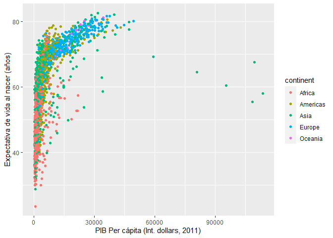
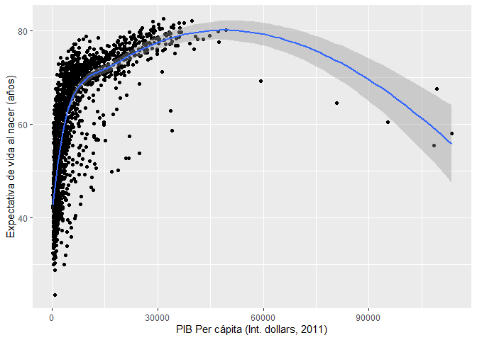
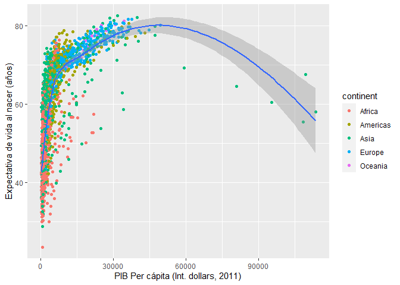

## Ideas básicas de R

1. Trabajamos sobre objetos

2. Los objetos hay que nombrarlos

3. Sobre los objetos aplicamos funciones. Estas las podemos crear o podemos usar las que otros han creado. 

Se dará cuenta que la sintaxis sigue una estructura. Eso es como aprender a hablar, uno sigue unas reglas gramaticales aún si no sabe cuales son esas reglas. Puro conocimiento tácito. La experiencia es lo que nos dá la maestría. 

## ¿Datos?

Los datos pueden entenderse como una colección de valores, los cuales pueden ser números, caracteres, simbolos. Los datos no son en si mismos información. Los datos son información si le dicen algo a alguien. Provee una respuesta a una pregunta. El usuario de esta información la transforma en conocimiento a través de la experiencia y la interpretación. Suponga que usted tiene lo siguiente en su hoja de cálculo


```r
library(flextable)
Día<-c("Lunes")
Valor<-c(31)
Unidad<-c("Celsius")
df<-data.frame(Día,Unidad,Valor)
myft<-flextable(df)
bft<-bold(myft,i=1, part="header")
bft<-theme_zebra(bft)
bft
```

```{=html}
<template id="60cb19a6-c445-4fd4-a383-aeb5e2127ead"><style>
.tabwid table{
  border-collapse:collapse;
  line-height:1;
  margin-left:auto;
  margin-right:auto;
  border-width: 0;
  display: table;
  margin-top: 1.275em;
  margin-bottom: 1.275em;
  border-spacing: 0;
  border-color: transparent;
}
.tabwid_left table{
  margin-left:0;
}
.tabwid_right table{
  margin-right:0;
}
.tabwid td {
    padding: 0;
}
.tabwid a {
  text-decoration: none;
}
.tabwid thead {
    background-color: transparent;
}
.tabwid tfoot {
    background-color: transparent;
}
.tabwid table tr {
background-color: transparent;
}
</style><div class="tabwid"><style>.cl-1d46cbdc{border-collapse:collapse;}.cl-1d365108{font-family:'Arial';font-size:11pt;font-weight:bold;font-style:normal;text-decoration:none;color:rgba(0, 0, 0, 1.00);background-color:transparent;}.cl-1d365109{font-family:'Arial';font-size:11pt;font-weight:normal;font-style:normal;text-decoration:none;color:rgba(0, 0, 0, 1.00);background-color:transparent;}.cl-1d36510a{margin:0;text-align:left;border-bottom: 0 solid rgba(0, 0, 0, 1.00);border-top: 0 solid rgba(0, 0, 0, 1.00);border-left: 0 solid rgba(0, 0, 0, 1.00);border-right: 0 solid rgba(0, 0, 0, 1.00);padding-bottom:5pt;padding-top:5pt;padding-left:5pt;padding-right:5pt;line-height: 1;background-color:transparent;}.cl-1d36510b{margin:0;text-align:right;border-bottom: 0 solid rgba(0, 0, 0, 1.00);border-top: 0 solid rgba(0, 0, 0, 1.00);border-left: 0 solid rgba(0, 0, 0, 1.00);border-right: 0 solid rgba(0, 0, 0, 1.00);padding-bottom:5pt;padding-top:5pt;padding-left:5pt;padding-right:5pt;line-height: 1;background-color:transparent;}.cl-1d36ebfe{width:54pt;background-clip: padding-box;background-color:rgba(239, 239, 239, 1.00);vertical-align: middle;border-bottom: 0 solid rgba(0, 0, 0, 1.00);border-top: 0 solid rgba(0, 0, 0, 1.00);border-left: 0 solid rgba(0, 0, 0, 1.00);border-right: 0 solid rgba(0, 0, 0, 1.00);margin-bottom:0;margin-top:0;margin-left:0;margin-right:0;}.cl-1d36ebff{width:54pt;background-clip: padding-box;background-color:rgba(239, 239, 239, 1.00);vertical-align: middle;border-bottom: 0 solid rgba(0, 0, 0, 1.00);border-top: 0 solid rgba(0, 0, 0, 1.00);border-left: 0 solid rgba(0, 0, 0, 1.00);border-right: 0 solid rgba(0, 0, 0, 1.00);margin-bottom:0;margin-top:0;margin-left:0;margin-right:0;}.cl-1d36ec00{width:54pt;background-clip: padding-box;background-color:rgba(207, 207, 207, 1.00);vertical-align: middle;border-bottom: 0 solid rgba(0, 0, 0, 1.00);border-top: 0 solid rgba(0, 0, 0, 1.00);border-left: 0 solid rgba(0, 0, 0, 1.00);border-right: 0 solid rgba(0, 0, 0, 1.00);margin-bottom:0;margin-top:0;margin-left:0;margin-right:0;}.cl-1d36ec01{width:54pt;background-clip: padding-box;background-color:rgba(207, 207, 207, 1.00);vertical-align: middle;border-bottom: 0 solid rgba(0, 0, 0, 1.00);border-top: 0 solid rgba(0, 0, 0, 1.00);border-left: 0 solid rgba(0, 0, 0, 1.00);border-right: 0 solid rgba(0, 0, 0, 1.00);margin-bottom:0;margin-top:0;margin-left:0;margin-right:0;}caption {color: #777;margin-top: 10px;margin-bottom: 10px;text-align: center;}</style><table class='cl-1d46cbdc'><thead><tr style="overflow-wrap:break-word;"><td class="cl-1d36ec00"><p class="cl-1d36510a"><span class="cl-1d365108">Día</span></p></td><td class="cl-1d36ec00"><p class="cl-1d36510a"><span class="cl-1d365108">Unidad</span></p></td><td class="cl-1d36ec01"><p class="cl-1d36510b"><span class="cl-1d365108">Valor</span></p></td></tr></thead><tbody><tr style="overflow-wrap:break-word;"><td class="cl-1d36ebfe"><p class="cl-1d36510a"><span class="cl-1d365109">Lunes</span></p></td><td class="cl-1d36ebfe"><p class="cl-1d36510a"><span class="cl-1d365109">Celsius</span></p></td><td class="cl-1d36ebff"><p class="cl-1d36510b"><span class="cl-1d365109">31</span></p></td></tr></tbody></table></div></template>
<div id="3f894e55-dd4a-4a91-bd2d-893dba322b90"></div>
<script>
var dest = document.getElementById("3f894e55-dd4a-4a91-bd2d-893dba322b90");
var template = document.getElementById("60cb19a6-c445-4fd4-a383-aeb5e2127ead");
var caption = template.content.querySelector("caption");
if(caption) {
  caption.style.cssText = "display:block;text-align:center;";
  var newcapt = document.createElement("p");
  newcapt.appendChild(caption)
  dest.parentNode.insertBefore(newcapt, dest.previousSibling);
}
var fantome = dest.attachShadow({mode: 'open'});
var templateContent = template.content;
fantome.appendChild(templateContent);
</script>

```

Los valores y caracteres que tiene allí son datos, que se convierten en información cuando se organizan para concluir que el lunes la temperatura fue de 31 grados celsius. 


### Señal y ruido 


Ahora, no todos los datos son útiles, y no siempre tener más datos significa tener más y mejor información. Lo que nos interesa es tener más señal y menos ruido. Cuando usted está en su clase remota por alguna plataforma escucha la voz del profesor, el pregón del vendedor de frutas, la maldición del vecino, el ventilador/abanico, en fin. Si a usted le interesa realmente la clase, la señal es la voz del profesor, lo demás es ruido. Si el propósito de los datos es informarnos para incitar la acción o la inacción, entonces el ruido es lo que debemos ignorar. 

Son datos aleatorios, inútiles para algún propósito. Como regla general, entre más datos mire más ruido consume. La razón ruido a señal se incrementa. En la vida real no queremos tomar decisiones basados en ruido. 


```r
library(quantmod)
start<-as.Date("2007-01-01")
end<-as.Date("2021-06-11")

getSymbols("BZ=F",src="yahoo", from=start, to=end)
```

```
## [1] "BZ=F"
```

```r
library(dygraphs)
brentd<-dygraph(`BZ=F`[,"BZ=F.Close"],main="Brent-precio de cierre (USD)-Diario")
brentd
```

```{=html}
<div id="htmlwidget-6d388eeeb43176692d58" style="width:672px;height:480px;" class="dygraphs html-widget"></div>
<script type="application/json" data-for="htmlwidget-6d388eeeb43176692d58">{"x":{"attrs":{"title":"Brent-precio de cierre (USD)-Diario","labels":["day","BZ=F.Close"],"legend":"auto","retainDateWindow":false,"axes":{"x":{"pixelsPerLabel":60}}},"scale":"daily","annotations":[],"shadings":[],"events":[],"format":"date","data":[["2007-07-30T00:00:00.000Z","2007-07-31T00:00:00.000Z","2007-08-01T00:00:00.000Z","2007-08-02T00:00:00.000Z","2007-08-03T00:00:00.000Z","2007-08-06T00:00:00.000Z","2007-08-07T00:00:00.000Z","2007-08-08T00:00:00.000Z","2007-08-09T00:00:00.000Z","2007-08-10T00:00:00.000Z","2007-08-13T00:00:00.000Z","2007-08-14T00:00:00.000Z","2007-08-15T00:00:00.000Z","2007-08-16T00:00:00.000Z","2007-08-17T00:00:00.000Z","2007-08-20T00:00:00.000Z","2007-08-21T00:00:00.000Z","2007-08-22T00:00:00.000Z","2007-08-23T00:00:00.000Z","2007-08-24T00:00:00.000Z","2007-08-27T00:00:00.000Z","2007-08-28T00:00:00.000Z","2007-08-29T00:00:00.000Z","2007-08-30T00:00:00.000Z","2007-08-31T00:00:00.000Z","2007-09-04T00:00:00.000Z","2007-09-05T00:00:00.000Z","2007-09-06T00:00:00.000Z","2007-09-07T00:00:00.000Z","2007-09-10T00:00:00.000Z","2007-09-11T00:00:00.000Z","2007-09-12T00:00:00.000Z","2007-09-13T00:00:00.000Z","2007-09-14T00:00:00.000Z","2007-09-17T00:00:00.000Z","2007-09-18T00:00:00.000Z","2007-09-19T00:00:00.000Z","2007-09-20T00:00:00.000Z","2007-09-21T00:00:00.000Z","2007-09-24T00:00:00.000Z","2007-09-25T00:00:00.000Z","2007-09-26T00:00:00.000Z","2007-09-27T00:00:00.000Z","2007-09-28T00:00:00.000Z","2007-10-01T00:00:00.000Z","2007-10-02T00:00:00.000Z","2007-10-03T00:00:00.000Z","2007-10-04T00:00:00.000Z","2007-10-05T00:00:00.000Z","2007-10-08T00:00:00.000Z","2007-10-09T00:00:00.000Z","2007-10-10T00:00:00.000Z","2007-10-11T00:00:00.000Z","2007-10-12T00:00:00.000Z","2007-10-15T00:00:00.000Z","2007-10-16T00:00:00.000Z","2007-10-17T00:00:00.000Z","2007-10-18T00:00:00.000Z","2007-10-19T00:00:00.000Z","2007-10-22T00:00:00.000Z","2007-10-23T00:00:00.000Z","2007-10-24T00:00:00.000Z","2007-10-25T00:00:00.000Z","2007-10-26T00:00:00.000Z","2007-10-29T00:00:00.000Z","2007-10-30T00:00:00.000Z","2007-10-31T00:00:00.000Z","2007-11-01T00:00:00.000Z","2007-11-02T00:00:00.000Z","2007-11-05T00:00:00.000Z","2007-11-06T00:00:00.000Z","2007-11-07T00:00:00.000Z","2007-11-08T00:00:00.000Z","2007-11-09T00:00:00.000Z","2007-11-12T00:00:00.000Z","2007-11-13T00:00:00.000Z","2007-11-14T00:00:00.000Z","2007-11-15T00:00:00.000Z","2007-11-16T00:00:00.000Z","2007-11-19T00:00:00.000Z","2007-11-20T00:00:00.000Z","2007-11-21T00:00:00.000Z","2007-11-23T00:00:00.000Z","2007-11-26T00:00:00.000Z","2007-11-27T00:00:00.000Z","2007-11-28T00:00:00.000Z","2007-11-29T00:00:00.000Z","2007-11-30T00:00:00.000Z","2007-12-03T00:00:00.000Z","2007-12-04T00:00:00.000Z","2007-12-05T00:00:00.000Z","2007-12-06T00:00:00.000Z","2007-12-07T00:00:00.000Z","2007-12-10T00:00:00.000Z","2007-12-11T00:00:00.000Z","2007-12-12T00:00:00.000Z","2007-12-13T00:00:00.000Z","2007-12-14T00:00:00.000Z","2007-12-17T00:00:00.000Z","2007-12-18T00:00:00.000Z","2007-12-19T00:00:00.000Z","2007-12-20T00:00:00.000Z","2007-12-21T00:00:00.000Z","2007-12-24T00:00:00.000Z","2007-12-26T00:00:00.000Z","2007-12-27T00:00:00.000Z","2007-12-28T00:00:00.000Z","2007-12-31T00:00:00.000Z","2008-01-02T00:00:00.000Z","2008-01-03T00:00:00.000Z","2008-01-04T00:00:00.000Z","2008-01-07T00:00:00.000Z","2008-01-08T00:00:00.000Z","2008-01-09T00:00:00.000Z","2008-01-10T00:00:00.000Z","2008-01-11T00:00:00.000Z","2008-01-14T00:00:00.000Z","2008-01-15T00:00:00.000Z","2008-01-16T00:00:00.000Z","2008-01-17T00:00:00.000Z","2008-01-18T00:00:00.000Z","2008-01-22T00:00:00.000Z","2008-01-23T00:00:00.000Z","2008-01-24T00:00:00.000Z","2008-01-25T00:00:00.000Z","2008-01-28T00:00:00.000Z","2008-01-29T00:00:00.000Z","2008-01-30T00:00:00.000Z","2008-01-31T00:00:00.000Z","2008-02-01T00:00:00.000Z","2008-02-04T00:00:00.000Z","2008-02-05T00:00:00.000Z","2008-02-06T00:00:00.000Z","2008-02-07T00:00:00.000Z","2008-02-08T00:00:00.000Z","2008-02-11T00:00:00.000Z","2008-02-12T00:00:00.000Z","2008-02-13T00:00:00.000Z","2008-02-14T00:00:00.000Z","2008-02-15T00:00:00.000Z","2008-02-19T00:00:00.000Z","2008-02-20T00:00:00.000Z","2008-02-21T00:00:00.000Z","2008-02-22T00:00:00.000Z","2008-02-25T00:00:00.000Z","2008-02-26T00:00:00.000Z","2008-02-27T00:00:00.000Z","2008-02-28T00:00:00.000Z","2008-02-29T00:00:00.000Z","2008-03-03T00:00:00.000Z","2008-03-04T00:00:00.000Z","2008-03-05T00:00:00.000Z","2008-03-06T00:00:00.000Z","2008-03-07T00:00:00.000Z","2008-03-10T00:00:00.000Z","2008-03-11T00:00:00.000Z","2008-03-12T00:00:00.000Z","2008-03-13T00:00:00.000Z","2008-03-14T00:00:00.000Z","2008-03-17T00:00:00.000Z","2008-03-18T00:00:00.000Z","2008-03-19T00:00:00.000Z","2008-03-20T00:00:00.000Z","2008-03-24T00:00:00.000Z","2008-03-25T00:00:00.000Z","2008-03-26T00:00:00.000Z","2008-03-27T00:00:00.000Z","2008-03-28T00:00:00.000Z","2008-03-31T00:00:00.000Z","2008-04-01T00:00:00.000Z","2008-04-02T00:00:00.000Z","2008-04-03T00:00:00.000Z","2008-04-04T00:00:00.000Z","2008-04-07T00:00:00.000Z","2008-04-08T00:00:00.000Z","2008-04-09T00:00:00.000Z","2008-04-10T00:00:00.000Z","2008-04-11T00:00:00.000Z","2008-04-14T00:00:00.000Z","2008-04-15T00:00:00.000Z","2008-04-16T00:00:00.000Z","2008-04-17T00:00:00.000Z","2008-04-18T00:00:00.000Z","2008-04-21T00:00:00.000Z","2008-04-22T00:00:00.000Z","2008-04-23T00:00:00.000Z","2008-04-24T00:00:00.000Z","2008-04-25T00:00:00.000Z","2008-04-28T00:00:00.000Z","2008-04-29T00:00:00.000Z","2008-04-30T00:00:00.000Z","2008-05-01T00:00:00.000Z","2008-05-02T00:00:00.000Z","2008-05-05T00:00:00.000Z","2008-05-06T00:00:00.000Z","2008-05-07T00:00:00.000Z","2008-05-08T00:00:00.000Z","2008-05-09T00:00:00.000Z","2008-05-12T00:00:00.000Z","2008-05-13T00:00:00.000Z","2008-05-14T00:00:00.000Z","2008-05-15T00:00:00.000Z","2008-05-16T00:00:00.000Z","2008-05-19T00:00:00.000Z","2008-05-20T00:00:00.000Z","2008-05-21T00:00:00.000Z","2008-05-22T00:00:00.000Z","2008-05-23T00:00:00.000Z","2008-05-27T00:00:00.000Z","2008-05-28T00:00:00.000Z","2008-05-29T00:00:00.000Z","2008-05-30T00:00:00.000Z","2008-06-02T00:00:00.000Z","2008-06-03T00:00:00.000Z","2008-06-04T00:00:00.000Z","2008-06-05T00:00:00.000Z","2008-06-06T00:00:00.000Z","2008-06-09T00:00:00.000Z","2008-06-10T00:00:00.000Z","2008-06-11T00:00:00.000Z","2008-06-12T00:00:00.000Z","2008-06-13T00:00:00.000Z","2008-06-16T00:00:00.000Z","2008-06-17T00:00:00.000Z","2008-06-18T00:00:00.000Z","2008-06-19T00:00:00.000Z","2008-06-20T00:00:00.000Z","2008-06-23T00:00:00.000Z","2008-06-24T00:00:00.000Z","2008-06-25T00:00:00.000Z","2008-06-26T00:00:00.000Z","2008-06-27T00:00:00.000Z","2008-06-30T00:00:00.000Z","2008-07-01T00:00:00.000Z","2008-07-02T00:00:00.000Z","2008-07-03T00:00:00.000Z","2008-07-07T00:00:00.000Z","2008-07-08T00:00:00.000Z","2008-07-09T00:00:00.000Z","2008-07-10T00:00:00.000Z","2008-07-11T00:00:00.000Z","2008-07-14T00:00:00.000Z","2008-07-15T00:00:00.000Z","2008-07-16T00:00:00.000Z","2008-07-17T00:00:00.000Z","2008-07-18T00:00:00.000Z","2008-07-21T00:00:00.000Z","2008-07-22T00:00:00.000Z","2008-07-23T00:00:00.000Z","2008-07-24T00:00:00.000Z","2008-07-25T00:00:00.000Z","2008-07-28T00:00:00.000Z","2008-07-29T00:00:00.000Z","2008-07-30T00:00:00.000Z","2008-07-31T00:00:00.000Z","2008-08-01T00:00:00.000Z","2008-08-04T00:00:00.000Z","2008-08-05T00:00:00.000Z","2008-08-06T00:00:00.000Z","2008-08-07T00:00:00.000Z","2008-08-08T00:00:00.000Z","2008-08-11T00:00:00.000Z","2008-08-12T00:00:00.000Z","2008-08-13T00:00:00.000Z","2008-08-14T00:00:00.000Z","2008-08-15T00:00:00.000Z","2008-08-18T00:00:00.000Z","2008-08-19T00:00:00.000Z","2008-08-20T00:00:00.000Z","2008-08-21T00:00:00.000Z","2008-08-22T00:00:00.000Z","2008-08-25T00:00:00.000Z","2008-08-26T00:00:00.000Z","2008-08-27T00:00:00.000Z","2008-08-28T00:00:00.000Z","2008-08-29T00:00:00.000Z","2008-09-02T00:00:00.000Z","2008-09-03T00:00:00.000Z","2008-09-04T00:00:00.000Z","2008-09-05T00:00:00.000Z","2008-09-08T00:00:00.000Z","2008-09-09T00:00:00.000Z","2008-09-10T00:00:00.000Z","2008-09-11T00:00:00.000Z","2008-09-12T00:00:00.000Z","2008-09-15T00:00:00.000Z","2008-09-16T00:00:00.000Z","2008-09-17T00:00:00.000Z","2008-09-18T00:00:00.000Z","2008-09-19T00:00:00.000Z","2008-09-22T00:00:00.000Z","2008-09-23T00:00:00.000Z","2008-09-24T00:00:00.000Z","2008-09-25T00:00:00.000Z","2008-09-26T00:00:00.000Z","2008-09-29T00:00:00.000Z","2008-09-30T00:00:00.000Z","2008-10-01T00:00:00.000Z","2008-10-02T00:00:00.000Z","2008-10-03T00:00:00.000Z","2008-10-06T00:00:00.000Z","2008-10-07T00:00:00.000Z","2008-10-08T00:00:00.000Z","2008-10-09T00:00:00.000Z","2008-10-10T00:00:00.000Z","2008-10-13T00:00:00.000Z","2008-10-14T00:00:00.000Z","2008-10-15T00:00:00.000Z","2008-10-16T00:00:00.000Z","2008-10-17T00:00:00.000Z","2008-10-20T00:00:00.000Z","2008-10-21T00:00:00.000Z","2008-10-22T00:00:00.000Z","2008-10-23T00:00:00.000Z","2008-10-24T00:00:00.000Z","2008-10-27T00:00:00.000Z","2008-10-28T00:00:00.000Z","2008-10-29T00:00:00.000Z","2008-10-30T00:00:00.000Z","2008-10-31T00:00:00.000Z","2008-11-03T00:00:00.000Z","2008-11-04T00:00:00.000Z","2008-11-05T00:00:00.000Z","2008-11-06T00:00:00.000Z","2008-11-07T00:00:00.000Z","2008-11-10T00:00:00.000Z","2008-11-11T00:00:00.000Z","2008-11-12T00:00:00.000Z","2008-11-13T00:00:00.000Z","2008-11-14T00:00:00.000Z","2008-11-17T00:00:00.000Z","2008-11-18T00:00:00.000Z","2008-11-19T00:00:00.000Z","2008-11-20T00:00:00.000Z","2008-11-21T00:00:00.000Z","2008-11-24T00:00:00.000Z","2008-11-25T00:00:00.000Z","2008-11-26T00:00:00.000Z","2008-11-28T00:00:00.000Z","2008-12-01T00:00:00.000Z","2008-12-02T00:00:00.000Z","2008-12-03T00:00:00.000Z","2008-12-04T00:00:00.000Z","2008-12-05T00:00:00.000Z","2008-12-08T00:00:00.000Z","2008-12-09T00:00:00.000Z","2008-12-10T00:00:00.000Z","2008-12-11T00:00:00.000Z","2008-12-12T00:00:00.000Z","2008-12-15T00:00:00.000Z","2008-12-16T00:00:00.000Z","2008-12-17T00:00:00.000Z","2008-12-18T00:00:00.000Z","2008-12-19T00:00:00.000Z","2008-12-22T00:00:00.000Z","2008-12-23T00:00:00.000Z","2008-12-24T00:00:00.000Z","2008-12-26T00:00:00.000Z","2008-12-29T00:00:00.000Z","2008-12-30T00:00:00.000Z","2008-12-31T00:00:00.000Z","2009-01-02T00:00:00.000Z","2009-01-05T00:00:00.000Z","2009-01-06T00:00:00.000Z","2009-01-07T00:00:00.000Z","2009-01-08T00:00:00.000Z","2009-01-09T00:00:00.000Z","2009-01-12T00:00:00.000Z","2009-01-13T00:00:00.000Z","2009-01-14T00:00:00.000Z","2009-01-15T00:00:00.000Z","2009-01-16T00:00:00.000Z","2009-01-20T00:00:00.000Z","2009-01-21T00:00:00.000Z","2009-01-22T00:00:00.000Z","2009-01-23T00:00:00.000Z","2009-01-26T00:00:00.000Z","2009-01-27T00:00:00.000Z","2009-01-28T00:00:00.000Z","2009-01-29T00:00:00.000Z","2009-01-30T00:00:00.000Z","2009-02-02T00:00:00.000Z","2009-02-03T00:00:00.000Z","2009-02-04T00:00:00.000Z","2009-02-05T00:00:00.000Z","2009-02-06T00:00:00.000Z","2009-02-09T00:00:00.000Z","2009-02-10T00:00:00.000Z","2009-02-11T00:00:00.000Z","2009-02-12T00:00:00.000Z","2009-02-13T00:00:00.000Z","2009-02-17T00:00:00.000Z","2009-02-18T00:00:00.000Z","2009-02-19T00:00:00.000Z","2009-02-20T00:00:00.000Z","2009-02-23T00:00:00.000Z","2009-02-24T00:00:00.000Z","2009-02-25T00:00:00.000Z","2009-02-26T00:00:00.000Z","2009-02-27T00:00:00.000Z","2009-03-02T00:00:00.000Z","2009-03-03T00:00:00.000Z","2009-03-04T00:00:00.000Z","2009-03-05T00:00:00.000Z","2009-03-06T00:00:00.000Z","2009-03-09T00:00:00.000Z","2009-03-10T00:00:00.000Z","2009-03-11T00:00:00.000Z","2009-03-12T00:00:00.000Z","2009-03-13T00:00:00.000Z","2009-03-16T00:00:00.000Z","2009-03-17T00:00:00.000Z","2009-03-18T00:00:00.000Z","2009-03-19T00:00:00.000Z","2009-03-20T00:00:00.000Z","2009-03-23T00:00:00.000Z","2009-03-24T00:00:00.000Z","2009-03-25T00:00:00.000Z","2009-03-26T00:00:00.000Z","2009-03-27T00:00:00.000Z","2009-03-30T00:00:00.000Z","2009-03-31T00:00:00.000Z","2009-04-01T00:00:00.000Z","2009-04-02T00:00:00.000Z","2009-04-03T00:00:00.000Z","2009-04-06T00:00:00.000Z","2009-04-07T00:00:00.000Z","2009-04-08T00:00:00.000Z","2009-04-09T00:00:00.000Z","2009-04-13T00:00:00.000Z","2009-04-14T00:00:00.000Z","2009-04-15T00:00:00.000Z","2009-04-16T00:00:00.000Z","2009-04-17T00:00:00.000Z","2009-04-20T00:00:00.000Z","2009-04-21T00:00:00.000Z","2009-04-22T00:00:00.000Z","2009-04-23T00:00:00.000Z","2009-04-24T00:00:00.000Z","2009-04-27T00:00:00.000Z","2009-04-28T00:00:00.000Z","2009-04-29T00:00:00.000Z","2009-04-30T00:00:00.000Z","2009-05-01T00:00:00.000Z","2009-05-04T00:00:00.000Z","2009-05-05T00:00:00.000Z","2009-05-06T00:00:00.000Z","2009-05-07T00:00:00.000Z","2009-05-08T00:00:00.000Z","2009-05-11T00:00:00.000Z","2009-05-12T00:00:00.000Z","2009-05-13T00:00:00.000Z","2009-05-14T00:00:00.000Z","2009-05-15T00:00:00.000Z","2009-05-18T00:00:00.000Z","2009-05-19T00:00:00.000Z","2009-05-20T00:00:00.000Z","2009-05-21T00:00:00.000Z","2009-05-22T00:00:00.000Z","2009-05-26T00:00:00.000Z","2009-05-27T00:00:00.000Z","2009-05-28T00:00:00.000Z","2009-05-29T00:00:00.000Z","2009-06-01T00:00:00.000Z","2009-06-02T00:00:00.000Z","2009-06-03T00:00:00.000Z","2009-06-04T00:00:00.000Z","2009-06-05T00:00:00.000Z","2009-06-08T00:00:00.000Z","2009-06-09T00:00:00.000Z","2009-06-10T00:00:00.000Z","2009-06-11T00:00:00.000Z","2009-06-12T00:00:00.000Z","2009-06-15T00:00:00.000Z","2009-06-16T00:00:00.000Z","2009-06-17T00:00:00.000Z","2009-06-18T00:00:00.000Z","2009-06-19T00:00:00.000Z","2009-06-22T00:00:00.000Z","2009-06-23T00:00:00.000Z","2009-06-24T00:00:00.000Z","2009-06-25T00:00:00.000Z","2009-06-26T00:00:00.000Z","2009-06-29T00:00:00.000Z","2009-06-30T00:00:00.000Z","2009-07-01T00:00:00.000Z","2009-07-02T00:00:00.000Z","2009-07-06T00:00:00.000Z","2009-07-07T00:00:00.000Z","2009-07-08T00:00:00.000Z","2009-07-09T00:00:00.000Z","2009-07-10T00:00:00.000Z","2009-07-13T00:00:00.000Z","2009-07-14T00:00:00.000Z","2009-07-15T00:00:00.000Z","2009-07-16T00:00:00.000Z","2009-07-17T00:00:00.000Z","2009-07-20T00:00:00.000Z","2009-07-21T00:00:00.000Z","2009-07-22T00:00:00.000Z","2009-07-23T00:00:00.000Z","2009-07-24T00:00:00.000Z","2009-07-27T00:00:00.000Z","2009-07-28T00:00:00.000Z","2009-07-29T00:00:00.000Z","2009-07-30T00:00:00.000Z","2009-07-31T00:00:00.000Z","2009-08-03T00:00:00.000Z","2009-08-04T00:00:00.000Z","2009-08-05T00:00:00.000Z","2009-08-06T00:00:00.000Z","2009-08-07T00:00:00.000Z","2009-08-10T00:00:00.000Z","2009-08-11T00:00:00.000Z","2009-08-12T00:00:00.000Z","2009-08-13T00:00:00.000Z","2009-08-14T00:00:00.000Z","2009-08-17T00:00:00.000Z","2009-08-18T00:00:00.000Z","2009-08-19T00:00:00.000Z","2009-08-20T00:00:00.000Z","2009-08-21T00:00:00.000Z","2009-08-24T00:00:00.000Z","2009-08-25T00:00:00.000Z","2009-08-26T00:00:00.000Z","2009-08-27T00:00:00.000Z","2009-08-28T00:00:00.000Z","2009-08-31T00:00:00.000Z","2009-09-01T00:00:00.000Z","2009-09-02T00:00:00.000Z","2009-09-03T00:00:00.000Z","2009-09-04T00:00:00.000Z","2009-09-08T00:00:00.000Z","2009-09-09T00:00:00.000Z","2009-09-10T00:00:00.000Z","2009-09-11T00:00:00.000Z","2009-09-14T00:00:00.000Z","2009-09-15T00:00:00.000Z","2009-09-16T00:00:00.000Z","2009-09-17T00:00:00.000Z","2009-09-18T00:00:00.000Z","2009-09-21T00:00:00.000Z","2009-09-22T00:00:00.000Z","2009-09-23T00:00:00.000Z","2009-09-24T00:00:00.000Z","2009-09-25T00:00:00.000Z","2009-09-28T00:00:00.000Z","2009-09-29T00:00:00.000Z","2009-09-30T00:00:00.000Z","2009-10-01T00:00:00.000Z","2009-10-02T00:00:00.000Z","2009-10-05T00:00:00.000Z","2009-10-06T00:00:00.000Z","2009-10-07T00:00:00.000Z","2009-10-08T00:00:00.000Z","2009-10-09T00:00:00.000Z","2009-10-12T00:00:00.000Z","2009-10-13T00:00:00.000Z","2009-10-14T00:00:00.000Z","2009-10-15T00:00:00.000Z","2009-10-16T00:00:00.000Z","2009-10-19T00:00:00.000Z","2009-10-20T00:00:00.000Z","2009-10-21T00:00:00.000Z","2009-10-22T00:00:00.000Z","2009-10-23T00:00:00.000Z","2009-10-26T00:00:00.000Z","2009-10-27T00:00:00.000Z","2009-10-28T00:00:00.000Z","2009-10-29T00:00:00.000Z","2009-10-30T00:00:00.000Z","2009-11-02T00:00:00.000Z","2009-11-03T00:00:00.000Z","2009-11-04T00:00:00.000Z","2009-11-05T00:00:00.000Z","2009-11-06T00:00:00.000Z","2009-11-09T00:00:00.000Z","2009-11-10T00:00:00.000Z","2009-11-11T00:00:00.000Z","2009-11-12T00:00:00.000Z","2009-11-13T00:00:00.000Z","2009-11-16T00:00:00.000Z","2009-11-17T00:00:00.000Z","2009-11-18T00:00:00.000Z","2009-11-19T00:00:00.000Z","2009-11-20T00:00:00.000Z","2009-11-23T00:00:00.000Z","2009-11-24T00:00:00.000Z","2009-11-25T00:00:00.000Z","2009-11-27T00:00:00.000Z","2009-11-30T00:00:00.000Z","2009-12-01T00:00:00.000Z","2009-12-02T00:00:00.000Z","2009-12-03T00:00:00.000Z","2009-12-04T00:00:00.000Z","2009-12-07T00:00:00.000Z","2009-12-08T00:00:00.000Z","2009-12-09T00:00:00.000Z","2009-12-10T00:00:00.000Z","2009-12-11T00:00:00.000Z","2009-12-14T00:00:00.000Z","2009-12-15T00:00:00.000Z","2009-12-16T00:00:00.000Z","2009-12-17T00:00:00.000Z","2009-12-18T00:00:00.000Z","2009-12-21T00:00:00.000Z","2009-12-22T00:00:00.000Z","2009-12-23T00:00:00.000Z","2009-12-24T00:00:00.000Z","2009-12-28T00:00:00.000Z","2009-12-29T00:00:00.000Z","2009-12-30T00:00:00.000Z","2009-12-31T00:00:00.000Z","2010-01-04T00:00:00.000Z","2010-01-05T00:00:00.000Z","2010-01-06T00:00:00.000Z","2010-01-07T00:00:00.000Z","2010-01-08T00:00:00.000Z","2010-01-11T00:00:00.000Z","2010-01-12T00:00:00.000Z","2010-01-13T00:00:00.000Z","2010-01-14T00:00:00.000Z","2010-01-15T00:00:00.000Z","2010-01-19T00:00:00.000Z","2010-01-20T00:00:00.000Z","2010-01-21T00:00:00.000Z","2010-01-22T00:00:00.000Z","2010-01-25T00:00:00.000Z","2010-01-26T00:00:00.000Z","2010-01-27T00:00:00.000Z","2010-01-28T00:00:00.000Z","2010-01-29T00:00:00.000Z","2010-02-01T00:00:00.000Z","2010-02-02T00:00:00.000Z","2010-02-03T00:00:00.000Z","2010-02-04T00:00:00.000Z","2010-02-05T00:00:00.000Z","2010-02-08T00:00:00.000Z","2010-02-09T00:00:00.000Z","2010-02-10T00:00:00.000Z","2010-02-11T00:00:00.000Z","2010-02-12T00:00:00.000Z","2010-02-16T00:00:00.000Z","2010-02-17T00:00:00.000Z","2010-02-18T00:00:00.000Z","2010-02-19T00:00:00.000Z","2010-02-22T00:00:00.000Z","2010-02-23T00:00:00.000Z","2010-02-24T00:00:00.000Z","2010-02-25T00:00:00.000Z","2010-02-26T00:00:00.000Z","2010-03-01T00:00:00.000Z","2010-03-02T00:00:00.000Z","2010-03-03T00:00:00.000Z","2010-03-04T00:00:00.000Z","2010-03-05T00:00:00.000Z","2010-03-08T00:00:00.000Z","2010-03-09T00:00:00.000Z","2010-03-10T00:00:00.000Z","2010-03-11T00:00:00.000Z","2010-03-12T00:00:00.000Z","2010-03-15T00:00:00.000Z","2010-03-16T00:00:00.000Z","2010-03-17T00:00:00.000Z","2010-03-18T00:00:00.000Z","2010-03-19T00:00:00.000Z","2010-03-22T00:00:00.000Z","2010-03-23T00:00:00.000Z","2010-03-24T00:00:00.000Z","2010-03-25T00:00:00.000Z","2010-03-26T00:00:00.000Z","2010-03-29T00:00:00.000Z","2010-03-30T00:00:00.000Z","2010-03-31T00:00:00.000Z","2010-04-01T00:00:00.000Z","2010-04-05T00:00:00.000Z","2010-04-06T00:00:00.000Z","2010-04-07T00:00:00.000Z","2010-04-08T00:00:00.000Z","2010-04-09T00:00:00.000Z","2010-04-12T00:00:00.000Z","2010-04-13T00:00:00.000Z","2010-04-14T00:00:00.000Z","2010-04-15T00:00:00.000Z","2010-04-16T00:00:00.000Z","2010-04-19T00:00:00.000Z","2010-04-20T00:00:00.000Z","2010-04-21T00:00:00.000Z","2010-04-22T00:00:00.000Z","2010-04-23T00:00:00.000Z","2010-04-26T00:00:00.000Z","2010-04-27T00:00:00.000Z","2010-04-28T00:00:00.000Z","2010-04-29T00:00:00.000Z","2010-04-30T00:00:00.000Z","2010-05-03T00:00:00.000Z","2010-05-04T00:00:00.000Z","2010-05-05T00:00:00.000Z","2010-05-06T00:00:00.000Z","2010-05-07T00:00:00.000Z","2010-05-10T00:00:00.000Z","2010-05-11T00:00:00.000Z","2010-05-12T00:00:00.000Z","2010-05-13T00:00:00.000Z","2010-05-14T00:00:00.000Z","2010-05-17T00:00:00.000Z","2010-05-18T00:00:00.000Z","2010-05-19T00:00:00.000Z","2010-05-20T00:00:00.000Z","2010-05-21T00:00:00.000Z","2010-05-24T00:00:00.000Z","2010-05-25T00:00:00.000Z","2010-05-26T00:00:00.000Z","2010-05-27T00:00:00.000Z","2010-05-28T00:00:00.000Z","2010-06-01T00:00:00.000Z","2010-06-02T00:00:00.000Z","2010-06-03T00:00:00.000Z","2010-06-04T00:00:00.000Z","2010-06-07T00:00:00.000Z","2010-06-08T00:00:00.000Z","2010-06-09T00:00:00.000Z","2010-06-10T00:00:00.000Z","2010-06-11T00:00:00.000Z","2010-06-14T00:00:00.000Z","2010-06-15T00:00:00.000Z","2010-06-16T00:00:00.000Z","2010-06-17T00:00:00.000Z","2010-06-18T00:00:00.000Z","2010-06-21T00:00:00.000Z","2010-06-22T00:00:00.000Z","2010-06-23T00:00:00.000Z","2010-06-24T00:00:00.000Z","2010-06-25T00:00:00.000Z","2010-06-28T00:00:00.000Z","2010-06-29T00:00:00.000Z","2010-06-30T00:00:00.000Z","2010-07-01T00:00:00.000Z","2010-07-02T00:00:00.000Z","2010-07-06T00:00:00.000Z","2010-07-07T00:00:00.000Z","2010-07-08T00:00:00.000Z","2010-07-09T00:00:00.000Z","2010-07-12T00:00:00.000Z","2010-07-13T00:00:00.000Z","2010-07-14T00:00:00.000Z","2010-07-15T00:00:00.000Z","2010-07-16T00:00:00.000Z","2010-07-19T00:00:00.000Z","2010-07-20T00:00:00.000Z","2010-07-21T00:00:00.000Z","2010-07-22T00:00:00.000Z","2010-07-23T00:00:00.000Z","2010-07-26T00:00:00.000Z","2010-07-27T00:00:00.000Z","2010-07-28T00:00:00.000Z","2010-07-29T00:00:00.000Z","2010-07-30T00:00:00.000Z","2010-08-02T00:00:00.000Z","2010-08-03T00:00:00.000Z","2010-08-04T00:00:00.000Z","2010-08-05T00:00:00.000Z","2010-08-06T00:00:00.000Z","2010-08-09T00:00:00.000Z","2010-08-10T00:00:00.000Z","2010-08-11T00:00:00.000Z","2010-08-12T00:00:00.000Z","2010-08-13T00:00:00.000Z","2010-08-16T00:00:00.000Z","2010-08-17T00:00:00.000Z","2010-08-18T00:00:00.000Z","2010-08-19T00:00:00.000Z","2010-08-20T00:00:00.000Z","2010-08-23T00:00:00.000Z","2010-08-24T00:00:00.000Z","2010-08-25T00:00:00.000Z","2010-08-26T00:00:00.000Z","2010-08-27T00:00:00.000Z","2010-08-30T00:00:00.000Z","2010-08-31T00:00:00.000Z","2010-09-01T00:00:00.000Z","2010-09-02T00:00:00.000Z","2010-09-03T00:00:00.000Z","2010-09-07T00:00:00.000Z","2010-09-08T00:00:00.000Z","2010-09-09T00:00:00.000Z","2010-09-10T00:00:00.000Z","2010-09-13T00:00:00.000Z","2010-09-14T00:00:00.000Z","2010-09-15T00:00:00.000Z","2010-09-16T00:00:00.000Z","2010-09-17T00:00:00.000Z","2010-09-20T00:00:00.000Z","2010-09-21T00:00:00.000Z","2010-09-22T00:00:00.000Z","2010-09-23T00:00:00.000Z","2010-09-24T00:00:00.000Z","2010-09-27T00:00:00.000Z","2010-09-28T00:00:00.000Z","2010-09-29T00:00:00.000Z","2010-09-30T00:00:00.000Z","2010-10-01T00:00:00.000Z","2010-10-04T00:00:00.000Z","2010-10-05T00:00:00.000Z","2010-10-06T00:00:00.000Z","2010-10-07T00:00:00.000Z","2010-10-08T00:00:00.000Z","2010-10-11T00:00:00.000Z","2010-10-12T00:00:00.000Z","2010-10-13T00:00:00.000Z","2010-10-14T00:00:00.000Z","2010-10-15T00:00:00.000Z","2010-10-18T00:00:00.000Z","2010-10-19T00:00:00.000Z","2010-10-20T00:00:00.000Z","2010-10-21T00:00:00.000Z","2010-10-22T00:00:00.000Z","2010-10-25T00:00:00.000Z","2010-10-26T00:00:00.000Z","2010-10-27T00:00:00.000Z","2010-10-28T00:00:00.000Z","2010-10-29T00:00:00.000Z","2010-11-01T00:00:00.000Z","2010-11-02T00:00:00.000Z","2010-11-03T00:00:00.000Z","2010-11-04T00:00:00.000Z","2010-11-05T00:00:00.000Z","2010-11-08T00:00:00.000Z","2010-11-09T00:00:00.000Z","2010-11-10T00:00:00.000Z","2010-11-11T00:00:00.000Z","2010-11-12T00:00:00.000Z","2010-11-15T00:00:00.000Z","2010-11-16T00:00:00.000Z","2010-11-17T00:00:00.000Z","2010-11-18T00:00:00.000Z","2010-11-19T00:00:00.000Z","2010-11-22T00:00:00.000Z","2010-11-23T00:00:00.000Z","2010-11-24T00:00:00.000Z","2010-11-26T00:00:00.000Z","2010-11-29T00:00:00.000Z","2010-11-30T00:00:00.000Z","2010-12-01T00:00:00.000Z","2010-12-02T00:00:00.000Z","2010-12-03T00:00:00.000Z","2010-12-06T00:00:00.000Z","2010-12-07T00:00:00.000Z","2010-12-08T00:00:00.000Z","2010-12-09T00:00:00.000Z","2010-12-10T00:00:00.000Z","2010-12-13T00:00:00.000Z","2010-12-14T00:00:00.000Z","2010-12-15T00:00:00.000Z","2010-12-16T00:00:00.000Z","2010-12-17T00:00:00.000Z","2010-12-20T00:00:00.000Z","2010-12-21T00:00:00.000Z","2010-12-22T00:00:00.000Z","2010-12-23T00:00:00.000Z","2010-12-27T00:00:00.000Z","2010-12-28T00:00:00.000Z","2010-12-29T00:00:00.000Z","2010-12-30T00:00:00.000Z","2010-12-31T00:00:00.000Z","2011-01-03T00:00:00.000Z","2011-01-04T00:00:00.000Z","2011-01-05T00:00:00.000Z","2011-01-06T00:00:00.000Z","2011-01-07T00:00:00.000Z","2011-01-10T00:00:00.000Z","2011-01-11T00:00:00.000Z","2011-01-12T00:00:00.000Z","2011-01-13T00:00:00.000Z","2011-01-14T00:00:00.000Z","2011-01-18T00:00:00.000Z","2011-01-19T00:00:00.000Z","2011-01-20T00:00:00.000Z","2011-01-21T00:00:00.000Z","2011-01-24T00:00:00.000Z","2011-01-25T00:00:00.000Z","2011-01-26T00:00:00.000Z","2011-01-27T00:00:00.000Z","2011-01-28T00:00:00.000Z","2011-01-31T00:00:00.000Z","2011-02-01T00:00:00.000Z","2011-02-02T00:00:00.000Z","2011-02-03T00:00:00.000Z","2011-02-04T00:00:00.000Z","2011-02-07T00:00:00.000Z","2011-02-08T00:00:00.000Z","2011-02-09T00:00:00.000Z","2011-02-10T00:00:00.000Z","2011-02-11T00:00:00.000Z","2011-02-14T00:00:00.000Z","2011-02-15T00:00:00.000Z","2011-02-16T00:00:00.000Z","2011-02-17T00:00:00.000Z","2011-02-18T00:00:00.000Z","2011-02-22T00:00:00.000Z","2011-02-23T00:00:00.000Z","2011-02-24T00:00:00.000Z","2011-02-25T00:00:00.000Z","2011-02-28T00:00:00.000Z","2011-03-01T00:00:00.000Z","2011-03-02T00:00:00.000Z","2011-03-03T00:00:00.000Z","2011-03-04T00:00:00.000Z","2011-03-07T00:00:00.000Z","2011-03-08T00:00:00.000Z","2011-03-09T00:00:00.000Z","2011-03-10T00:00:00.000Z","2011-03-11T00:00:00.000Z","2011-03-14T00:00:00.000Z","2011-03-15T00:00:00.000Z","2011-03-16T00:00:00.000Z","2011-03-17T00:00:00.000Z","2011-03-18T00:00:00.000Z","2011-03-21T00:00:00.000Z","2011-03-22T00:00:00.000Z","2011-03-23T00:00:00.000Z","2011-03-24T00:00:00.000Z","2011-03-25T00:00:00.000Z","2011-03-28T00:00:00.000Z","2011-03-29T00:00:00.000Z","2011-03-30T00:00:00.000Z","2011-03-31T00:00:00.000Z","2011-04-01T00:00:00.000Z","2011-04-04T00:00:00.000Z","2011-04-05T00:00:00.000Z","2011-04-06T00:00:00.000Z","2011-04-07T00:00:00.000Z","2011-04-08T00:00:00.000Z","2011-04-11T00:00:00.000Z","2011-04-12T00:00:00.000Z","2011-04-13T00:00:00.000Z","2011-04-14T00:00:00.000Z","2011-04-15T00:00:00.000Z","2011-04-18T00:00:00.000Z","2011-04-19T00:00:00.000Z","2011-04-20T00:00:00.000Z","2011-04-21T00:00:00.000Z","2011-04-25T00:00:00.000Z","2011-04-26T00:00:00.000Z","2011-04-27T00:00:00.000Z","2011-04-28T00:00:00.000Z","2011-04-29T00:00:00.000Z","2011-05-02T00:00:00.000Z","2011-05-03T00:00:00.000Z","2011-05-04T00:00:00.000Z","2011-05-05T00:00:00.000Z","2011-05-06T00:00:00.000Z","2011-05-09T00:00:00.000Z","2011-05-10T00:00:00.000Z","2011-05-11T00:00:00.000Z","2011-05-12T00:00:00.000Z","2011-05-13T00:00:00.000Z","2011-05-16T00:00:00.000Z","2011-05-17T00:00:00.000Z","2011-05-18T00:00:00.000Z","2011-05-19T00:00:00.000Z","2011-05-20T00:00:00.000Z","2011-05-23T00:00:00.000Z","2011-05-24T00:00:00.000Z","2011-05-25T00:00:00.000Z","2011-05-26T00:00:00.000Z","2011-05-27T00:00:00.000Z","2011-05-31T00:00:00.000Z","2011-06-01T00:00:00.000Z","2011-06-02T00:00:00.000Z","2011-06-03T00:00:00.000Z","2011-06-06T00:00:00.000Z","2011-06-07T00:00:00.000Z","2011-06-08T00:00:00.000Z","2011-06-09T00:00:00.000Z","2011-06-10T00:00:00.000Z","2011-06-13T00:00:00.000Z","2011-06-14T00:00:00.000Z","2011-06-15T00:00:00.000Z","2011-06-16T00:00:00.000Z","2011-06-17T00:00:00.000Z","2011-06-20T00:00:00.000Z","2011-06-21T00:00:00.000Z","2011-06-22T00:00:00.000Z","2011-06-23T00:00:00.000Z","2011-06-24T00:00:00.000Z","2011-06-27T00:00:00.000Z","2011-06-28T00:00:00.000Z","2011-06-29T00:00:00.000Z","2011-06-30T00:00:00.000Z","2011-07-01T00:00:00.000Z","2011-07-05T00:00:00.000Z","2011-07-06T00:00:00.000Z","2011-07-07T00:00:00.000Z","2011-07-08T00:00:00.000Z","2011-07-11T00:00:00.000Z","2011-07-12T00:00:00.000Z","2011-07-13T00:00:00.000Z","2011-07-14T00:00:00.000Z","2011-07-15T00:00:00.000Z","2011-07-18T00:00:00.000Z","2011-07-19T00:00:00.000Z","2011-07-20T00:00:00.000Z","2011-07-21T00:00:00.000Z","2011-07-22T00:00:00.000Z","2011-07-25T00:00:00.000Z","2011-07-26T00:00:00.000Z","2011-07-27T00:00:00.000Z","2011-07-28T00:00:00.000Z","2011-07-29T00:00:00.000Z","2011-08-01T00:00:00.000Z","2011-08-02T00:00:00.000Z","2011-08-03T00:00:00.000Z","2011-08-04T00:00:00.000Z","2011-08-05T00:00:00.000Z","2011-08-08T00:00:00.000Z","2011-08-09T00:00:00.000Z","2011-08-10T00:00:00.000Z","2011-08-11T00:00:00.000Z","2011-08-12T00:00:00.000Z","2011-08-15T00:00:00.000Z","2011-08-16T00:00:00.000Z","2011-08-17T00:00:00.000Z","2011-08-18T00:00:00.000Z","2011-08-19T00:00:00.000Z","2011-08-22T00:00:00.000Z","2011-08-23T00:00:00.000Z","2011-08-24T00:00:00.000Z","2011-08-25T00:00:00.000Z","2011-08-26T00:00:00.000Z","2011-08-29T00:00:00.000Z","2011-08-30T00:00:00.000Z","2011-08-31T00:00:00.000Z","2011-09-01T00:00:00.000Z","2011-09-02T00:00:00.000Z","2011-09-06T00:00:00.000Z","2011-09-07T00:00:00.000Z","2011-09-08T00:00:00.000Z","2011-09-09T00:00:00.000Z","2011-09-12T00:00:00.000Z","2011-09-13T00:00:00.000Z","2011-09-14T00:00:00.000Z","2011-09-15T00:00:00.000Z","2011-09-16T00:00:00.000Z","2011-09-19T00:00:00.000Z","2011-09-20T00:00:00.000Z","2011-09-21T00:00:00.000Z","2011-09-22T00:00:00.000Z","2011-09-23T00:00:00.000Z","2011-09-26T00:00:00.000Z","2011-09-27T00:00:00.000Z","2011-09-28T00:00:00.000Z","2011-09-29T00:00:00.000Z","2011-09-30T00:00:00.000Z","2011-10-03T00:00:00.000Z","2011-10-04T00:00:00.000Z","2011-10-05T00:00:00.000Z","2011-10-06T00:00:00.000Z","2011-10-07T00:00:00.000Z","2011-10-10T00:00:00.000Z","2011-10-11T00:00:00.000Z","2011-10-12T00:00:00.000Z","2011-10-13T00:00:00.000Z","2011-10-14T00:00:00.000Z","2011-10-17T00:00:00.000Z","2011-10-18T00:00:00.000Z","2011-10-19T00:00:00.000Z","2011-10-20T00:00:00.000Z","2011-10-21T00:00:00.000Z","2011-10-24T00:00:00.000Z","2011-10-25T00:00:00.000Z","2011-10-26T00:00:00.000Z","2011-10-27T00:00:00.000Z","2011-10-28T00:00:00.000Z","2011-10-31T00:00:00.000Z","2011-11-01T00:00:00.000Z","2011-11-02T00:00:00.000Z","2011-11-03T00:00:00.000Z","2011-11-04T00:00:00.000Z","2011-11-07T00:00:00.000Z","2011-11-08T00:00:00.000Z","2011-11-09T00:00:00.000Z","2011-11-10T00:00:00.000Z","2011-11-11T00:00:00.000Z","2011-11-14T00:00:00.000Z","2011-11-15T00:00:00.000Z","2011-11-16T00:00:00.000Z","2011-11-17T00:00:00.000Z","2011-11-18T00:00:00.000Z","2011-11-21T00:00:00.000Z","2011-11-22T00:00:00.000Z","2011-11-23T00:00:00.000Z","2011-11-25T00:00:00.000Z","2011-11-28T00:00:00.000Z","2011-11-29T00:00:00.000Z","2011-11-30T00:00:00.000Z","2011-12-01T00:00:00.000Z","2011-12-02T00:00:00.000Z","2011-12-05T00:00:00.000Z","2011-12-06T00:00:00.000Z","2011-12-07T00:00:00.000Z","2011-12-08T00:00:00.000Z","2011-12-09T00:00:00.000Z","2011-12-12T00:00:00.000Z","2011-12-13T00:00:00.000Z","2011-12-14T00:00:00.000Z","2011-12-15T00:00:00.000Z","2011-12-16T00:00:00.000Z","2011-12-19T00:00:00.000Z","2011-12-20T00:00:00.000Z","2011-12-21T00:00:00.000Z","2011-12-22T00:00:00.000Z","2011-12-23T00:00:00.000Z","2011-12-27T00:00:00.000Z","2011-12-28T00:00:00.000Z","2011-12-29T00:00:00.000Z","2011-12-30T00:00:00.000Z","2012-01-03T00:00:00.000Z","2012-01-04T00:00:00.000Z","2012-01-05T00:00:00.000Z","2012-01-06T00:00:00.000Z","2012-01-09T00:00:00.000Z","2012-01-10T00:00:00.000Z","2012-01-11T00:00:00.000Z","2012-01-12T00:00:00.000Z","2012-01-13T00:00:00.000Z","2012-01-17T00:00:00.000Z","2012-01-18T00:00:00.000Z","2012-01-19T00:00:00.000Z","2012-01-20T00:00:00.000Z","2012-01-23T00:00:00.000Z","2012-01-24T00:00:00.000Z","2012-01-25T00:00:00.000Z","2012-01-26T00:00:00.000Z","2012-01-27T00:00:00.000Z","2012-01-30T00:00:00.000Z","2012-01-31T00:00:00.000Z","2012-02-01T00:00:00.000Z","2012-02-02T00:00:00.000Z","2012-02-03T00:00:00.000Z","2012-02-06T00:00:00.000Z","2012-02-07T00:00:00.000Z","2012-02-08T00:00:00.000Z","2012-02-09T00:00:00.000Z","2012-02-10T00:00:00.000Z","2012-02-13T00:00:00.000Z","2012-02-14T00:00:00.000Z","2012-02-15T00:00:00.000Z","2012-02-16T00:00:00.000Z","2012-02-17T00:00:00.000Z","2012-02-21T00:00:00.000Z","2012-02-22T00:00:00.000Z","2012-02-23T00:00:00.000Z","2012-02-24T00:00:00.000Z","2012-02-27T00:00:00.000Z","2012-02-28T00:00:00.000Z","2012-02-29T00:00:00.000Z","2012-03-01T00:00:00.000Z","2012-03-02T00:00:00.000Z","2012-03-05T00:00:00.000Z","2012-03-06T00:00:00.000Z","2012-03-07T00:00:00.000Z","2012-03-08T00:00:00.000Z","2012-03-09T00:00:00.000Z","2012-03-12T00:00:00.000Z","2012-03-13T00:00:00.000Z","2012-03-14T00:00:00.000Z","2012-03-15T00:00:00.000Z","2012-03-16T00:00:00.000Z","2012-03-19T00:00:00.000Z","2012-03-20T00:00:00.000Z","2012-03-21T00:00:00.000Z","2012-03-22T00:00:00.000Z","2012-03-23T00:00:00.000Z","2012-03-26T00:00:00.000Z","2012-03-27T00:00:00.000Z","2012-03-28T00:00:00.000Z","2012-03-29T00:00:00.000Z","2012-03-30T00:00:00.000Z","2012-04-02T00:00:00.000Z","2012-04-03T00:00:00.000Z","2012-04-04T00:00:00.000Z","2012-04-05T00:00:00.000Z","2012-04-09T00:00:00.000Z","2012-04-10T00:00:00.000Z","2012-04-11T00:00:00.000Z","2012-04-12T00:00:00.000Z","2012-04-13T00:00:00.000Z","2012-04-16T00:00:00.000Z","2012-04-17T00:00:00.000Z","2012-04-18T00:00:00.000Z","2012-04-19T00:00:00.000Z","2012-04-20T00:00:00.000Z","2012-04-23T00:00:00.000Z","2012-04-24T00:00:00.000Z","2012-04-25T00:00:00.000Z","2012-04-26T00:00:00.000Z","2012-04-27T00:00:00.000Z","2012-04-30T00:00:00.000Z","2012-05-01T00:00:00.000Z","2012-05-02T00:00:00.000Z","2012-05-03T00:00:00.000Z","2012-05-04T00:00:00.000Z","2012-05-07T00:00:00.000Z","2012-05-08T00:00:00.000Z","2012-05-09T00:00:00.000Z","2012-05-10T00:00:00.000Z","2012-05-11T00:00:00.000Z","2012-05-14T00:00:00.000Z","2012-05-15T00:00:00.000Z","2012-05-16T00:00:00.000Z","2012-05-17T00:00:00.000Z","2012-05-18T00:00:00.000Z","2012-05-21T00:00:00.000Z","2012-05-22T00:00:00.000Z","2012-05-23T00:00:00.000Z","2012-05-24T00:00:00.000Z","2012-05-25T00:00:00.000Z","2012-05-29T00:00:00.000Z","2012-05-30T00:00:00.000Z","2012-05-31T00:00:00.000Z","2012-06-01T00:00:00.000Z","2012-06-04T00:00:00.000Z","2012-06-05T00:00:00.000Z","2012-06-06T00:00:00.000Z","2012-06-07T00:00:00.000Z","2012-06-08T00:00:00.000Z","2012-06-11T00:00:00.000Z","2012-06-12T00:00:00.000Z","2012-06-13T00:00:00.000Z","2012-06-14T00:00:00.000Z","2012-06-15T00:00:00.000Z","2012-06-18T00:00:00.000Z","2012-06-19T00:00:00.000Z","2012-06-20T00:00:00.000Z","2012-06-21T00:00:00.000Z","2012-06-22T00:00:00.000Z","2012-06-25T00:00:00.000Z","2012-06-26T00:00:00.000Z","2012-06-27T00:00:00.000Z","2012-06-28T00:00:00.000Z","2012-06-29T00:00:00.000Z","2012-07-02T00:00:00.000Z","2012-07-03T00:00:00.000Z","2012-07-05T00:00:00.000Z","2012-07-06T00:00:00.000Z","2012-07-09T00:00:00.000Z","2012-07-10T00:00:00.000Z","2012-07-11T00:00:00.000Z","2012-07-12T00:00:00.000Z","2012-07-13T00:00:00.000Z","2012-07-16T00:00:00.000Z","2012-07-17T00:00:00.000Z","2012-07-18T00:00:00.000Z","2012-07-19T00:00:00.000Z","2012-07-20T00:00:00.000Z","2012-07-23T00:00:00.000Z","2012-07-24T00:00:00.000Z","2012-07-25T00:00:00.000Z","2012-07-26T00:00:00.000Z","2012-07-27T00:00:00.000Z","2012-07-30T00:00:00.000Z","2012-07-31T00:00:00.000Z","2012-08-01T00:00:00.000Z","2012-08-02T00:00:00.000Z","2012-08-03T00:00:00.000Z","2012-08-06T00:00:00.000Z","2012-08-07T00:00:00.000Z","2012-08-08T00:00:00.000Z","2012-08-09T00:00:00.000Z","2012-08-10T00:00:00.000Z","2012-08-13T00:00:00.000Z","2012-08-14T00:00:00.000Z","2012-08-15T00:00:00.000Z","2012-08-16T00:00:00.000Z","2012-08-17T00:00:00.000Z","2012-08-20T00:00:00.000Z","2012-08-21T00:00:00.000Z","2012-08-22T00:00:00.000Z","2012-08-23T00:00:00.000Z","2012-08-24T00:00:00.000Z","2012-08-27T00:00:00.000Z","2012-08-28T00:00:00.000Z","2012-08-29T00:00:00.000Z","2012-08-30T00:00:00.000Z","2012-08-31T00:00:00.000Z","2012-09-04T00:00:00.000Z","2012-09-05T00:00:00.000Z","2012-09-06T00:00:00.000Z","2012-09-07T00:00:00.000Z","2012-09-10T00:00:00.000Z","2012-09-11T00:00:00.000Z","2012-09-12T00:00:00.000Z","2012-09-13T00:00:00.000Z","2012-09-14T00:00:00.000Z","2012-09-17T00:00:00.000Z","2012-09-18T00:00:00.000Z","2012-09-19T00:00:00.000Z","2012-09-20T00:00:00.000Z","2012-09-21T00:00:00.000Z","2012-09-24T00:00:00.000Z","2012-09-25T00:00:00.000Z","2012-09-26T00:00:00.000Z","2012-09-27T00:00:00.000Z","2012-09-28T00:00:00.000Z","2012-10-01T00:00:00.000Z","2012-10-02T00:00:00.000Z","2012-10-03T00:00:00.000Z","2012-10-04T00:00:00.000Z","2012-10-05T00:00:00.000Z","2012-10-08T00:00:00.000Z","2012-10-09T00:00:00.000Z","2012-10-10T00:00:00.000Z","2012-10-11T00:00:00.000Z","2012-10-12T00:00:00.000Z","2012-10-15T00:00:00.000Z","2012-10-16T00:00:00.000Z","2012-10-17T00:00:00.000Z","2012-10-18T00:00:00.000Z","2012-10-19T00:00:00.000Z","2012-10-22T00:00:00.000Z","2012-10-23T00:00:00.000Z","2012-10-24T00:00:00.000Z","2012-10-25T00:00:00.000Z","2012-10-26T00:00:00.000Z","2012-10-31T00:00:00.000Z","2012-11-01T00:00:00.000Z","2012-11-02T00:00:00.000Z","2012-11-05T00:00:00.000Z","2012-11-06T00:00:00.000Z","2012-11-07T00:00:00.000Z","2012-11-08T00:00:00.000Z","2012-11-09T00:00:00.000Z","2012-11-12T00:00:00.000Z","2012-11-13T00:00:00.000Z","2012-11-14T00:00:00.000Z","2012-11-15T00:00:00.000Z","2012-11-16T00:00:00.000Z","2012-11-19T00:00:00.000Z","2012-11-20T00:00:00.000Z","2012-11-21T00:00:00.000Z","2012-11-23T00:00:00.000Z","2012-11-26T00:00:00.000Z","2012-11-27T00:00:00.000Z","2012-11-28T00:00:00.000Z","2012-11-29T00:00:00.000Z","2012-11-30T00:00:00.000Z","2012-12-03T00:00:00.000Z","2012-12-04T00:00:00.000Z","2012-12-05T00:00:00.000Z","2012-12-06T00:00:00.000Z","2012-12-07T00:00:00.000Z","2012-12-10T00:00:00.000Z","2012-12-11T00:00:00.000Z","2012-12-12T00:00:00.000Z","2012-12-13T00:00:00.000Z","2012-12-14T00:00:00.000Z","2012-12-17T00:00:00.000Z","2012-12-18T00:00:00.000Z","2012-12-19T00:00:00.000Z","2012-12-20T00:00:00.000Z","2012-12-21T00:00:00.000Z","2012-12-24T00:00:00.000Z","2012-12-26T00:00:00.000Z","2012-12-27T00:00:00.000Z","2012-12-28T00:00:00.000Z","2012-12-31T00:00:00.000Z","2013-01-02T00:00:00.000Z","2013-01-03T00:00:00.000Z","2013-01-04T00:00:00.000Z","2013-01-07T00:00:00.000Z","2013-01-08T00:00:00.000Z","2013-01-09T00:00:00.000Z","2013-01-10T00:00:00.000Z","2013-01-11T00:00:00.000Z","2013-01-14T00:00:00.000Z","2013-01-15T00:00:00.000Z","2013-01-16T00:00:00.000Z","2013-01-17T00:00:00.000Z","2013-01-18T00:00:00.000Z","2013-01-22T00:00:00.000Z","2013-01-23T00:00:00.000Z","2013-01-24T00:00:00.000Z","2013-01-25T00:00:00.000Z","2013-01-28T00:00:00.000Z","2013-01-29T00:00:00.000Z","2013-01-30T00:00:00.000Z","2013-01-31T00:00:00.000Z","2013-02-01T00:00:00.000Z","2013-02-04T00:00:00.000Z","2013-02-05T00:00:00.000Z","2013-02-06T00:00:00.000Z","2013-02-07T00:00:00.000Z","2013-02-08T00:00:00.000Z","2013-02-11T00:00:00.000Z","2013-02-12T00:00:00.000Z","2013-02-13T00:00:00.000Z","2013-02-14T00:00:00.000Z","2013-02-15T00:00:00.000Z","2013-02-19T00:00:00.000Z","2013-02-20T00:00:00.000Z","2013-02-21T00:00:00.000Z","2013-02-22T00:00:00.000Z","2013-02-25T00:00:00.000Z","2013-02-26T00:00:00.000Z","2013-02-27T00:00:00.000Z","2013-02-28T00:00:00.000Z","2013-03-01T00:00:00.000Z","2013-03-04T00:00:00.000Z","2013-03-05T00:00:00.000Z","2013-03-06T00:00:00.000Z","2013-03-07T00:00:00.000Z","2013-03-08T00:00:00.000Z","2013-03-11T00:00:00.000Z","2013-03-12T00:00:00.000Z","2013-03-13T00:00:00.000Z","2013-03-14T00:00:00.000Z","2013-03-15T00:00:00.000Z","2013-03-18T00:00:00.000Z","2013-03-19T00:00:00.000Z","2013-03-20T00:00:00.000Z","2013-03-21T00:00:00.000Z","2013-03-22T00:00:00.000Z","2013-03-25T00:00:00.000Z","2013-03-26T00:00:00.000Z","2013-03-27T00:00:00.000Z","2013-03-28T00:00:00.000Z","2013-03-29T00:00:00.000Z","2013-04-01T00:00:00.000Z","2013-04-02T00:00:00.000Z","2013-04-03T00:00:00.000Z","2013-04-04T00:00:00.000Z","2013-04-05T00:00:00.000Z","2013-04-08T00:00:00.000Z","2013-04-09T00:00:00.000Z","2013-04-10T00:00:00.000Z","2013-04-11T00:00:00.000Z","2013-04-12T00:00:00.000Z","2013-04-15T00:00:00.000Z","2013-04-16T00:00:00.000Z","2013-04-17T00:00:00.000Z","2013-04-18T00:00:00.000Z","2013-04-19T00:00:00.000Z","2013-04-22T00:00:00.000Z","2013-04-23T00:00:00.000Z","2013-04-24T00:00:00.000Z","2013-04-25T00:00:00.000Z","2013-04-26T00:00:00.000Z","2013-04-29T00:00:00.000Z","2013-04-30T00:00:00.000Z","2013-05-01T00:00:00.000Z","2013-05-02T00:00:00.000Z","2013-05-03T00:00:00.000Z","2013-05-06T00:00:00.000Z","2013-05-07T00:00:00.000Z","2013-05-08T00:00:00.000Z","2013-05-09T00:00:00.000Z","2013-05-10T00:00:00.000Z","2013-05-13T00:00:00.000Z","2013-05-14T00:00:00.000Z","2013-05-15T00:00:00.000Z","2013-05-16T00:00:00.000Z","2013-05-17T00:00:00.000Z","2013-05-20T00:00:00.000Z","2013-05-21T00:00:00.000Z","2013-05-22T00:00:00.000Z","2013-05-23T00:00:00.000Z","2013-05-24T00:00:00.000Z","2013-05-28T00:00:00.000Z","2013-05-29T00:00:00.000Z","2013-05-30T00:00:00.000Z","2013-05-31T00:00:00.000Z","2013-06-03T00:00:00.000Z","2013-06-04T00:00:00.000Z","2013-06-05T00:00:00.000Z","2013-06-06T00:00:00.000Z","2013-06-07T00:00:00.000Z","2013-06-10T00:00:00.000Z","2013-06-11T00:00:00.000Z","2013-06-12T00:00:00.000Z","2013-06-13T00:00:00.000Z","2013-06-14T00:00:00.000Z","2013-06-17T00:00:00.000Z","2013-06-18T00:00:00.000Z","2013-06-19T00:00:00.000Z","2013-06-20T00:00:00.000Z","2013-06-21T00:00:00.000Z","2013-06-24T00:00:00.000Z","2013-06-25T00:00:00.000Z","2013-06-26T00:00:00.000Z","2013-06-27T00:00:00.000Z","2013-06-28T00:00:00.000Z","2013-07-01T00:00:00.000Z","2013-07-02T00:00:00.000Z","2013-07-03T00:00:00.000Z","2013-07-05T00:00:00.000Z","2013-07-08T00:00:00.000Z","2013-07-09T00:00:00.000Z","2013-07-10T00:00:00.000Z","2013-07-11T00:00:00.000Z","2013-07-12T00:00:00.000Z","2013-07-15T00:00:00.000Z","2013-07-16T00:00:00.000Z","2013-07-17T00:00:00.000Z","2013-07-18T00:00:00.000Z","2013-07-19T00:00:00.000Z","2013-07-22T00:00:00.000Z","2013-07-23T00:00:00.000Z","2013-07-24T00:00:00.000Z","2013-07-25T00:00:00.000Z","2013-07-26T00:00:00.000Z","2013-07-29T00:00:00.000Z","2013-07-30T00:00:00.000Z","2013-07-31T00:00:00.000Z","2013-08-01T00:00:00.000Z","2013-08-02T00:00:00.000Z","2013-08-05T00:00:00.000Z","2013-08-06T00:00:00.000Z","2013-08-07T00:00:00.000Z","2013-08-08T00:00:00.000Z","2013-08-09T00:00:00.000Z","2013-08-12T00:00:00.000Z","2013-08-13T00:00:00.000Z","2013-08-14T00:00:00.000Z","2013-08-15T00:00:00.000Z","2013-08-16T00:00:00.000Z","2013-08-19T00:00:00.000Z","2013-08-20T00:00:00.000Z","2013-08-21T00:00:00.000Z","2013-08-22T00:00:00.000Z","2013-08-23T00:00:00.000Z","2013-08-26T00:00:00.000Z","2013-08-27T00:00:00.000Z","2013-08-28T00:00:00.000Z","2013-08-29T00:00:00.000Z","2013-08-30T00:00:00.000Z","2013-09-03T00:00:00.000Z","2013-09-04T00:00:00.000Z","2013-09-05T00:00:00.000Z","2013-09-06T00:00:00.000Z","2013-09-09T00:00:00.000Z","2013-09-10T00:00:00.000Z","2013-09-11T00:00:00.000Z","2013-09-12T00:00:00.000Z","2013-09-13T00:00:00.000Z","2013-09-16T00:00:00.000Z","2013-09-17T00:00:00.000Z","2013-09-18T00:00:00.000Z","2013-09-19T00:00:00.000Z","2013-09-20T00:00:00.000Z","2013-09-23T00:00:00.000Z","2013-09-24T00:00:00.000Z","2013-09-25T00:00:00.000Z","2013-09-26T00:00:00.000Z","2013-09-27T00:00:00.000Z","2013-09-30T00:00:00.000Z","2013-10-01T00:00:00.000Z","2013-10-02T00:00:00.000Z","2013-10-03T00:00:00.000Z","2013-10-04T00:00:00.000Z","2013-10-07T00:00:00.000Z","2013-10-08T00:00:00.000Z","2013-10-09T00:00:00.000Z","2013-10-10T00:00:00.000Z","2013-10-11T00:00:00.000Z","2013-10-14T00:00:00.000Z","2013-10-15T00:00:00.000Z","2013-10-16T00:00:00.000Z","2013-10-17T00:00:00.000Z","2013-10-18T00:00:00.000Z","2013-10-21T00:00:00.000Z","2013-10-22T00:00:00.000Z","2013-10-23T00:00:00.000Z","2013-10-24T00:00:00.000Z","2013-10-25T00:00:00.000Z","2013-10-28T00:00:00.000Z","2013-10-29T00:00:00.000Z","2013-10-30T00:00:00.000Z","2013-10-31T00:00:00.000Z","2013-11-01T00:00:00.000Z","2013-11-04T00:00:00.000Z","2013-11-05T00:00:00.000Z","2013-11-06T00:00:00.000Z","2013-11-07T00:00:00.000Z","2013-11-08T00:00:00.000Z","2013-11-11T00:00:00.000Z","2013-11-12T00:00:00.000Z","2013-11-13T00:00:00.000Z","2013-11-14T00:00:00.000Z","2013-11-15T00:00:00.000Z","2013-11-18T00:00:00.000Z","2013-11-19T00:00:00.000Z","2013-11-20T00:00:00.000Z","2013-11-21T00:00:00.000Z","2013-11-22T00:00:00.000Z","2013-11-25T00:00:00.000Z","2013-11-26T00:00:00.000Z","2013-11-27T00:00:00.000Z","2013-11-29T00:00:00.000Z","2013-12-02T00:00:00.000Z","2013-12-03T00:00:00.000Z","2013-12-04T00:00:00.000Z","2013-12-05T00:00:00.000Z","2013-12-06T00:00:00.000Z","2013-12-09T00:00:00.000Z","2013-12-10T00:00:00.000Z","2013-12-11T00:00:00.000Z","2013-12-12T00:00:00.000Z","2013-12-13T00:00:00.000Z","2013-12-16T00:00:00.000Z","2013-12-17T00:00:00.000Z","2013-12-18T00:00:00.000Z","2013-12-19T00:00:00.000Z","2013-12-20T00:00:00.000Z","2013-12-23T00:00:00.000Z","2013-12-24T00:00:00.000Z","2013-12-26T00:00:00.000Z","2013-12-27T00:00:00.000Z","2013-12-30T00:00:00.000Z","2013-12-31T00:00:00.000Z","2014-01-02T00:00:00.000Z","2014-01-03T00:00:00.000Z","2014-01-06T00:00:00.000Z","2014-01-07T00:00:00.000Z","2014-01-08T00:00:00.000Z","2014-01-09T00:00:00.000Z","2014-01-10T00:00:00.000Z","2014-01-13T00:00:00.000Z","2014-01-14T00:00:00.000Z","2014-01-15T00:00:00.000Z","2014-01-16T00:00:00.000Z","2014-01-17T00:00:00.000Z","2014-01-21T00:00:00.000Z","2014-01-22T00:00:00.000Z","2014-01-23T00:00:00.000Z","2014-01-24T00:00:00.000Z","2014-01-27T00:00:00.000Z","2014-01-28T00:00:00.000Z","2014-01-29T00:00:00.000Z","2014-01-30T00:00:00.000Z","2014-01-31T00:00:00.000Z","2014-02-03T00:00:00.000Z","2014-02-04T00:00:00.000Z","2014-02-05T00:00:00.000Z","2014-02-06T00:00:00.000Z","2014-02-07T00:00:00.000Z","2014-02-10T00:00:00.000Z","2014-02-11T00:00:00.000Z","2014-02-12T00:00:00.000Z","2014-02-13T00:00:00.000Z","2014-02-14T00:00:00.000Z","2014-02-18T00:00:00.000Z","2014-02-19T00:00:00.000Z","2014-02-20T00:00:00.000Z","2014-02-21T00:00:00.000Z","2014-02-24T00:00:00.000Z","2014-02-25T00:00:00.000Z","2014-02-26T00:00:00.000Z","2014-02-27T00:00:00.000Z","2014-02-28T00:00:00.000Z","2014-03-03T00:00:00.000Z","2014-03-04T00:00:00.000Z","2014-03-05T00:00:00.000Z","2014-03-06T00:00:00.000Z","2014-03-07T00:00:00.000Z","2014-03-10T00:00:00.000Z","2014-03-11T00:00:00.000Z","2014-03-12T00:00:00.000Z","2014-03-13T00:00:00.000Z","2014-03-14T00:00:00.000Z","2014-03-17T00:00:00.000Z","2014-03-18T00:00:00.000Z","2014-03-19T00:00:00.000Z","2014-03-20T00:00:00.000Z","2014-03-21T00:00:00.000Z","2014-03-24T00:00:00.000Z","2014-03-25T00:00:00.000Z","2014-03-26T00:00:00.000Z","2014-03-27T00:00:00.000Z","2014-03-28T00:00:00.000Z","2014-03-31T00:00:00.000Z","2014-04-01T00:00:00.000Z","2014-04-02T00:00:00.000Z","2014-04-03T00:00:00.000Z","2014-04-04T00:00:00.000Z","2014-04-07T00:00:00.000Z","2014-04-08T00:00:00.000Z","2014-04-09T00:00:00.000Z","2014-04-10T00:00:00.000Z","2014-04-11T00:00:00.000Z","2014-04-14T00:00:00.000Z","2014-04-15T00:00:00.000Z","2014-04-16T00:00:00.000Z","2014-04-17T00:00:00.000Z","2014-04-21T00:00:00.000Z","2014-04-22T00:00:00.000Z","2014-04-23T00:00:00.000Z","2014-04-24T00:00:00.000Z","2014-04-25T00:00:00.000Z","2014-04-28T00:00:00.000Z","2014-04-29T00:00:00.000Z","2014-04-30T00:00:00.000Z","2014-05-01T00:00:00.000Z","2014-05-02T00:00:00.000Z","2014-05-05T00:00:00.000Z","2014-05-06T00:00:00.000Z","2014-05-07T00:00:00.000Z","2014-05-08T00:00:00.000Z","2014-05-09T00:00:00.000Z","2014-05-12T00:00:00.000Z","2014-05-13T00:00:00.000Z","2014-05-14T00:00:00.000Z","2014-05-15T00:00:00.000Z","2014-05-16T00:00:00.000Z","2014-05-19T00:00:00.000Z","2014-05-20T00:00:00.000Z","2014-05-21T00:00:00.000Z","2014-05-22T00:00:00.000Z","2014-05-23T00:00:00.000Z","2014-05-27T00:00:00.000Z","2014-05-28T00:00:00.000Z","2014-05-29T00:00:00.000Z","2014-05-30T00:00:00.000Z","2014-06-02T00:00:00.000Z","2014-06-03T00:00:00.000Z","2014-06-04T00:00:00.000Z","2014-06-05T00:00:00.000Z","2014-06-06T00:00:00.000Z","2014-06-09T00:00:00.000Z","2014-06-10T00:00:00.000Z","2014-06-11T00:00:00.000Z","2014-06-12T00:00:00.000Z","2014-06-13T00:00:00.000Z","2014-06-16T00:00:00.000Z","2014-06-17T00:00:00.000Z","2014-06-18T00:00:00.000Z","2014-06-19T00:00:00.000Z","2014-06-20T00:00:00.000Z","2014-06-23T00:00:00.000Z","2014-06-24T00:00:00.000Z","2014-06-25T00:00:00.000Z","2014-06-26T00:00:00.000Z","2014-06-27T00:00:00.000Z","2014-06-30T00:00:00.000Z","2014-07-01T00:00:00.000Z","2014-07-02T00:00:00.000Z","2014-07-03T00:00:00.000Z","2014-07-07T00:00:00.000Z","2014-07-08T00:00:00.000Z","2014-07-09T00:00:00.000Z","2014-07-10T00:00:00.000Z","2014-07-11T00:00:00.000Z","2014-07-14T00:00:00.000Z","2014-07-15T00:00:00.000Z","2014-07-16T00:00:00.000Z","2014-07-17T00:00:00.000Z","2014-07-18T00:00:00.000Z","2014-07-21T00:00:00.000Z","2014-07-22T00:00:00.000Z","2014-07-23T00:00:00.000Z","2014-07-24T00:00:00.000Z","2014-07-25T00:00:00.000Z","2014-07-28T00:00:00.000Z","2014-07-29T00:00:00.000Z","2014-07-30T00:00:00.000Z","2014-07-31T00:00:00.000Z","2014-08-01T00:00:00.000Z","2014-08-04T00:00:00.000Z","2014-08-05T00:00:00.000Z","2014-08-06T00:00:00.000Z","2014-08-07T00:00:00.000Z","2014-08-08T00:00:00.000Z","2014-08-11T00:00:00.000Z","2014-08-12T00:00:00.000Z","2014-08-13T00:00:00.000Z","2014-08-14T00:00:00.000Z","2014-08-15T00:00:00.000Z","2014-08-18T00:00:00.000Z","2014-08-19T00:00:00.000Z","2014-08-20T00:00:00.000Z","2014-08-21T00:00:00.000Z","2014-08-22T00:00:00.000Z","2014-08-25T00:00:00.000Z","2014-08-26T00:00:00.000Z","2014-08-27T00:00:00.000Z","2014-08-28T00:00:00.000Z","2014-08-29T00:00:00.000Z","2014-09-02T00:00:00.000Z","2014-09-03T00:00:00.000Z","2014-09-04T00:00:00.000Z","2014-09-05T00:00:00.000Z","2014-09-08T00:00:00.000Z","2014-09-09T00:00:00.000Z","2014-09-10T00:00:00.000Z","2014-09-11T00:00:00.000Z","2014-09-12T00:00:00.000Z","2014-09-15T00:00:00.000Z","2014-09-16T00:00:00.000Z","2014-09-17T00:00:00.000Z","2014-09-18T00:00:00.000Z","2014-09-19T00:00:00.000Z","2014-09-22T00:00:00.000Z","2014-09-23T00:00:00.000Z","2014-09-24T00:00:00.000Z","2014-09-25T00:00:00.000Z","2014-09-26T00:00:00.000Z","2014-09-29T00:00:00.000Z","2014-09-30T00:00:00.000Z","2014-10-01T00:00:00.000Z","2014-10-02T00:00:00.000Z","2014-10-03T00:00:00.000Z","2014-10-06T00:00:00.000Z","2014-10-07T00:00:00.000Z","2014-10-08T00:00:00.000Z","2014-10-09T00:00:00.000Z","2014-10-10T00:00:00.000Z","2014-10-13T00:00:00.000Z","2014-10-14T00:00:00.000Z","2014-10-15T00:00:00.000Z","2014-10-16T00:00:00.000Z","2014-10-17T00:00:00.000Z","2014-10-20T00:00:00.000Z","2014-10-21T00:00:00.000Z","2014-10-22T00:00:00.000Z","2014-10-23T00:00:00.000Z","2014-10-24T00:00:00.000Z","2014-10-27T00:00:00.000Z","2014-10-28T00:00:00.000Z","2014-10-29T00:00:00.000Z","2014-10-30T00:00:00.000Z","2014-10-31T00:00:00.000Z","2014-11-03T00:00:00.000Z","2014-11-04T00:00:00.000Z","2014-11-05T00:00:00.000Z","2014-11-06T00:00:00.000Z","2014-11-07T00:00:00.000Z","2014-11-10T00:00:00.000Z","2014-11-11T00:00:00.000Z","2014-11-12T00:00:00.000Z","2014-11-13T00:00:00.000Z","2014-11-14T00:00:00.000Z","2014-11-17T00:00:00.000Z","2014-11-18T00:00:00.000Z","2014-11-19T00:00:00.000Z","2014-11-20T00:00:00.000Z","2014-11-21T00:00:00.000Z","2014-11-24T00:00:00.000Z","2014-11-25T00:00:00.000Z","2014-11-26T00:00:00.000Z","2014-11-28T00:00:00.000Z","2014-12-01T00:00:00.000Z","2014-12-02T00:00:00.000Z","2014-12-03T00:00:00.000Z","2014-12-04T00:00:00.000Z","2014-12-05T00:00:00.000Z","2014-12-08T00:00:00.000Z","2014-12-09T00:00:00.000Z","2014-12-10T00:00:00.000Z","2014-12-11T00:00:00.000Z","2014-12-12T00:00:00.000Z","2014-12-15T00:00:00.000Z","2014-12-16T00:00:00.000Z","2014-12-17T00:00:00.000Z","2014-12-18T00:00:00.000Z","2014-12-19T00:00:00.000Z","2014-12-22T00:00:00.000Z","2014-12-23T00:00:00.000Z","2014-12-24T00:00:00.000Z","2014-12-26T00:00:00.000Z","2014-12-29T00:00:00.000Z","2014-12-30T00:00:00.000Z","2014-12-31T00:00:00.000Z","2015-01-02T00:00:00.000Z","2015-01-05T00:00:00.000Z","2015-01-06T00:00:00.000Z","2015-01-07T00:00:00.000Z","2015-01-08T00:00:00.000Z","2015-01-09T00:00:00.000Z","2015-01-12T00:00:00.000Z","2015-01-13T00:00:00.000Z","2015-01-14T00:00:00.000Z","2015-01-15T00:00:00.000Z","2015-01-16T00:00:00.000Z","2015-01-20T00:00:00.000Z","2015-01-21T00:00:00.000Z","2015-01-22T00:00:00.000Z","2015-01-23T00:00:00.000Z","2015-01-26T00:00:00.000Z","2015-01-27T00:00:00.000Z","2015-01-28T00:00:00.000Z","2015-01-29T00:00:00.000Z","2015-01-30T00:00:00.000Z","2015-02-02T00:00:00.000Z","2015-02-03T00:00:00.000Z","2015-02-04T00:00:00.000Z","2015-02-05T00:00:00.000Z","2015-02-06T00:00:00.000Z","2015-02-09T00:00:00.000Z","2015-02-10T00:00:00.000Z","2015-02-11T00:00:00.000Z","2015-02-12T00:00:00.000Z","2015-02-13T00:00:00.000Z","2015-02-17T00:00:00.000Z","2015-02-18T00:00:00.000Z","2015-02-19T00:00:00.000Z","2015-02-20T00:00:00.000Z","2015-02-23T00:00:00.000Z","2015-02-24T00:00:00.000Z","2015-02-25T00:00:00.000Z","2015-02-26T00:00:00.000Z","2015-02-27T00:00:00.000Z","2015-03-02T00:00:00.000Z","2015-03-03T00:00:00.000Z","2015-03-04T00:00:00.000Z","2015-03-05T00:00:00.000Z","2015-03-06T00:00:00.000Z","2015-03-09T00:00:00.000Z","2015-03-10T00:00:00.000Z","2015-03-11T00:00:00.000Z","2015-03-12T00:00:00.000Z","2015-03-13T00:00:00.000Z","2015-03-16T00:00:00.000Z","2015-03-17T00:00:00.000Z","2015-03-18T00:00:00.000Z","2015-03-19T00:00:00.000Z","2015-03-20T00:00:00.000Z","2015-03-23T00:00:00.000Z","2015-03-24T00:00:00.000Z","2015-03-25T00:00:00.000Z","2015-03-26T00:00:00.000Z","2015-03-27T00:00:00.000Z","2015-03-30T00:00:00.000Z","2015-03-31T00:00:00.000Z","2015-04-01T00:00:00.000Z","2015-04-02T00:00:00.000Z","2015-04-06T00:00:00.000Z","2015-04-07T00:00:00.000Z","2015-04-08T00:00:00.000Z","2015-04-09T00:00:00.000Z","2015-04-10T00:00:00.000Z","2015-04-13T00:00:00.000Z","2015-04-14T00:00:00.000Z","2015-04-15T00:00:00.000Z","2015-04-16T00:00:00.000Z","2015-04-17T00:00:00.000Z","2015-04-20T00:00:00.000Z","2015-04-21T00:00:00.000Z","2015-04-22T00:00:00.000Z","2015-04-23T00:00:00.000Z","2015-04-24T00:00:00.000Z","2015-04-27T00:00:00.000Z","2015-04-28T00:00:00.000Z","2015-04-29T00:00:00.000Z","2015-04-30T00:00:00.000Z","2015-05-01T00:00:00.000Z","2015-05-04T00:00:00.000Z","2015-05-05T00:00:00.000Z","2015-05-06T00:00:00.000Z","2015-05-07T00:00:00.000Z","2015-05-08T00:00:00.000Z","2015-05-11T00:00:00.000Z","2015-05-12T00:00:00.000Z","2015-05-13T00:00:00.000Z","2015-05-14T00:00:00.000Z","2015-05-15T00:00:00.000Z","2015-05-18T00:00:00.000Z","2015-05-19T00:00:00.000Z","2015-05-20T00:00:00.000Z","2015-05-21T00:00:00.000Z","2015-05-22T00:00:00.000Z","2015-05-26T00:00:00.000Z","2015-05-27T00:00:00.000Z","2015-05-28T00:00:00.000Z","2015-05-29T00:00:00.000Z","2015-06-01T00:00:00.000Z","2015-06-02T00:00:00.000Z","2015-06-03T00:00:00.000Z","2015-06-04T00:00:00.000Z","2015-06-05T00:00:00.000Z","2015-06-08T00:00:00.000Z","2015-06-09T00:00:00.000Z","2015-06-10T00:00:00.000Z","2015-06-11T00:00:00.000Z","2015-06-12T00:00:00.000Z","2015-06-15T00:00:00.000Z","2015-06-16T00:00:00.000Z","2015-06-17T00:00:00.000Z","2015-06-18T00:00:00.000Z","2015-06-19T00:00:00.000Z","2015-06-22T00:00:00.000Z","2015-06-23T00:00:00.000Z","2015-06-24T00:00:00.000Z","2015-06-25T00:00:00.000Z","2015-06-26T00:00:00.000Z","2015-06-29T00:00:00.000Z","2015-06-30T00:00:00.000Z","2015-07-01T00:00:00.000Z","2015-07-02T00:00:00.000Z","2015-07-06T00:00:00.000Z","2015-07-07T00:00:00.000Z","2015-07-08T00:00:00.000Z","2015-07-09T00:00:00.000Z","2015-07-10T00:00:00.000Z","2015-07-13T00:00:00.000Z","2015-07-14T00:00:00.000Z","2015-07-15T00:00:00.000Z","2015-07-16T00:00:00.000Z","2015-07-17T00:00:00.000Z","2015-07-20T00:00:00.000Z","2015-07-21T00:00:00.000Z","2015-07-22T00:00:00.000Z","2015-07-23T00:00:00.000Z","2015-07-24T00:00:00.000Z","2015-07-27T00:00:00.000Z","2015-07-28T00:00:00.000Z","2015-07-29T00:00:00.000Z","2015-07-30T00:00:00.000Z","2015-07-31T00:00:00.000Z","2015-08-03T00:00:00.000Z","2015-08-04T00:00:00.000Z","2015-08-05T00:00:00.000Z","2015-08-06T00:00:00.000Z","2015-08-07T00:00:00.000Z","2015-08-10T00:00:00.000Z","2015-08-11T00:00:00.000Z","2015-08-12T00:00:00.000Z","2015-08-13T00:00:00.000Z","2015-08-14T00:00:00.000Z","2015-08-17T00:00:00.000Z","2015-08-18T00:00:00.000Z","2015-08-19T00:00:00.000Z","2015-08-20T00:00:00.000Z","2015-08-21T00:00:00.000Z","2015-08-24T00:00:00.000Z","2015-08-25T00:00:00.000Z","2015-08-26T00:00:00.000Z","2015-08-27T00:00:00.000Z","2015-08-28T00:00:00.000Z","2015-08-31T00:00:00.000Z","2015-09-01T00:00:00.000Z","2015-09-02T00:00:00.000Z","2015-09-03T00:00:00.000Z","2015-09-04T00:00:00.000Z","2015-09-08T00:00:00.000Z","2015-09-09T00:00:00.000Z","2015-09-10T00:00:00.000Z","2015-09-11T00:00:00.000Z","2015-09-14T00:00:00.000Z","2015-09-15T00:00:00.000Z","2015-09-16T00:00:00.000Z","2015-09-17T00:00:00.000Z","2015-09-18T00:00:00.000Z","2015-09-21T00:00:00.000Z","2015-09-22T00:00:00.000Z","2015-09-23T00:00:00.000Z","2015-09-24T00:00:00.000Z","2015-09-25T00:00:00.000Z","2015-09-28T00:00:00.000Z","2015-09-29T00:00:00.000Z","2015-09-30T00:00:00.000Z","2015-10-01T00:00:00.000Z","2015-10-02T00:00:00.000Z","2015-10-05T00:00:00.000Z","2015-10-06T00:00:00.000Z","2015-10-07T00:00:00.000Z","2015-10-08T00:00:00.000Z","2015-10-09T00:00:00.000Z","2015-10-12T00:00:00.000Z","2015-10-13T00:00:00.000Z","2015-10-14T00:00:00.000Z","2015-10-15T00:00:00.000Z","2015-10-16T00:00:00.000Z","2015-10-19T00:00:00.000Z","2015-10-20T00:00:00.000Z","2015-10-21T00:00:00.000Z","2015-10-22T00:00:00.000Z","2015-10-23T00:00:00.000Z","2015-10-26T00:00:00.000Z","2015-10-27T00:00:00.000Z","2015-10-28T00:00:00.000Z","2015-10-29T00:00:00.000Z","2015-10-30T00:00:00.000Z","2015-11-02T00:00:00.000Z","2015-11-03T00:00:00.000Z","2015-11-04T00:00:00.000Z","2015-11-05T00:00:00.000Z","2015-11-06T00:00:00.000Z","2015-11-09T00:00:00.000Z","2015-11-10T00:00:00.000Z","2015-11-11T00:00:00.000Z","2015-11-12T00:00:00.000Z","2015-11-13T00:00:00.000Z","2015-11-16T00:00:00.000Z","2015-11-17T00:00:00.000Z","2015-11-18T00:00:00.000Z","2015-11-19T00:00:00.000Z","2015-11-20T00:00:00.000Z","2015-11-23T00:00:00.000Z","2015-11-24T00:00:00.000Z","2015-11-25T00:00:00.000Z","2015-11-27T00:00:00.000Z","2015-11-30T00:00:00.000Z","2015-12-01T00:00:00.000Z","2015-12-02T00:00:00.000Z","2015-12-03T00:00:00.000Z","2015-12-04T00:00:00.000Z","2015-12-07T00:00:00.000Z","2015-12-08T00:00:00.000Z","2015-12-09T00:00:00.000Z","2015-12-10T00:00:00.000Z","2015-12-11T00:00:00.000Z","2015-12-14T00:00:00.000Z","2015-12-15T00:00:00.000Z","2015-12-16T00:00:00.000Z","2015-12-17T00:00:00.000Z","2015-12-18T00:00:00.000Z","2015-12-21T00:00:00.000Z","2015-12-22T00:00:00.000Z","2015-12-23T00:00:00.000Z","2015-12-24T00:00:00.000Z","2015-12-28T00:00:00.000Z","2015-12-29T00:00:00.000Z","2015-12-30T00:00:00.000Z","2015-12-31T00:00:00.000Z","2016-01-04T00:00:00.000Z","2016-01-05T00:00:00.000Z","2016-01-06T00:00:00.000Z","2016-01-07T00:00:00.000Z","2016-01-08T00:00:00.000Z","2016-01-11T00:00:00.000Z","2016-01-12T00:00:00.000Z","2016-01-13T00:00:00.000Z","2016-01-14T00:00:00.000Z","2016-01-15T00:00:00.000Z","2016-01-18T00:00:00.000Z","2016-01-19T00:00:00.000Z","2016-01-20T00:00:00.000Z","2016-01-21T00:00:00.000Z","2016-01-22T00:00:00.000Z","2016-01-25T00:00:00.000Z","2016-01-26T00:00:00.000Z","2016-01-27T00:00:00.000Z","2016-01-28T00:00:00.000Z","2016-01-29T00:00:00.000Z","2016-02-01T00:00:00.000Z","2016-02-02T00:00:00.000Z","2016-02-03T00:00:00.000Z","2016-02-04T00:00:00.000Z","2016-02-05T00:00:00.000Z","2016-02-08T00:00:00.000Z","2016-02-09T00:00:00.000Z","2016-02-10T00:00:00.000Z","2016-02-11T00:00:00.000Z","2016-02-12T00:00:00.000Z","2016-02-15T00:00:00.000Z","2016-02-16T00:00:00.000Z","2016-02-17T00:00:00.000Z","2016-02-18T00:00:00.000Z","2016-02-19T00:00:00.000Z","2016-02-22T00:00:00.000Z","2016-02-23T00:00:00.000Z","2016-02-24T00:00:00.000Z","2016-02-25T00:00:00.000Z","2016-02-26T00:00:00.000Z","2016-02-29T00:00:00.000Z","2016-03-01T00:00:00.000Z","2016-03-02T00:00:00.000Z","2016-03-03T00:00:00.000Z","2016-03-04T00:00:00.000Z","2016-03-07T00:00:00.000Z","2016-03-08T00:00:00.000Z","2016-03-09T00:00:00.000Z","2016-03-10T00:00:00.000Z","2016-03-11T00:00:00.000Z","2016-03-14T00:00:00.000Z","2016-03-15T00:00:00.000Z","2016-03-16T00:00:00.000Z","2016-03-17T00:00:00.000Z","2016-03-18T00:00:00.000Z","2016-03-21T00:00:00.000Z","2016-03-22T00:00:00.000Z","2016-03-23T00:00:00.000Z","2016-03-24T00:00:00.000Z","2016-03-28T00:00:00.000Z","2016-03-29T00:00:00.000Z","2016-03-30T00:00:00.000Z","2016-03-31T00:00:00.000Z","2016-04-01T00:00:00.000Z","2016-04-04T00:00:00.000Z","2016-04-05T00:00:00.000Z","2016-04-06T00:00:00.000Z","2016-04-07T00:00:00.000Z","2016-04-08T00:00:00.000Z","2016-04-11T00:00:00.000Z","2016-04-12T00:00:00.000Z","2016-04-13T00:00:00.000Z","2016-04-14T00:00:00.000Z","2016-04-15T00:00:00.000Z","2016-04-18T00:00:00.000Z","2016-04-19T00:00:00.000Z","2016-04-20T00:00:00.000Z","2016-04-21T00:00:00.000Z","2016-04-22T00:00:00.000Z","2016-04-25T00:00:00.000Z","2016-04-26T00:00:00.000Z","2016-04-27T00:00:00.000Z","2016-04-28T00:00:00.000Z","2016-04-29T00:00:00.000Z","2016-05-02T00:00:00.000Z","2016-05-03T00:00:00.000Z","2016-05-04T00:00:00.000Z","2016-05-05T00:00:00.000Z","2016-05-06T00:00:00.000Z","2016-05-09T00:00:00.000Z","2016-05-10T00:00:00.000Z","2016-05-11T00:00:00.000Z","2016-05-12T00:00:00.000Z","2016-05-13T00:00:00.000Z","2016-05-16T00:00:00.000Z","2016-05-17T00:00:00.000Z","2016-05-18T00:00:00.000Z","2016-05-19T00:00:00.000Z","2016-05-20T00:00:00.000Z","2016-05-23T00:00:00.000Z","2016-05-24T00:00:00.000Z","2016-05-25T00:00:00.000Z","2016-05-26T00:00:00.000Z","2016-05-27T00:00:00.000Z","2016-05-31T00:00:00.000Z","2016-06-01T00:00:00.000Z","2016-06-02T00:00:00.000Z","2016-06-03T00:00:00.000Z","2016-06-06T00:00:00.000Z","2016-06-07T00:00:00.000Z","2016-06-08T00:00:00.000Z","2016-06-09T00:00:00.000Z","2016-06-10T00:00:00.000Z","2016-06-13T00:00:00.000Z","2016-06-14T00:00:00.000Z","2016-06-15T00:00:00.000Z","2016-06-16T00:00:00.000Z","2016-06-17T00:00:00.000Z","2016-06-20T00:00:00.000Z","2016-06-21T00:00:00.000Z","2016-06-22T00:00:00.000Z","2016-06-23T00:00:00.000Z","2016-06-24T00:00:00.000Z","2016-06-27T00:00:00.000Z","2016-06-28T00:00:00.000Z","2016-06-29T00:00:00.000Z","2016-06-30T00:00:00.000Z","2016-07-01T00:00:00.000Z","2016-07-05T00:00:00.000Z","2016-07-06T00:00:00.000Z","2016-07-07T00:00:00.000Z","2016-07-08T00:00:00.000Z","2016-07-11T00:00:00.000Z","2016-07-12T00:00:00.000Z","2016-07-13T00:00:00.000Z","2016-07-14T00:00:00.000Z","2016-07-15T00:00:00.000Z","2016-07-18T00:00:00.000Z","2016-07-19T00:00:00.000Z","2016-07-20T00:00:00.000Z","2016-07-21T00:00:00.000Z","2016-07-22T00:00:00.000Z","2016-07-25T00:00:00.000Z","2016-07-26T00:00:00.000Z","2016-07-27T00:00:00.000Z","2016-07-28T00:00:00.000Z","2016-07-29T00:00:00.000Z","2016-08-01T00:00:00.000Z","2016-08-02T00:00:00.000Z","2016-08-03T00:00:00.000Z","2016-08-04T00:00:00.000Z","2016-08-05T00:00:00.000Z","2016-08-08T00:00:00.000Z","2016-08-09T00:00:00.000Z","2016-08-10T00:00:00.000Z","2016-08-11T00:00:00.000Z","2016-08-12T00:00:00.000Z","2016-08-15T00:00:00.000Z","2016-08-16T00:00:00.000Z","2016-08-17T00:00:00.000Z","2016-08-18T00:00:00.000Z","2016-08-19T00:00:00.000Z","2016-08-22T00:00:00.000Z","2016-08-23T00:00:00.000Z","2016-08-24T00:00:00.000Z","2016-08-25T00:00:00.000Z","2016-08-26T00:00:00.000Z","2016-08-29T00:00:00.000Z","2016-08-30T00:00:00.000Z","2016-08-31T00:00:00.000Z","2016-09-01T00:00:00.000Z","2016-09-02T00:00:00.000Z","2016-09-06T00:00:00.000Z","2016-09-07T00:00:00.000Z","2016-09-08T00:00:00.000Z","2016-09-09T00:00:00.000Z","2016-09-12T00:00:00.000Z","2016-09-13T00:00:00.000Z","2016-09-14T00:00:00.000Z","2016-09-15T00:00:00.000Z","2016-09-16T00:00:00.000Z","2016-09-19T00:00:00.000Z","2016-09-20T00:00:00.000Z","2016-09-21T00:00:00.000Z","2016-09-22T00:00:00.000Z","2016-09-23T00:00:00.000Z","2016-09-26T00:00:00.000Z","2016-09-27T00:00:00.000Z","2016-09-28T00:00:00.000Z","2016-09-29T00:00:00.000Z","2016-09-30T00:00:00.000Z","2016-10-03T00:00:00.000Z","2016-10-04T00:00:00.000Z","2016-10-05T00:00:00.000Z","2016-10-06T00:00:00.000Z","2016-10-07T00:00:00.000Z","2016-10-11T00:00:00.000Z","2016-10-12T00:00:00.000Z","2016-10-13T00:00:00.000Z","2016-10-14T00:00:00.000Z","2016-10-17T00:00:00.000Z","2016-10-18T00:00:00.000Z","2016-10-19T00:00:00.000Z","2016-10-20T00:00:00.000Z","2016-10-21T00:00:00.000Z","2016-10-24T00:00:00.000Z","2016-10-25T00:00:00.000Z","2016-10-26T00:00:00.000Z","2016-10-27T00:00:00.000Z","2016-10-28T00:00:00.000Z","2016-10-31T00:00:00.000Z","2016-11-01T00:00:00.000Z","2016-11-02T00:00:00.000Z","2016-11-03T00:00:00.000Z","2016-11-04T00:00:00.000Z","2016-11-07T00:00:00.000Z","2016-11-08T00:00:00.000Z","2016-11-09T00:00:00.000Z","2016-11-10T00:00:00.000Z","2016-11-14T00:00:00.000Z","2016-11-15T00:00:00.000Z","2016-11-16T00:00:00.000Z","2016-11-17T00:00:00.000Z","2016-11-18T00:00:00.000Z","2016-11-21T00:00:00.000Z","2016-11-22T00:00:00.000Z","2016-11-23T00:00:00.000Z","2016-11-25T00:00:00.000Z","2016-11-28T00:00:00.000Z","2016-11-29T00:00:00.000Z","2016-11-30T00:00:00.000Z","2016-12-01T00:00:00.000Z","2016-12-02T00:00:00.000Z","2016-12-05T00:00:00.000Z","2016-12-06T00:00:00.000Z","2016-12-07T00:00:00.000Z","2016-12-08T00:00:00.000Z","2016-12-09T00:00:00.000Z","2016-12-12T00:00:00.000Z","2016-12-13T00:00:00.000Z","2016-12-14T00:00:00.000Z","2016-12-15T00:00:00.000Z","2016-12-16T00:00:00.000Z","2016-12-19T00:00:00.000Z","2016-12-20T00:00:00.000Z","2016-12-21T00:00:00.000Z","2016-12-22T00:00:00.000Z","2016-12-23T00:00:00.000Z","2016-12-27T00:00:00.000Z","2016-12-28T00:00:00.000Z","2016-12-29T00:00:00.000Z","2016-12-30T00:00:00.000Z","2017-01-03T00:00:00.000Z","2017-01-04T00:00:00.000Z","2017-01-05T00:00:00.000Z","2017-01-06T00:00:00.000Z","2017-01-09T00:00:00.000Z","2017-01-10T00:00:00.000Z","2017-01-11T00:00:00.000Z","2017-01-12T00:00:00.000Z","2017-01-13T00:00:00.000Z","2017-01-17T00:00:00.000Z","2017-01-18T00:00:00.000Z","2017-01-19T00:00:00.000Z","2017-01-20T00:00:00.000Z","2017-01-23T00:00:00.000Z","2017-01-24T00:00:00.000Z","2017-01-25T00:00:00.000Z","2017-01-26T00:00:00.000Z","2017-01-27T00:00:00.000Z","2017-01-30T00:00:00.000Z","2017-01-31T00:00:00.000Z","2017-02-01T00:00:00.000Z","2017-02-02T00:00:00.000Z","2017-02-03T00:00:00.000Z","2017-02-06T00:00:00.000Z","2017-02-07T00:00:00.000Z","2017-02-08T00:00:00.000Z","2017-02-09T00:00:00.000Z","2017-02-10T00:00:00.000Z","2017-02-13T00:00:00.000Z","2017-02-14T00:00:00.000Z","2017-02-15T00:00:00.000Z","2017-02-16T00:00:00.000Z","2017-02-17T00:00:00.000Z","2017-02-21T00:00:00.000Z","2017-02-22T00:00:00.000Z","2017-02-23T00:00:00.000Z","2017-02-24T00:00:00.000Z","2017-02-27T00:00:00.000Z","2017-02-28T00:00:00.000Z","2017-03-01T00:00:00.000Z","2017-03-02T00:00:00.000Z","2017-03-03T00:00:00.000Z","2017-03-06T00:00:00.000Z","2017-03-07T00:00:00.000Z","2017-03-08T00:00:00.000Z","2017-03-09T00:00:00.000Z","2017-03-10T00:00:00.000Z","2017-03-13T00:00:00.000Z","2017-03-14T00:00:00.000Z","2017-03-15T00:00:00.000Z","2017-03-16T00:00:00.000Z","2017-03-17T00:00:00.000Z","2017-03-20T00:00:00.000Z","2017-03-21T00:00:00.000Z","2017-03-22T00:00:00.000Z","2017-03-23T00:00:00.000Z","2017-03-24T00:00:00.000Z","2017-03-27T00:00:00.000Z","2017-03-28T00:00:00.000Z","2017-03-29T00:00:00.000Z","2017-03-30T00:00:00.000Z","2017-03-31T00:00:00.000Z","2017-04-03T00:00:00.000Z","2017-04-04T00:00:00.000Z","2017-04-05T00:00:00.000Z","2017-04-06T00:00:00.000Z","2017-04-07T00:00:00.000Z","2017-04-10T00:00:00.000Z","2017-04-11T00:00:00.000Z","2017-04-12T00:00:00.000Z","2017-04-13T00:00:00.000Z","2017-04-17T00:00:00.000Z","2017-04-18T00:00:00.000Z","2017-04-19T00:00:00.000Z","2017-04-20T00:00:00.000Z","2017-04-21T00:00:00.000Z","2017-04-24T00:00:00.000Z","2017-04-25T00:00:00.000Z","2017-04-26T00:00:00.000Z","2017-04-27T00:00:00.000Z","2017-04-28T00:00:00.000Z","2017-05-01T00:00:00.000Z","2017-05-02T00:00:00.000Z","2017-05-03T00:00:00.000Z","2017-05-04T00:00:00.000Z","2017-05-05T00:00:00.000Z","2017-05-08T00:00:00.000Z","2017-05-09T00:00:00.000Z","2017-05-10T00:00:00.000Z","2017-05-11T00:00:00.000Z","2017-05-12T00:00:00.000Z","2017-05-15T00:00:00.000Z","2017-05-16T00:00:00.000Z","2017-05-17T00:00:00.000Z","2017-05-18T00:00:00.000Z","2017-05-19T00:00:00.000Z","2017-05-22T00:00:00.000Z","2017-05-23T00:00:00.000Z","2017-05-24T00:00:00.000Z","2017-05-25T00:00:00.000Z","2017-05-26T00:00:00.000Z","2017-05-30T00:00:00.000Z","2017-05-31T00:00:00.000Z","2017-06-01T00:00:00.000Z","2017-06-02T00:00:00.000Z","2017-06-05T00:00:00.000Z","2017-06-06T00:00:00.000Z","2017-06-07T00:00:00.000Z","2017-06-08T00:00:00.000Z","2017-06-09T00:00:00.000Z","2017-06-12T00:00:00.000Z","2017-06-13T00:00:00.000Z","2017-06-14T00:00:00.000Z","2017-06-15T00:00:00.000Z","2017-06-16T00:00:00.000Z","2017-06-19T00:00:00.000Z","2017-06-20T00:00:00.000Z","2017-06-21T00:00:00.000Z","2017-06-22T00:00:00.000Z","2017-06-23T00:00:00.000Z","2017-06-26T00:00:00.000Z","2017-06-27T00:00:00.000Z","2017-06-28T00:00:00.000Z","2017-06-29T00:00:00.000Z","2017-06-30T00:00:00.000Z","2017-07-03T00:00:00.000Z","2017-07-05T00:00:00.000Z","2017-07-06T00:00:00.000Z","2017-07-07T00:00:00.000Z","2017-07-10T00:00:00.000Z","2017-07-11T00:00:00.000Z","2017-07-12T00:00:00.000Z","2017-07-13T00:00:00.000Z","2017-07-14T00:00:00.000Z","2017-07-17T00:00:00.000Z","2017-07-18T00:00:00.000Z","2017-07-19T00:00:00.000Z","2017-07-20T00:00:00.000Z","2017-07-21T00:00:00.000Z","2017-07-24T00:00:00.000Z","2017-07-25T00:00:00.000Z","2017-07-26T00:00:00.000Z","2017-07-27T00:00:00.000Z","2017-07-28T00:00:00.000Z","2017-07-31T00:00:00.000Z","2017-08-01T00:00:00.000Z","2017-08-02T00:00:00.000Z","2017-08-03T00:00:00.000Z","2017-08-04T00:00:00.000Z","2017-08-07T00:00:00.000Z","2017-08-08T00:00:00.000Z","2017-08-09T00:00:00.000Z","2017-08-10T00:00:00.000Z","2017-08-11T00:00:00.000Z","2017-08-14T00:00:00.000Z","2017-08-15T00:00:00.000Z","2017-08-16T00:00:00.000Z","2017-08-17T00:00:00.000Z","2017-08-18T00:00:00.000Z","2017-08-21T00:00:00.000Z","2017-08-22T00:00:00.000Z","2017-08-23T00:00:00.000Z","2017-08-24T00:00:00.000Z","2017-08-25T00:00:00.000Z","2017-08-28T00:00:00.000Z","2017-08-29T00:00:00.000Z","2017-08-30T00:00:00.000Z","2017-08-31T00:00:00.000Z","2017-09-01T00:00:00.000Z","2017-09-05T00:00:00.000Z","2017-09-06T00:00:00.000Z","2017-09-07T00:00:00.000Z","2017-09-08T00:00:00.000Z","2017-09-11T00:00:00.000Z","2017-09-12T00:00:00.000Z","2017-09-13T00:00:00.000Z","2017-09-14T00:00:00.000Z","2017-09-15T00:00:00.000Z","2017-09-18T00:00:00.000Z","2017-09-19T00:00:00.000Z","2017-09-20T00:00:00.000Z","2017-09-21T00:00:00.000Z","2017-09-22T00:00:00.000Z","2017-09-25T00:00:00.000Z","2017-09-26T00:00:00.000Z","2017-09-27T00:00:00.000Z","2017-09-28T00:00:00.000Z","2017-09-29T00:00:00.000Z","2017-10-02T00:00:00.000Z","2017-10-03T00:00:00.000Z","2017-10-04T00:00:00.000Z","2017-10-05T00:00:00.000Z","2017-10-06T00:00:00.000Z","2017-10-09T00:00:00.000Z","2017-10-10T00:00:00.000Z","2017-10-11T00:00:00.000Z","2017-10-12T00:00:00.000Z","2017-10-13T00:00:00.000Z","2017-10-16T00:00:00.000Z","2017-10-17T00:00:00.000Z","2017-10-18T00:00:00.000Z","2017-10-19T00:00:00.000Z","2017-10-20T00:00:00.000Z","2017-10-23T00:00:00.000Z","2017-10-24T00:00:00.000Z","2017-10-25T00:00:00.000Z","2017-10-26T00:00:00.000Z","2017-10-27T00:00:00.000Z","2017-10-30T00:00:00.000Z","2017-10-31T00:00:00.000Z","2017-11-01T00:00:00.000Z","2017-11-02T00:00:00.000Z","2017-11-03T00:00:00.000Z","2017-11-06T00:00:00.000Z","2017-11-07T00:00:00.000Z","2017-11-08T00:00:00.000Z","2017-11-09T00:00:00.000Z","2017-11-10T00:00:00.000Z","2017-11-13T00:00:00.000Z","2017-11-14T00:00:00.000Z","2017-11-15T00:00:00.000Z","2017-11-16T00:00:00.000Z","2017-11-17T00:00:00.000Z","2017-11-20T00:00:00.000Z","2017-11-21T00:00:00.000Z","2017-11-22T00:00:00.000Z","2017-11-24T00:00:00.000Z","2017-11-27T00:00:00.000Z","2017-11-28T00:00:00.000Z","2017-11-29T00:00:00.000Z","2017-11-30T00:00:00.000Z","2017-12-01T00:00:00.000Z","2017-12-04T00:00:00.000Z","2017-12-05T00:00:00.000Z","2017-12-06T00:00:00.000Z","2017-12-07T00:00:00.000Z","2017-12-08T00:00:00.000Z","2017-12-11T00:00:00.000Z","2017-12-12T00:00:00.000Z","2017-12-13T00:00:00.000Z","2017-12-14T00:00:00.000Z","2017-12-15T00:00:00.000Z","2017-12-18T00:00:00.000Z","2017-12-19T00:00:00.000Z","2017-12-20T00:00:00.000Z","2017-12-21T00:00:00.000Z","2017-12-22T00:00:00.000Z","2017-12-26T00:00:00.000Z","2017-12-27T00:00:00.000Z","2017-12-28T00:00:00.000Z","2017-12-29T00:00:00.000Z","2018-01-02T00:00:00.000Z","2018-01-03T00:00:00.000Z","2018-01-04T00:00:00.000Z","2018-01-05T00:00:00.000Z","2018-01-08T00:00:00.000Z","2018-01-09T00:00:00.000Z","2018-01-10T00:00:00.000Z","2018-01-11T00:00:00.000Z","2018-01-12T00:00:00.000Z","2018-01-16T00:00:00.000Z","2018-01-17T00:00:00.000Z","2018-01-18T00:00:00.000Z","2018-01-19T00:00:00.000Z","2018-01-22T00:00:00.000Z","2018-01-23T00:00:00.000Z","2018-01-24T00:00:00.000Z","2018-01-25T00:00:00.000Z","2018-01-26T00:00:00.000Z","2018-01-29T00:00:00.000Z","2018-01-30T00:00:00.000Z","2018-01-31T00:00:00.000Z","2018-02-01T00:00:00.000Z","2018-02-02T00:00:00.000Z","2018-02-05T00:00:00.000Z","2018-02-06T00:00:00.000Z","2018-02-07T00:00:00.000Z","2018-02-08T00:00:00.000Z","2018-02-09T00:00:00.000Z","2018-02-12T00:00:00.000Z","2018-02-13T00:00:00.000Z","2018-02-14T00:00:00.000Z","2018-02-15T00:00:00.000Z","2018-02-16T00:00:00.000Z","2018-02-20T00:00:00.000Z","2018-02-21T00:00:00.000Z","2018-02-22T00:00:00.000Z","2018-02-23T00:00:00.000Z","2018-02-26T00:00:00.000Z","2018-02-27T00:00:00.000Z","2018-02-28T00:00:00.000Z","2018-03-01T00:00:00.000Z","2018-03-02T00:00:00.000Z","2018-03-05T00:00:00.000Z","2018-03-06T00:00:00.000Z","2018-03-07T00:00:00.000Z","2018-03-08T00:00:00.000Z","2018-03-09T00:00:00.000Z","2018-03-12T00:00:00.000Z","2018-03-13T00:00:00.000Z","2018-03-14T00:00:00.000Z","2018-03-15T00:00:00.000Z","2018-03-16T00:00:00.000Z","2018-03-19T00:00:00.000Z","2018-03-20T00:00:00.000Z","2018-03-21T00:00:00.000Z","2018-03-22T00:00:00.000Z","2018-03-23T00:00:00.000Z","2018-03-26T00:00:00.000Z","2018-03-27T00:00:00.000Z","2018-03-28T00:00:00.000Z","2018-03-29T00:00:00.000Z","2018-04-02T00:00:00.000Z","2018-04-03T00:00:00.000Z","2018-04-04T00:00:00.000Z","2018-04-05T00:00:00.000Z","2018-04-06T00:00:00.000Z","2018-04-09T00:00:00.000Z","2018-04-10T00:00:00.000Z","2018-04-11T00:00:00.000Z","2018-04-12T00:00:00.000Z","2018-04-13T00:00:00.000Z","2018-04-16T00:00:00.000Z","2018-04-17T00:00:00.000Z","2018-04-18T00:00:00.000Z","2018-04-19T00:00:00.000Z","2018-04-20T00:00:00.000Z","2018-04-23T00:00:00.000Z","2018-04-24T00:00:00.000Z","2018-04-25T00:00:00.000Z","2018-04-26T00:00:00.000Z","2018-04-27T00:00:00.000Z","2018-04-30T00:00:00.000Z","2018-05-01T00:00:00.000Z","2018-05-02T00:00:00.000Z","2018-05-03T00:00:00.000Z","2018-05-04T00:00:00.000Z","2018-05-07T00:00:00.000Z","2018-05-08T00:00:00.000Z","2018-05-09T00:00:00.000Z","2018-05-10T00:00:00.000Z","2018-05-11T00:00:00.000Z","2018-05-14T00:00:00.000Z","2018-05-15T00:00:00.000Z","2018-05-16T00:00:00.000Z","2018-05-17T00:00:00.000Z","2018-05-18T00:00:00.000Z","2018-05-21T00:00:00.000Z","2018-05-22T00:00:00.000Z","2018-05-23T00:00:00.000Z","2018-05-24T00:00:00.000Z","2018-05-25T00:00:00.000Z","2018-05-29T00:00:00.000Z","2018-05-30T00:00:00.000Z","2018-05-31T00:00:00.000Z","2018-06-01T00:00:00.000Z","2018-06-04T00:00:00.000Z","2018-06-05T00:00:00.000Z","2018-06-06T00:00:00.000Z","2018-06-07T00:00:00.000Z","2018-06-08T00:00:00.000Z","2018-06-11T00:00:00.000Z","2018-06-12T00:00:00.000Z","2018-06-13T00:00:00.000Z","2018-06-14T00:00:00.000Z","2018-06-15T00:00:00.000Z","2018-06-18T00:00:00.000Z","2018-06-19T00:00:00.000Z","2018-06-20T00:00:00.000Z","2018-06-21T00:00:00.000Z","2018-06-22T00:00:00.000Z","2018-06-25T00:00:00.000Z","2018-06-26T00:00:00.000Z","2018-06-27T00:00:00.000Z","2018-06-28T00:00:00.000Z","2018-06-29T00:00:00.000Z","2018-07-02T00:00:00.000Z","2018-07-03T00:00:00.000Z","2018-07-05T00:00:00.000Z","2018-07-06T00:00:00.000Z","2018-07-09T00:00:00.000Z","2018-07-10T00:00:00.000Z","2018-07-11T00:00:00.000Z","2018-07-12T00:00:00.000Z","2018-07-13T00:00:00.000Z","2018-07-16T00:00:00.000Z","2018-07-17T00:00:00.000Z","2018-07-18T00:00:00.000Z","2018-07-19T00:00:00.000Z","2018-07-20T00:00:00.000Z","2018-07-23T00:00:00.000Z","2018-07-24T00:00:00.000Z","2018-07-25T00:00:00.000Z","2018-07-26T00:00:00.000Z","2018-07-27T00:00:00.000Z","2018-07-30T00:00:00.000Z","2018-07-31T00:00:00.000Z","2018-08-01T00:00:00.000Z","2018-08-02T00:00:00.000Z","2018-08-03T00:00:00.000Z","2018-08-06T00:00:00.000Z","2018-08-07T00:00:00.000Z","2018-08-08T00:00:00.000Z","2018-08-09T00:00:00.000Z","2018-08-10T00:00:00.000Z","2018-08-13T00:00:00.000Z","2018-08-14T00:00:00.000Z","2018-08-15T00:00:00.000Z","2018-08-16T00:00:00.000Z","2018-08-17T00:00:00.000Z","2018-08-20T00:00:00.000Z","2018-08-21T00:00:00.000Z","2018-08-22T00:00:00.000Z","2018-08-23T00:00:00.000Z","2018-08-24T00:00:00.000Z","2018-08-27T00:00:00.000Z","2018-08-28T00:00:00.000Z","2018-08-29T00:00:00.000Z","2018-08-30T00:00:00.000Z","2018-08-31T00:00:00.000Z","2018-09-04T00:00:00.000Z","2018-09-05T00:00:00.000Z","2018-09-06T00:00:00.000Z","2018-09-07T00:00:00.000Z","2018-09-10T00:00:00.000Z","2018-09-11T00:00:00.000Z","2018-09-12T00:00:00.000Z","2018-09-13T00:00:00.000Z","2018-09-14T00:00:00.000Z","2018-09-17T00:00:00.000Z","2018-09-18T00:00:00.000Z","2018-09-19T00:00:00.000Z","2018-09-20T00:00:00.000Z","2018-09-21T00:00:00.000Z","2018-09-24T00:00:00.000Z","2018-09-25T00:00:00.000Z","2018-09-26T00:00:00.000Z","2018-09-27T00:00:00.000Z","2018-09-28T00:00:00.000Z","2018-10-01T00:00:00.000Z","2018-10-02T00:00:00.000Z","2018-10-03T00:00:00.000Z","2018-10-04T00:00:00.000Z","2018-10-05T00:00:00.000Z","2018-10-08T00:00:00.000Z","2018-10-09T00:00:00.000Z","2018-10-10T00:00:00.000Z","2018-10-11T00:00:00.000Z","2018-10-12T00:00:00.000Z","2018-10-15T00:00:00.000Z","2018-10-16T00:00:00.000Z","2018-10-17T00:00:00.000Z","2018-10-18T00:00:00.000Z","2018-10-19T00:00:00.000Z","2018-10-22T00:00:00.000Z","2018-10-23T00:00:00.000Z","2018-10-24T00:00:00.000Z","2018-10-25T00:00:00.000Z","2018-10-26T00:00:00.000Z","2018-10-29T00:00:00.000Z","2018-10-30T00:00:00.000Z","2018-10-31T00:00:00.000Z","2018-11-01T00:00:00.000Z","2018-11-02T00:00:00.000Z","2018-11-05T00:00:00.000Z","2018-11-06T00:00:00.000Z","2018-11-07T00:00:00.000Z","2018-11-08T00:00:00.000Z","2018-11-09T00:00:00.000Z","2018-11-12T00:00:00.000Z","2018-11-13T00:00:00.000Z","2018-11-14T00:00:00.000Z","2018-11-15T00:00:00.000Z","2018-11-16T00:00:00.000Z","2018-11-19T00:00:00.000Z","2018-11-20T00:00:00.000Z","2018-11-21T00:00:00.000Z","2018-11-23T00:00:00.000Z","2018-11-26T00:00:00.000Z","2018-11-27T00:00:00.000Z","2018-11-28T00:00:00.000Z","2018-11-29T00:00:00.000Z","2018-11-30T00:00:00.000Z","2018-12-03T00:00:00.000Z","2018-12-04T00:00:00.000Z","2018-12-06T00:00:00.000Z","2018-12-07T00:00:00.000Z","2018-12-10T00:00:00.000Z","2018-12-11T00:00:00.000Z","2018-12-12T00:00:00.000Z","2018-12-13T00:00:00.000Z","2018-12-14T00:00:00.000Z","2018-12-17T00:00:00.000Z","2018-12-18T00:00:00.000Z","2018-12-19T00:00:00.000Z","2018-12-20T00:00:00.000Z","2018-12-21T00:00:00.000Z","2018-12-24T00:00:00.000Z","2018-12-26T00:00:00.000Z","2018-12-27T00:00:00.000Z","2018-12-28T00:00:00.000Z","2018-12-31T00:00:00.000Z","2019-01-02T00:00:00.000Z","2019-01-03T00:00:00.000Z","2019-01-04T00:00:00.000Z","2019-01-07T00:00:00.000Z","2019-01-08T00:00:00.000Z","2019-01-09T00:00:00.000Z","2019-01-10T00:00:00.000Z","2019-01-11T00:00:00.000Z","2019-01-14T00:00:00.000Z","2019-01-15T00:00:00.000Z","2019-01-16T00:00:00.000Z","2019-01-17T00:00:00.000Z","2019-01-18T00:00:00.000Z","2019-01-22T00:00:00.000Z","2019-01-23T00:00:00.000Z","2019-01-24T00:00:00.000Z","2019-01-25T00:00:00.000Z","2019-01-28T00:00:00.000Z","2019-01-29T00:00:00.000Z","2019-01-30T00:00:00.000Z","2019-01-31T00:00:00.000Z","2019-02-01T00:00:00.000Z","2019-02-04T00:00:00.000Z","2019-02-05T00:00:00.000Z","2019-02-06T00:00:00.000Z","2019-02-07T00:00:00.000Z","2019-02-08T00:00:00.000Z","2019-02-11T00:00:00.000Z","2019-02-12T00:00:00.000Z","2019-02-13T00:00:00.000Z","2019-02-14T00:00:00.000Z","2019-02-15T00:00:00.000Z","2019-02-19T00:00:00.000Z","2019-02-20T00:00:00.000Z","2019-02-21T00:00:00.000Z","2019-02-22T00:00:00.000Z","2019-02-25T00:00:00.000Z","2019-02-26T00:00:00.000Z","2019-02-27T00:00:00.000Z","2019-02-28T00:00:00.000Z","2019-03-01T00:00:00.000Z","2019-03-04T00:00:00.000Z","2019-03-05T00:00:00.000Z","2019-03-06T00:00:00.000Z","2019-03-07T00:00:00.000Z","2019-03-08T00:00:00.000Z","2019-03-11T00:00:00.000Z","2019-03-12T00:00:00.000Z","2019-03-13T00:00:00.000Z","2019-03-14T00:00:00.000Z","2019-03-15T00:00:00.000Z","2019-03-18T00:00:00.000Z","2019-03-19T00:00:00.000Z","2019-03-20T00:00:00.000Z","2019-03-21T00:00:00.000Z","2019-03-22T00:00:00.000Z","2019-03-25T00:00:00.000Z","2019-03-26T00:00:00.000Z","2019-03-27T00:00:00.000Z","2019-03-28T00:00:00.000Z","2019-03-29T00:00:00.000Z","2019-04-01T00:00:00.000Z","2019-04-02T00:00:00.000Z","2019-04-03T00:00:00.000Z","2019-04-04T00:00:00.000Z","2019-04-05T00:00:00.000Z","2019-04-08T00:00:00.000Z","2019-04-09T00:00:00.000Z","2019-04-10T00:00:00.000Z","2019-04-11T00:00:00.000Z","2019-04-12T00:00:00.000Z","2019-04-15T00:00:00.000Z","2019-04-16T00:00:00.000Z","2019-04-17T00:00:00.000Z","2019-04-18T00:00:00.000Z","2019-04-22T00:00:00.000Z","2019-04-23T00:00:00.000Z","2019-04-24T00:00:00.000Z","2019-04-25T00:00:00.000Z","2019-04-26T00:00:00.000Z","2019-04-29T00:00:00.000Z","2019-04-30T00:00:00.000Z","2019-05-01T00:00:00.000Z","2019-05-02T00:00:00.000Z","2019-05-03T00:00:00.000Z","2019-05-06T00:00:00.000Z","2019-05-07T00:00:00.000Z","2019-05-08T00:00:00.000Z","2019-05-09T00:00:00.000Z","2019-05-10T00:00:00.000Z","2019-05-13T00:00:00.000Z","2019-05-14T00:00:00.000Z","2019-05-15T00:00:00.000Z","2019-05-16T00:00:00.000Z","2019-05-17T00:00:00.000Z","2019-05-20T00:00:00.000Z","2019-05-21T00:00:00.000Z","2019-05-22T00:00:00.000Z","2019-05-23T00:00:00.000Z","2019-05-24T00:00:00.000Z","2019-05-28T00:00:00.000Z","2019-05-29T00:00:00.000Z","2019-05-30T00:00:00.000Z","2019-05-31T00:00:00.000Z","2019-06-03T00:00:00.000Z","2019-06-04T00:00:00.000Z","2019-06-05T00:00:00.000Z","2019-06-06T00:00:00.000Z","2019-06-07T00:00:00.000Z","2019-06-10T00:00:00.000Z","2019-06-11T00:00:00.000Z","2019-06-12T00:00:00.000Z","2019-06-13T00:00:00.000Z","2019-06-14T00:00:00.000Z","2019-06-17T00:00:00.000Z","2019-06-18T00:00:00.000Z","2019-06-19T00:00:00.000Z","2019-06-20T00:00:00.000Z","2019-06-21T00:00:00.000Z","2019-06-24T00:00:00.000Z","2019-06-25T00:00:00.000Z","2019-06-26T00:00:00.000Z","2019-06-27T00:00:00.000Z","2019-06-28T00:00:00.000Z","2019-07-01T00:00:00.000Z","2019-07-02T00:00:00.000Z","2019-07-03T00:00:00.000Z","2019-07-05T00:00:00.000Z","2019-07-08T00:00:00.000Z","2019-07-09T00:00:00.000Z","2019-07-10T00:00:00.000Z","2019-07-11T00:00:00.000Z","2019-07-12T00:00:00.000Z","2019-07-15T00:00:00.000Z","2019-07-16T00:00:00.000Z","2019-07-17T00:00:00.000Z","2019-07-18T00:00:00.000Z","2019-07-19T00:00:00.000Z","2019-07-22T00:00:00.000Z","2019-07-23T00:00:00.000Z","2019-07-24T00:00:00.000Z","2019-07-25T00:00:00.000Z","2019-07-26T00:00:00.000Z","2019-07-29T00:00:00.000Z","2019-07-30T00:00:00.000Z","2019-07-31T00:00:00.000Z","2019-08-01T00:00:00.000Z","2019-08-02T00:00:00.000Z","2019-08-05T00:00:00.000Z","2019-08-06T00:00:00.000Z","2019-08-07T00:00:00.000Z","2019-08-08T00:00:00.000Z","2019-08-09T00:00:00.000Z","2019-08-12T00:00:00.000Z","2019-08-13T00:00:00.000Z","2019-08-14T00:00:00.000Z","2019-08-15T00:00:00.000Z","2019-08-16T00:00:00.000Z","2019-08-19T00:00:00.000Z","2019-08-20T00:00:00.000Z","2019-08-21T00:00:00.000Z","2019-08-22T00:00:00.000Z","2019-08-23T00:00:00.000Z","2019-08-26T00:00:00.000Z","2019-08-27T00:00:00.000Z","2019-08-28T00:00:00.000Z","2019-08-29T00:00:00.000Z","2019-08-30T00:00:00.000Z","2019-09-03T00:00:00.000Z","2019-09-04T00:00:00.000Z","2019-09-05T00:00:00.000Z","2019-09-06T00:00:00.000Z","2019-09-09T00:00:00.000Z","2019-09-10T00:00:00.000Z","2019-09-11T00:00:00.000Z","2019-09-12T00:00:00.000Z","2019-09-13T00:00:00.000Z","2019-09-16T00:00:00.000Z","2019-09-17T00:00:00.000Z","2019-09-18T00:00:00.000Z","2019-09-19T00:00:00.000Z","2019-09-20T00:00:00.000Z","2019-09-23T00:00:00.000Z","2019-09-24T00:00:00.000Z","2019-09-25T00:00:00.000Z","2019-09-26T00:00:00.000Z","2019-09-27T00:00:00.000Z","2019-09-30T00:00:00.000Z","2019-10-01T00:00:00.000Z","2019-10-02T00:00:00.000Z","2019-10-03T00:00:00.000Z","2019-10-04T00:00:00.000Z","2019-10-07T00:00:00.000Z","2019-10-08T00:00:00.000Z","2019-10-09T00:00:00.000Z","2019-10-10T00:00:00.000Z","2019-10-11T00:00:00.000Z","2019-10-14T00:00:00.000Z","2019-10-15T00:00:00.000Z","2019-10-16T00:00:00.000Z","2019-10-17T00:00:00.000Z","2019-10-18T00:00:00.000Z","2019-10-21T00:00:00.000Z","2019-10-22T00:00:00.000Z","2019-10-23T00:00:00.000Z","2019-10-24T00:00:00.000Z","2019-10-25T00:00:00.000Z","2019-10-28T00:00:00.000Z","2019-10-29T00:00:00.000Z","2019-10-30T00:00:00.000Z","2019-10-31T00:00:00.000Z","2019-11-01T00:00:00.000Z","2019-11-04T00:00:00.000Z","2019-11-05T00:00:00.000Z","2019-11-06T00:00:00.000Z","2019-11-07T00:00:00.000Z","2019-11-08T00:00:00.000Z","2019-11-11T00:00:00.000Z","2019-11-12T00:00:00.000Z","2019-11-13T00:00:00.000Z","2019-11-14T00:00:00.000Z","2019-11-15T00:00:00.000Z","2019-11-18T00:00:00.000Z","2019-11-19T00:00:00.000Z","2019-11-20T00:00:00.000Z","2019-11-21T00:00:00.000Z","2019-11-22T00:00:00.000Z","2019-11-25T00:00:00.000Z","2019-11-26T00:00:00.000Z","2019-11-27T00:00:00.000Z","2019-11-29T00:00:00.000Z","2019-12-02T00:00:00.000Z","2019-12-03T00:00:00.000Z","2019-12-04T00:00:00.000Z","2019-12-05T00:00:00.000Z","2019-12-06T00:00:00.000Z","2019-12-09T00:00:00.000Z","2019-12-10T00:00:00.000Z","2019-12-11T00:00:00.000Z","2019-12-12T00:00:00.000Z","2019-12-13T00:00:00.000Z","2019-12-16T00:00:00.000Z","2019-12-17T00:00:00.000Z","2019-12-18T00:00:00.000Z","2019-12-19T00:00:00.000Z","2019-12-20T00:00:00.000Z","2019-12-23T00:00:00.000Z","2019-12-24T00:00:00.000Z","2019-12-26T00:00:00.000Z","2019-12-27T00:00:00.000Z","2019-12-30T00:00:00.000Z","2019-12-31T00:00:00.000Z","2020-01-02T00:00:00.000Z","2020-01-03T00:00:00.000Z","2020-01-06T00:00:00.000Z","2020-01-07T00:00:00.000Z","2020-01-08T00:00:00.000Z","2020-01-09T00:00:00.000Z","2020-01-10T00:00:00.000Z","2020-01-13T00:00:00.000Z","2020-01-14T00:00:00.000Z","2020-01-15T00:00:00.000Z","2020-01-16T00:00:00.000Z","2020-01-17T00:00:00.000Z","2020-01-21T00:00:00.000Z","2020-01-22T00:00:00.000Z","2020-01-23T00:00:00.000Z","2020-01-24T00:00:00.000Z","2020-01-27T00:00:00.000Z","2020-01-28T00:00:00.000Z","2020-01-29T00:00:00.000Z","2020-01-30T00:00:00.000Z","2020-01-31T00:00:00.000Z","2020-02-03T00:00:00.000Z","2020-02-04T00:00:00.000Z","2020-02-05T00:00:00.000Z","2020-02-06T00:00:00.000Z","2020-02-07T00:00:00.000Z","2020-02-10T00:00:00.000Z","2020-02-11T00:00:00.000Z","2020-02-12T00:00:00.000Z","2020-02-13T00:00:00.000Z","2020-02-14T00:00:00.000Z","2020-02-18T00:00:00.000Z","2020-02-19T00:00:00.000Z","2020-02-20T00:00:00.000Z","2020-02-21T00:00:00.000Z","2020-02-24T00:00:00.000Z","2020-02-25T00:00:00.000Z","2020-02-26T00:00:00.000Z","2020-02-27T00:00:00.000Z","2020-02-28T00:00:00.000Z","2020-03-02T00:00:00.000Z","2020-03-03T00:00:00.000Z","2020-03-04T00:00:00.000Z","2020-03-05T00:00:00.000Z","2020-03-06T00:00:00.000Z","2020-03-09T00:00:00.000Z","2020-03-10T00:00:00.000Z","2020-03-11T00:00:00.000Z","2020-03-12T00:00:00.000Z","2020-03-13T00:00:00.000Z","2020-03-16T00:00:00.000Z","2020-03-17T00:00:00.000Z","2020-03-18T00:00:00.000Z","2020-03-19T00:00:00.000Z","2020-03-20T00:00:00.000Z","2020-03-23T00:00:00.000Z","2020-03-24T00:00:00.000Z","2020-03-25T00:00:00.000Z","2020-03-26T00:00:00.000Z","2020-03-27T00:00:00.000Z","2020-03-30T00:00:00.000Z","2020-03-31T00:00:00.000Z","2020-04-01T00:00:00.000Z","2020-04-02T00:00:00.000Z","2020-04-03T00:00:00.000Z","2020-04-06T00:00:00.000Z","2020-04-07T00:00:00.000Z","2020-04-08T00:00:00.000Z","2020-04-09T00:00:00.000Z","2020-04-13T00:00:00.000Z","2020-04-14T00:00:00.000Z","2020-04-15T00:00:00.000Z","2020-04-16T00:00:00.000Z","2020-04-17T00:00:00.000Z","2020-04-20T00:00:00.000Z","2020-04-21T00:00:00.000Z","2020-04-22T00:00:00.000Z","2020-04-23T00:00:00.000Z","2020-04-24T00:00:00.000Z","2020-04-27T00:00:00.000Z","2020-04-28T00:00:00.000Z","2020-04-29T00:00:00.000Z","2020-04-30T00:00:00.000Z","2020-05-01T00:00:00.000Z","2020-05-04T00:00:00.000Z","2020-05-05T00:00:00.000Z","2020-05-06T00:00:00.000Z","2020-05-07T00:00:00.000Z","2020-05-08T00:00:00.000Z","2020-05-11T00:00:00.000Z","2020-05-12T00:00:00.000Z","2020-05-13T00:00:00.000Z","2020-05-14T00:00:00.000Z","2020-05-15T00:00:00.000Z","2020-05-18T00:00:00.000Z","2020-05-19T00:00:00.000Z","2020-05-20T00:00:00.000Z","2020-05-21T00:00:00.000Z","2020-05-22T00:00:00.000Z","2020-05-26T00:00:00.000Z","2020-05-27T00:00:00.000Z","2020-05-28T00:00:00.000Z","2020-05-29T00:00:00.000Z","2020-06-01T00:00:00.000Z","2020-06-02T00:00:00.000Z","2020-06-03T00:00:00.000Z","2020-06-04T00:00:00.000Z","2020-06-05T00:00:00.000Z","2020-06-08T00:00:00.000Z","2020-06-09T00:00:00.000Z","2020-06-10T00:00:00.000Z","2020-06-11T00:00:00.000Z","2020-06-12T00:00:00.000Z","2020-06-15T00:00:00.000Z","2020-06-16T00:00:00.000Z","2020-06-17T00:00:00.000Z","2020-06-18T00:00:00.000Z","2020-06-19T00:00:00.000Z","2020-06-22T00:00:00.000Z","2020-06-23T00:00:00.000Z","2020-06-24T00:00:00.000Z","2020-06-25T00:00:00.000Z","2020-06-26T00:00:00.000Z","2020-06-29T00:00:00.000Z","2020-06-30T00:00:00.000Z","2020-07-01T00:00:00.000Z","2020-07-02T00:00:00.000Z","2020-07-06T00:00:00.000Z","2020-07-07T00:00:00.000Z","2020-07-08T00:00:00.000Z","2020-07-09T00:00:00.000Z","2020-07-10T00:00:00.000Z","2020-07-13T00:00:00.000Z","2020-07-14T00:00:00.000Z","2020-07-15T00:00:00.000Z","2020-07-16T00:00:00.000Z","2020-07-17T00:00:00.000Z","2020-07-20T00:00:00.000Z","2020-07-21T00:00:00.000Z","2020-07-22T00:00:00.000Z","2020-07-23T00:00:00.000Z","2020-07-24T00:00:00.000Z","2020-07-27T00:00:00.000Z","2020-07-28T00:00:00.000Z","2020-07-29T00:00:00.000Z","2020-07-30T00:00:00.000Z","2020-07-31T00:00:00.000Z","2020-08-03T00:00:00.000Z","2020-08-04T00:00:00.000Z","2020-08-05T00:00:00.000Z","2020-08-06T00:00:00.000Z","2020-08-07T00:00:00.000Z","2020-08-10T00:00:00.000Z","2020-08-11T00:00:00.000Z","2020-08-12T00:00:00.000Z","2020-08-13T00:00:00.000Z","2020-08-14T00:00:00.000Z","2020-08-17T00:00:00.000Z","2020-08-18T00:00:00.000Z","2020-08-19T00:00:00.000Z","2020-08-20T00:00:00.000Z","2020-08-21T00:00:00.000Z","2020-08-24T00:00:00.000Z","2020-08-25T00:00:00.000Z","2020-08-26T00:00:00.000Z","2020-08-27T00:00:00.000Z","2020-08-28T00:00:00.000Z","2020-08-31T00:00:00.000Z","2020-09-01T00:00:00.000Z","2020-09-02T00:00:00.000Z","2020-09-03T00:00:00.000Z","2020-09-04T00:00:00.000Z","2020-09-08T00:00:00.000Z","2020-09-09T00:00:00.000Z","2020-09-10T00:00:00.000Z","2020-09-11T00:00:00.000Z","2020-09-14T00:00:00.000Z","2020-09-15T00:00:00.000Z","2020-09-16T00:00:00.000Z","2020-09-17T00:00:00.000Z","2020-09-18T00:00:00.000Z","2020-09-21T00:00:00.000Z","2020-09-22T00:00:00.000Z","2020-09-23T00:00:00.000Z","2020-09-24T00:00:00.000Z","2020-09-25T00:00:00.000Z","2020-09-28T00:00:00.000Z","2020-09-29T00:00:00.000Z","2020-09-30T00:00:00.000Z","2020-10-01T00:00:00.000Z","2020-10-02T00:00:00.000Z","2020-10-05T00:00:00.000Z","2020-10-06T00:00:00.000Z","2020-10-07T00:00:00.000Z","2020-10-08T00:00:00.000Z","2020-10-09T00:00:00.000Z","2020-10-12T00:00:00.000Z","2020-10-13T00:00:00.000Z","2020-10-14T00:00:00.000Z","2020-10-15T00:00:00.000Z","2020-10-16T00:00:00.000Z","2020-10-19T00:00:00.000Z","2020-10-20T00:00:00.000Z","2020-10-21T00:00:00.000Z","2020-10-22T00:00:00.000Z","2020-10-23T00:00:00.000Z","2020-10-26T00:00:00.000Z","2020-10-27T00:00:00.000Z","2020-10-28T00:00:00.000Z","2020-10-29T00:00:00.000Z","2020-10-30T00:00:00.000Z","2020-11-02T00:00:00.000Z","2020-11-03T00:00:00.000Z","2020-11-04T00:00:00.000Z","2020-11-05T00:00:00.000Z","2020-11-06T00:00:00.000Z","2020-11-09T00:00:00.000Z","2020-11-10T00:00:00.000Z","2020-11-11T00:00:00.000Z","2020-11-12T00:00:00.000Z","2020-11-13T00:00:00.000Z","2020-11-16T00:00:00.000Z","2020-11-17T00:00:00.000Z","2020-11-18T00:00:00.000Z","2020-11-19T00:00:00.000Z","2020-11-20T00:00:00.000Z","2020-11-23T00:00:00.000Z","2020-11-24T00:00:00.000Z","2020-11-25T00:00:00.000Z","2020-11-27T00:00:00.000Z","2020-11-30T00:00:00.000Z","2020-12-01T00:00:00.000Z","2020-12-02T00:00:00.000Z","2020-12-03T00:00:00.000Z","2020-12-04T00:00:00.000Z","2020-12-07T00:00:00.000Z","2020-12-08T00:00:00.000Z","2020-12-09T00:00:00.000Z","2020-12-10T00:00:00.000Z","2020-12-11T00:00:00.000Z","2020-12-14T00:00:00.000Z","2020-12-15T00:00:00.000Z","2020-12-16T00:00:00.000Z","2020-12-17T00:00:00.000Z","2020-12-18T00:00:00.000Z","2020-12-21T00:00:00.000Z","2020-12-22T00:00:00.000Z","2020-12-23T00:00:00.000Z","2020-12-24T00:00:00.000Z","2020-12-28T00:00:00.000Z","2020-12-29T00:00:00.000Z","2020-12-30T00:00:00.000Z","2020-12-31T00:00:00.000Z","2021-01-04T00:00:00.000Z","2021-01-05T00:00:00.000Z","2021-01-06T00:00:00.000Z","2021-01-07T00:00:00.000Z","2021-01-08T00:00:00.000Z","2021-01-11T00:00:00.000Z","2021-01-12T00:00:00.000Z","2021-01-13T00:00:00.000Z","2021-01-14T00:00:00.000Z","2021-01-15T00:00:00.000Z","2021-01-19T00:00:00.000Z","2021-01-20T00:00:00.000Z","2021-01-21T00:00:00.000Z","2021-01-22T00:00:00.000Z","2021-01-25T00:00:00.000Z","2021-01-26T00:00:00.000Z","2021-01-27T00:00:00.000Z","2021-01-28T00:00:00.000Z","2021-01-29T00:00:00.000Z","2021-02-01T00:00:00.000Z","2021-02-02T00:00:00.000Z","2021-02-03T00:00:00.000Z","2021-02-04T00:00:00.000Z","2021-02-05T00:00:00.000Z","2021-02-08T00:00:00.000Z","2021-02-09T00:00:00.000Z","2021-02-10T00:00:00.000Z","2021-02-11T00:00:00.000Z","2021-02-12T00:00:00.000Z","2021-02-16T00:00:00.000Z","2021-02-17T00:00:00.000Z","2021-02-18T00:00:00.000Z","2021-02-19T00:00:00.000Z","2021-02-22T00:00:00.000Z","2021-02-23T00:00:00.000Z","2021-02-24T00:00:00.000Z","2021-02-25T00:00:00.000Z","2021-02-26T00:00:00.000Z","2021-03-01T00:00:00.000Z","2021-03-02T00:00:00.000Z","2021-03-03T00:00:00.000Z","2021-03-04T00:00:00.000Z","2021-03-05T00:00:00.000Z","2021-03-08T00:00:00.000Z","2021-03-09T00:00:00.000Z","2021-03-10T00:00:00.000Z","2021-03-11T00:00:00.000Z","2021-03-12T00:00:00.000Z","2021-03-15T00:00:00.000Z","2021-03-16T00:00:00.000Z","2021-03-17T00:00:00.000Z","2021-03-18T00:00:00.000Z","2021-03-19T00:00:00.000Z","2021-03-22T00:00:00.000Z","2021-03-23T00:00:00.000Z","2021-03-24T00:00:00.000Z","2021-03-25T00:00:00.000Z","2021-03-26T00:00:00.000Z","2021-03-29T00:00:00.000Z","2021-03-30T00:00:00.000Z","2021-03-31T00:00:00.000Z","2021-04-01T00:00:00.000Z","2021-04-05T00:00:00.000Z","2021-04-06T00:00:00.000Z","2021-04-07T00:00:00.000Z","2021-04-08T00:00:00.000Z","2021-04-09T00:00:00.000Z","2021-04-12T00:00:00.000Z","2021-04-13T00:00:00.000Z","2021-04-14T00:00:00.000Z","2021-04-15T00:00:00.000Z","2021-04-16T00:00:00.000Z","2021-04-19T00:00:00.000Z","2021-04-20T00:00:00.000Z","2021-04-21T00:00:00.000Z","2021-04-22T00:00:00.000Z","2021-04-23T00:00:00.000Z","2021-04-26T00:00:00.000Z","2021-04-27T00:00:00.000Z","2021-04-28T00:00:00.000Z","2021-04-29T00:00:00.000Z","2021-04-30T00:00:00.000Z","2021-05-03T00:00:00.000Z","2021-05-04T00:00:00.000Z","2021-05-05T00:00:00.000Z","2021-05-06T00:00:00.000Z","2021-05-07T00:00:00.000Z","2021-05-10T00:00:00.000Z","2021-05-11T00:00:00.000Z","2021-05-12T00:00:00.000Z","2021-05-13T00:00:00.000Z","2021-05-14T00:00:00.000Z","2021-05-17T00:00:00.000Z","2021-05-18T00:00:00.000Z","2021-05-19T00:00:00.000Z","2021-05-20T00:00:00.000Z","2021-05-21T00:00:00.000Z","2021-05-24T00:00:00.000Z","2021-05-25T00:00:00.000Z","2021-05-26T00:00:00.000Z","2021-05-27T00:00:00.000Z","2021-05-28T00:00:00.000Z","2021-06-01T00:00:00.000Z","2021-06-02T00:00:00.000Z","2021-06-03T00:00:00.000Z","2021-06-04T00:00:00.000Z","2021-06-07T00:00:00.000Z","2021-06-08T00:00:00.000Z","2021-06-09T00:00:00.000Z","2021-06-10T00:00:00.000Z"],[75.739998,77.050003,75.349998,75.760002,74.75,71.169998,71.800003,70.989998,70.209999,70.389999,70.230003,70.510002,71.639999,69.769997,70.440002,69.849998,68.690002,68.699997,69.860001,70.620003,70.949997,70.550003,72.129997,71.900002,72.690002,73.919998,74.339996,74.769997,75.07,75.480003,76.379997,77.68,77.120003,76.220001,76.980003,77.589996,78.470001,79.089996,79.300003,78.910004,77.620003,77.43,80.029999,79.169998,77.639999,77.379997,77.379997,78.970001,78.900002,76.580002,77.489998,78.599998,80.150002,80.550003,82.75,83.550003,83.129997,84.599998,83.790001,83.269997,82.849998,84.370003,87.480003,88.690002,90.32,87.440002,90.629997,89.720001,92.080002,90.489998,93.260002,93.239998,92.790001,93.18,91.980003,88.830002,91.360001,90.230003,91.620003,92.279999,95.489998,94.839996,null,95.32,92.519997,89.809998,90.220001,88.260002,89.800003,89.529999,88.489998,90.18,88.639999,88.040001,89.989998,94.019997,92.120003,91.690002,91.290001,90.120003,91.480003,90.879997,92.459999,null,93.940002,94.779999,93.879997,93.849998,97.839996,97.599998,96.790001,94.389999,95.540001,94.370003,92.220001,91.07,92.919998,90.980003,89.5,88.75,89.230003,88.449997,86.620003,89.07,90.900002,91.379997,92,92.529999,92.209999,89.440002,90.400002,88.82,87.779999,88.510002,91.940002,93.529999,92.860001,93.32,95.160004,94.629997,98.559998,98.419998,96.239998,97.010002,97.690002,99.470001,98.269997,100.900002,100.099998,100.480003,97.519997,101.639999,102.610001,102.379997,104.160004,105.25,106.269997,107.540001,106.199997,101.75,105.559998,100.720001,100.379997,99.860001,100.599998,103.989998,105,103.769997,100.300003,100.169998,103.75,102.519997,104.900002,107.139999,106.339996,108.470001,108.199997,108.75,109.839996,111.580002,112.660004,112.43,113.919998,114.43,115.949997,116.459999,114.339996,116.339996,116.739998,113.43,111.360001,110.5,114.559998,117.989998,120.309998,122.32,122.839996,125.400002,122.910004,124.099998,121.860001,122.629997,124.989998,125.059998,127.839996,132.699997,130.509995,131.570007,128.309998,130.929993,126.889999,127.779999,128.020004,124.580002,122.099998,127.540001,137.690002,133.910004,131.020004,135.020004,136.089996,135.110001,134.710007,133.720001,136.440002,132,134.860001,135.910004,136.460007,134.330002,139.830002,140.309998,139.830002,140.669998,144.259995,null,141.869995,136.429993,136.580002,142.029999,144.490005,143.919998,138.75,135.809998,131.070007,130.190002,132.610001,129.550003,125.290001,126.440002,124.519997,125.839996,122.709999,127.099998,123.980003,124.18,120.68,117.699997,117,117.860001,113.330002,112.669998,111.150002,113.470001,113.68,112.550003,111.940002,113.25,114.360001,120.160004,113.919998,114.029999,114.629997,116.220001,114.169998,114.050003,108.339996,108.059998,106.300003,104.089996,103.440002,100.339996,98.970001,97.639999,97.580002,94.239998,89.220001,94.839996,95.190002,99.610001,106.040001,103.080002,102.449997,104.599998,103.540001,93.980003,98.169998,95.330002,90.559998,90.25,83.68,84.660004,84.360001,82.660004,74.089996,77.459999,74.529999,70.800003,null,69.599998,72.029999,69.720001,64.519997,65.919998,62.049999,61.41,60.290001,65.470001,63.709999,65.32,60.48,66.440002,61.869999,57.43,57.349998,59.080002,55.709999,52.369999,null,54.240002,52.310001,51.84,51.720001,48.080002,49.189999,53.93,50.349998,53.919998,null,47.970001,45.439999,45.439999,42.279999,39.740002,43.419998,41.529999,42.400002,47.389999,46.41,44.599998,null,45.529999,43.360001,44,41.450001,40.360001,null,38.369999,40.549999,40.150002,null,46.91,49.619999,50.529999,45.860001,44.669998,44.419998,42.91,44.830002,45.080002,null,46.57,43.619999,45.02,45.389999,48.369999,46.959999,43.73,44.900002,45.400002,45.880001,43.82,44.080002,44.150002,46.459999,46.209999,46.02,44.610001,44.279999,null,46.259998,42.450001,40.75,43.279999,43.139999,42.360001,43.84,45.419998,47.610001,47.200001,43.16,44.560001,46.990002,44.779999,45.939999,45.349998,45.150002,42.549999,46.200001,45.880001,46.459999,48.240002,47.66,50.669998,51.220001,53.470001,53.5,51.75,53.459999,51.98,47.990002,49.23,48.439999,52.75,53.470001,52.240002,51.220001,51.59,54.060001,52.139999,51.959999,null,null,null,null,null,null,null,null,null,null,null,null,52.849998,54.580002,54.119999,56.150002,56.470001,58.139999,57.48,57.939999,57.34,null,55.98,58.470001,58.919998,60.59,59.93,60.779999,61.240002,62.5,64.389999,65.519997,67.970001,68.169998,65.879997,68.709999,68.339996,67.879997,69.620003,70.800003,71.790001,70.919998,69.440002,70.239998,70.849998,71.059998,69.190002,66.980003,68.800003,68.330002,69.779999,68.919998,70.989998,69.300003,68.790001,66.650002,64.050003,63.23,60.43,61.099998,60.52,60.689999,60.860001,63.09,null,65.379997,66.440002,66.870003,67.209999,69.25,70.32,70.809998,69.879997,66.529999,70.110001,71.699997,73.550003,74.279999,75.510002,74.830002,73.589996,73.5,72.459999,72.889999,73.480003,72.410004,70.540001,72.370003,74.589996,73.330002,74.190002,74.260002,71.82,71.650002,72.510002,72.790001,69.650002,67.730003,67.660004,67.120003,66.82,69.419998,69.830002,69.860001,67.690002,67.440002,null,71.669998,71.550003,71.32,68.690002,70.529999,67.989998,64.82,65.110001,65.540001,65.489998,69.07,69.190002,68.07,68.040001,68.559998,67.199997,69.769997,70,71.360001,72.400002,73.099998,null,76.989998,77.769997,77.239998,79.690002,79.510002,78.919998,77.260002,77.919998,75.860001,78.040001,75.199997,76.550003,78.110001,78.889999,77.989998,75.870003,77.769997,77.5,77.949997,76.019997,75.550003,78.760002,78.970001,79.470001,77.639999,77.199997,77.459999,76.459999,78.440002,null,78.470001,79.349998,77.879997,78.360001,77.519997,76.43,75.190002,72.389999,71.860001,71.879997,71.889999,72.050003,73.550003,73.370003,73.75,72.989998,73.459999,75.449997,null,77.32,77.639999,78.029999,77.93,80.120003,80.589996,81.889999,81.510002,81.370003,80.970001,79.300003,78.309998,77.82,77.110001,77.629997,76.32,74.580002,72.830002,73.690002,73.290001,72.239998,72.129997,71.459999,73.110001,76.059998,75.919998,72.129997,69.589996,70.110001,72.129997,72.540001,73.050003,72.900002,75.68,76.269997,77.779999,78.190002,78.610001,77.25,78.089996,76.290001,77.589996,76.889999,78.18,79.25,78.540001,79.889999,80.470001,79.910004,80.480003,80.279999,79.389999,77.889999,79.019997,81.959999,81.480003,79.879997,80.540001,80.699997,79.620003,79.610001,79.290001,81.169998,81.279999,82.699997,84.010002,85.879997,86.150002,85.589996,84.809998,84.830002,84.769997,84.720001,86.150002,87.169998,85.989998,84.230003,84.800003,85.699997,85.669998,87.25,86.830002,85.779999,86.160004,86.900002,87.440002,88.940002,null,82.610001,79.830002,78.269997,80.120003,80.489998,81.199997,80.110001,77.18,75.099998,74.43,73.690002,71.839996,71.68,71.169998,69.550003,71.739998,74.660004,74.019997,72.709999,73.75,75.410004,72.089996,72.089996,72.089996,72.089996,75.290001,74.349998,75.199997,76.199997,78.139999,78.68,78.220001,78.82,78.040001,76.269997,76.470001,78.120003,77.589996,75.440002,75.010002,72.339996,71.650002,71.449997,73.510002,74.709999,75.419998,74.370003,76.650002,76.769997,null,75.370003,75.620003,76.220001,75.370003,77.82,77.449997,77.5,76.129997,76.059998,77.589996,78.18,80.82,82.68,82.199997,81.610001,80.160004,80.989998,79.599998,77.639999,75.519997,75.110001,74.849998,76.93,76.470001,75.300003,74.260002,73.620003,72.379997,73.480003,75.019997,76.650002,76.599998,74.639999,76.349998,76.93,76.669998,77.739998,78.169998,77.470001,78.160004,79.029999,79.160004,78.910004,78.480003,78.209999,79.32,78.419998,77.949997,78.110001,78.870003,78.57,78.709999,80.769997,82.309998,83.75,83.279999,84.839996,85.059998,83.43,84.029999,83.720001,83.5,84.639999,84.529999,82.449997,84.370003,81.099998,83.599998,81.830002,82.959999,83.540001,83.660004,83.230003,83.589996,83.150002,84.620003,85.410004,86.379997,88,88.110001,88.459999,88.330002,88.959999,88.809998,86.339996,86.699997,84.730003,83.279999,85.050003,84.339996,83.959999,83.25,85.839996,null,87.339996,85.919998,88.870003,90.690002,91.419998,91.449997,91.389999,90.769997,90.989998,90.480003,91.190002,91.209999,92.199997,91.709999,91.669998,92.739998,93.199997,93.650002,94.25,93.849998,94.379997,94.139999,93.089996,94.75,94.839996,93.529999,95.5,94.519997,93.330002,95.699997,97.610001,98.120003,98.059998,null,97.800003,98.160004,96.580002,97.599998,96.610001,95.25,97.910004,97.389999,99.419998,101.010002,101.739998,102.339996,101.760002,99.830002,99.25,99.919998,101.82,100.870003,101.43,103.080002,101.639999,103.779999,102.589996,102.519997,105.779999,111.25,111.360001,112.139999,111.800003,115.419998,116.349998,114.790001,115.970001,115.040001,113.059998,115.940002,115.43,113.839996,113.669998,108.519997,110.620003,114.900002,113.93,114.959999,115.699997,115.550003,115.720001,115.589996,114.800003,null,115.129997,117.360001,118.699997,121.059998,122.220001,122.300003,122.669998,126.650002,123.980003,120.919998,122.879997,122.360001,123.449997,121.610001,121.330002,null,123.989998,123.660004,124.139999,125.129997,125.019997,125.889999,125.120003,122.449997,121.190002,110.800003,109.129997,115.900002,117.629997,112.57,112.980003,113.830002,112.730003,109.989998,112.300003,111.419998,112.389999,110.099998,112.529999,114.93,115.050003,115.029999,116.730003,114.529999,115.540001,115.839996,114.480003,116.779999,117.849998,119.57,118.779999,119.099998,120.160004,117.099998,114.019997,113.209999,111.690002,110.949997,114.209999,107.260002,105.120003,105.989998,108.779999,112.400002,112.480003,111.769997,null,113.620003,118.589996,118.330002,117.239998,117.75,null,118.32,117.260002,116.050003,null,118.150002,117.510002,118.669998,117.940002,118.279999,117.43,117.360001,116.739998,116.809998,116.459999,113.230003,107.25,109.370003,103.739998,102.57,106.68,108.019997,108.029999,109.910004,null,110.599998,106.989998,108.620003,108.360001,109.309998,110.150002,null,111.360001,111.879997,114.019997,114.849998,114.290001,112.330002,112.889999,115.800003,114.550003,112.769997,112.25,111.889999,112.400002,115.339996,112.220001,109.139999,110.540001,110.360001,105.489998,103.970001,null,107.139999,103.809998,103.949997,102.760002,101.709999,99.790001,null,105.730003,105.879997,108.949997,110.730003,111.360001,111.110001,114.68,110.160004,111.150002,108.389999,109.760002,109.559998,111.449997,110.919998,108.910004,112.080002,109.910004,109.559998,109.540001,109.339996,110.830002,111.970001,114.559998,115,112.309998,113.709999,114.160004,111.889999,112.389999,111.879997,108.220001,107.559998,null,109.029999,107.019997,null,109,110.82,null,108.989998,109.940002,109.809998,110.809998,109.529999,108.110001,108.620003,107.260002,109.5,105.019997,105.089996,103.349998,103.639999,106.730003,107.709999,107.889999,107.959999,109.269997,107.559998,108.010002,107.379997,112.129997,113.699997,112.739998,113.059998,112.449997,113.279999,112.239998,111.260002,110.440002,111.529999,110.660004,111.550003,109.860001,110.580002,110.029999,109.809998,110.790001,111.459999,110.75,110.980003,111.559998,112.07,114.580002,115.93,116.230003,117.199997,118.589996,117.309998,117.93,118.160004,118.93,120.110001,119.580002,121.660004,122.900002,123.620003,125.470001,124.169998,121.550003,122.660004,126.199997,123.650002,123.800003,121.980003,124.120003,125.440002,125.980003,125.339996,126.220001,124.970001,123.550003,125.809998,125.709999,124.120003,124.199997,123.139999,125.129997,125.650002,125.540001,124.160004,122.389999,122.879997,125.43,124.860001,122.339996,123.43,122.669998,119.879997,120.18,121.709999,121.830002,118.68,118.779999,117.970001,118,118.760002,118.709999,118.160004,119.120003,119.919998,119.830002,119.470001,119.660004,118.199997,116.080002,113.18,113.160004,112.730003,113.199997,112.730003,112.260002,111.57,112.239998,111.709999,107.489998,107.139999,108.809998,108.410004,105.559998,106.550003,106.830002,106.68,103.470001,101.870003,98.43,98.849998,98.839996,100.639999,99.93,99.470001,98,97.139999,97.129997,97.029999,97.610001,96.050003,95.760002,92.690002,89.230003,90.980003,91.010002,93.019997,93.5,91.360001,97.800003,97.339996,null,100.699997,98.190002,100.32,97.970001,100.230003,101.07,102.400002,103.550003,104,105.160004,107.800003,106.830002,103.260002,103.419998,104.379997,105.260002,106.470001,106.199997,104.919998,105.959999,105.900002,108.940002,109.550003,112,112.139999,113.220001,112.949997,113.599998,114.029999,116.25,116.900002,113.709999,113.699997,114.639999,114.910004,115.010002,113.589996,112.260002,112.580002,112.540001,112.650002,114.57,114.18,113.089996,113.489998,114.25,114.809998,115.400002,115.959999,116.900002,null,null,112.029999,108.190002,110.029999,111.419998,109.809998,110.449997,110.040001,112.010002,112.389999,112.190002,111.57,108.169998,112.580002,112.019997,111.82,114.5,114.330002,115.709999,114.620003,115.800003,115.07,null,null,110.139999,109.440002,108.25,107.849998,108.489998,109.550003,108.699997,108.169998,105.68,107.730003,111.07,106.82,107.25,109.400002,109.07,108.260002,109.610001,110.980003,null,110.839996,109.830002,110.860001,null,110.919998,109.870003,109.510002,110.760002,111.230003,110.919998,109.839996,108.809998,107.029999,107.019997,107.330002,108.010002,109.5,107.910004,109.150002,null,null,110.360001,110.199997,108.970001,null,111.07,110.800003,110.620003,111.110001,112.470001,112.139999,111.309998,111.400002,111.940002,111.760002,111.889999,110.639999,111.879997,110.300003,110.610001,110.610001,110.610001,112.419998,112.800003,113.279999,113.279999,113.480003,114.360001,114.900002,115.550003,116.760002,115.599998,116.519997,116.730003,117.239998,118.900002,118.129997,118.660004,118.720001,118.580002,118.580002,117.519997,115.599998,113.529999,114.099998,114.440002,112.709999,111.870003,111.379997,110.400002,110.089996,111.610001,111.059998,111.150002,110.849998,110.220001,109.650002,108.519997,109.419998,109.379997,null,107.449997,108.720001,107.470001,107.660004,108.169998,109.360001,109.690002,110.019997,null,111.080002,110.690002,107.110001,106.339996,104.120003,104.660004,106.230003,105.790001,104.269997,103.110001,100.389999,100.360001,100.360001,99.129997,99.650002,100.389999,100.309998,101.730003,103.410004,103.160004,103.809998,102.370003,99.949997,102.849998,104.190002,105.459999,104.400002,104.339996,104.470001,103.910004,102.82,102.599998,103.68,103.800003,103.720001,103.720001,103.910004,102.599998,102.440002,102.639999,104.230003,102.43,102.190002,100.389999,102.059998,103.239998,103.040001,103.610001,104.559998,103.949997,102.959999,103.489998,104.25,104.290001,null,106.019997,106.120003,102.150002,100.910004,101.160004,101.260002,101.660004,102.82,102.160004,103,104,null,107.720001,107.43,107.809998,108.510002,107.730003,108.809998,109.089996,109.400002,109.360001,null,108.07,108.150002,108.419998,107.190002,107.650002,107.169998,107.449997,106.910004,107.699997,109.540001,108.949997,108.699997,108.18,107.440002,106.68,108.220001,108.970001,109.82,110.199997,111.110001,111.169998,null,110.150002,109.809998,109.900002,111.040001,110.730003,114.360001,116.610001,115.160004,114.010002,115.68,114.910004,115.260002,116.120003,113.720001,111.25,111.5,112.629997,112.779999,null,null,110.599998,108.760002,109.220001,108.160004,108.639999,108.32,109.209999,108.629997,108.370003,107.940002,109.190002,109,109.459999,109.68,110.160004,109.059998,111.800003,111.279999,111.040001,109.959999,110.860001,110.970001,null,109.639999,109.970001,107.800003,106.989998,106.93,109.610001,109.010002,109.860001,108.839996,105.910004,106.230003,105.330002,105.239998,103.459999,105.120003,106.400002,105.809998,107.120003,108.540001,108.550003,null,106.919998,108.059998,110.080002,111.050003,111,110.879997,111.309998,null,111.449997,112.620003,111.879997,110.980003,111.610001,109.389999,109.379997,109.699997,108.669998,108.830002,110.470001,110.410004,null,110.290001,111.769997,111.559998,null,111.980003,112.18,111.209999,110.800003,107.779999,106.889999,106.730003,107.349998,107.150002,106.389999,107.25,106.75,106.389999,107.129997,107.089996,107.059998,null,108.269997,107.580002,107.879997,106.690002,107.410004,107.849998,107.949997,106.400002,106.040001,105.779999,106.25,107.190002,109.57,108.629997,108.68,108.790001,108.730003,108.730003,null,110.470001,110.300003,109.849998,110.639999,109.510002,109.519997,108.959999,109.07,111.199997,109.300003,107.760002,108.099998,109,108.080002,108.550003,108.019997,107.389999,108.57,108.540001,106.790001,105.849998,106.449997,106.919998,106.809998,106.989998,107.029999,107.830002,108.07,107.760002,105.620003,104.790001,106.150002,106.720001,105.82,107.669998,107.980003,107.459999,107.330002,109.07,108.739998,108.800003,109.529999,109.949997,109.269997,109.110001,110.330002,109.580002,108.120003,108.980003,108.07,107.760002,108.589996,107.720001,107.059998,108.129997,108.040001,107.889999,108.410004,109.239998,110.190002,110.440002,110.419998,109.370003,109.690002,110.550003,110.360001,110.540001,110.019997,109.809998,109.970001,109.410004,108.830002,108.82,108.400002,108.790001,108.610001,109.989998,109.519997,109.949997,113.019997,113.410004,113.220001,113.449997,114.260002,115.059998,114.809998,114.120003,114.459999,114,113.209999,113.300003,112.360001,112.290001,111.239998,null,110.239998,108.940002,108.279999,108.669998,106.660004,106.980003,106.019997,105.849998,105.959999,107.239998,107.68,107.330002,108.029999,107.07,108.389999,107.57,107.720001,106.510002,106.019997,104.839996,105.410004,104.610001,104.589996,105.440002,105.019997,104.68,103.019997,104.279999,102.010002,101.949997,101.599998,101.559998,102.279999,102.629997,102.290001,102.650002,102.5,102.720001,102.459999,103.190002,100.339996,102.769997,101.830002,100.82,100.199997,99.160004,98.040001,98.080002,97.110001,96.650002,96.629997,98.970001,97.699997,98.389999,96.970001,96.849998,96.949997,97,97,97.199997,94.669998,94.160004,93.419998,92.309998,92.790001,92.110001,91.379997,90.050003,90.209999,88.889999,85.040001,83.779999,84.470001,84.540001,85.400002,86.220001,84.709999,86.830002,86.129997,85.830002,86.029999,87.120003,86.239998,85.860001,84.779999,82.82,82.949997,82.860001,83.389999,82.339996,81.669998,80.379997,77.919998,77.739998,79.309998,78.470001,78.099998,79.330002,80.360001,79.68,78.330002,77.75,null,72.540001,70.540001,69.919998,69.639999,69.07,66.190002,66.839996,64.239998,63.68,61.849998,61.060001,59.860001,59.799999,59.27,61.380001,60.110001,61.689999,null,59.450001,57.880001,57.900002,57.330002,56.419998,53.110001,51.099998,51.150002,50.959999,50.110001,47.43,46.59,48.689999,47.669998,47.689999,47.990002,49.029999,48.52,48.790001,48.16,49.599998,48.470001,49.130001,52.990002,54.75,57.91,54.16,56.57,57.799999,58.34,56.43,54.66,57.049999,57.389999,62.529999,60.529999,60.209999,60.220001,58.900002,58.66,61.630001,60.049999,62.580002,59.540001,61.02,60.549999,60.48,59.73,58.529999,56.389999,57.540001,57.080002,54.669998,53.439999,53.43,55.91,54.43,55.32,55.919998,55.110001,56.48,59.189999,56.41,56.290001,55.110001,57.099998,54.950001,58.119999,59.099998,55.549999,56.57,57.869999,57.93,58.43,60.32,60.400002,63.450001,63.450001,62.080002,62.73,64.849998,65.279999,64.830002,64.639999,65.839996,66.779999,66.459999,66.449997,67.519997,67.769997,65.540001,65.389999,64.910004,66.860001,66.809998,66.589996,66.57,66.269997,64.019997,65.029999,66.540001,65.370003,63.720001,62.060001,62.580002,65.559998,64.879997,65.489998,63.799999,62.029999,63.310001,62.689999,64.879997,65.699997,65.110001,63.869999,62.610001,62.630001,63.869999,64.260002,63.02,63.34,64.449997,63.490002,63.200001,63.259998,62.009998,63.59,62.009998,62.07,56.540001,56.849998,57.049999,58.610001,58.73,57.849998,58.509998,57.049999,57.509998,57.52,56.650002,57.040001,56.130001,55.27,54.619999,53.470001,53.299999,53.380001,53.310001,52.209999,49.52,49.990002,49.59,49.52,48.610001,50.41,49.18,49.66,49.220001,49.029999,49.029999,48.810001,47.16,46.619999,45.459999,42.689999,43.209999,43.139999,47.560001,50.049999,54.150002,49.560001,50.5,50.68,49.610001,49.52,47.580002,48.889999,48.139999,46.369999,46.630001,46.610001,49.080002,47.470001,48.919998,49.080002,47.75,48.169998,48.599998,47.34,48.23,48.369999,47.689999,48.130001,49.25,51.919998,51.330002,53.049999,52.650002,49.860001,49.240002,49.150002,48.709999,48.73,48.610001,48.709999,47.849998,48.080002,47.990002,47.540001,46.810001,49.049999,48.799999,49.560001,48.790001,50.540001,48.580002,47.98,47.419998,47.189999,47.439999,45.810001,44.060001,43.610001,43.580002,43.57,44.139999,44.18,44.66,44.830002,46.119999,46.169998,44.860001,44.610001,44.439999,42.490002,43.84,43,40.73,40.259998,40.110001,39.73,37.93,37.919998,38.450001,37.189999,37.18,36.880001,36.349998,36.110001,37.360001,37.889999,36.619999,37.790001,36.459999,37.279999,37.220001,36.419998,34.23,33.75,33.549999,31.549999,30.860001,30.309999,31.030001,31.01,null,28.76,27.879999,29.25,32.18,30.5,31.799999,33.099998,33.889999,34.740002,34.689999,32.720001,35.040001,34.459999,34.060001,32.880001,30.32,30.84,30.059999,33.360001,null,32.18,34.5,34.279999,33.009998,34.689999,33.27,34.41,35.290001,35.099998,35.970001,35.959999,36.93,37.07,38.720001,40.84,39.650002,41.07,40.049999,40.389999,39.529999,38.740002,40.330002,41.540001,41.200001,41.540001,41.790001,40.470001,40.439999,40.27,39.139999,39.259998,39.599998,39.66,37.689999,37.869999,39.84,39.43,41.939999,42.830002,44.689999,44.18,43.84,43.099998,42.91,44.029999,45.799999,44.529999,45.110001,44.48,45.740002,47.18,48.139999,48.130001,48.099998,46.75,44.619999,45.009998,45.369999,43.630001,45.52,47.599998,48.080002,47.830002,48.970001,49.279999,48.93,48.810001,48.720001,48.349998,48.610001,49.740002,49.59,49.32,49.689999,49.709999,50.040001,49.639999,50.549999,51.439999,52.509998,51.950001,50.540001,50.349998,49.830002,48.970001,47.189999,49.169998,50.650002,50.619999,49.880001,50.91,48.41,47.16,48.580002,50.610001,49.68,49.84,47.959999,48.799999,46.400002,46.759998,46.25,48.470001,46.259998,47.369999,47.610001,46.959999,46.66,47.169998,46.200001,45.689999,44.720001,44.869999,43.470001,42.700001,42.459999,42.450001,41.799999,43.099998,44.290001,44.27,45.389999,44.98,44.049999,46.040001,46.970001,48.349998,49.23,49.849998,50.889999,50.880001,49.16,49.959999,49.049999,49.669998,49.919998,49.259998,48.369999,47.040001,47.049999,46.830002,47.259998,47.98,49.990002,48.009998,48.32,47.099998,45.849998,46.59,45.77,45.950001,45.880001,46.830002,47.650002,45.889999,47.349998,45.970001,48.689999,49.240002,49.060001,49.099998,50.869999,51.860001,52.509998,51.93,52.41,51.810001,52.029999,51.950001,51.52,51.68,52.669998,51.380001,51.779999,51.459999,50.790001,49.98,50.470001,49.709999,48.299999,48.330002,46.860001,46.349998,45.580002,46.150002,46.040001,46.360001,45.84,44.43,46.950001,46.630001,46.490002,46.860001,48.900002,49.119999,48.950001,47.240002,48.240002,46.380001,50.470001,50.459999,54.459999,54.939999,53.93,53,53.889999,54.330002,55.689999,55.720001,53.900002,54.02,55.209999,54.919998,55.349998,54.459999,55.049999,55.16,56.09,56.220001,56.139999,56.130001,55.470001,56.459999,56.889999,57.099998,54.939999,53.639999,55.099998,56.009998,55.450001,55.470001,53.919998,54.16,55.490002,55.23,55.439999,55.080002,56.240002,55.52,55.23,55.700001,55.66,56.560001,56.810001,55.720001,55.049999,55.119999,55.630001,56.700001,55.59,55.970001,55.75,55.650002,55.810001,56.66,55.84,56.580002,55.990002,55.93,55.59,55.599998,55.080002,55.900002,56.009998,55.919998,53.110001,52.189999,51.369999,51.349998,50.919998,51.810001,51.740002,51.759998,51.619999,50.959999,50.639999,50.560001,50.799999,50.75,51.330002,52.419998,52.959999,52.830002,52.73,54.169998,54.360001,54.889999,55.240002,55.98,56.23,55.860001,55.889999,55.360001,54.889999,52.93,52.990002,51.959999,51.599998,52.099998,51.82,51.439999,51.73,51.66,null,50.790001,48.380001,49.099998,49.34,48.73,50.220001,50.77,50.84,51.82,51.650002,52.209999,52.509998,53.610001,53.869999,54.150002,53.959999,51.459999,52.150002,51.84,50.310001,50.330002,49.950001,49.470001,50.119999,48.060001,47.860001,48.150002,48.290001,48.720001,47,46.919998,47.369999,46.91,46.02,44.82,45.220001,45.540001,45.830002,46.650002,47.310001,47.419998,47.919998,null,47.790001,48.110001,46.709999,46.880001,47.52,47.740002,48.419998,48.91,48.419998,48.84,49.700001,49.299999,48.060001,48.599998,50.200001,50.970001,51.490002,52.52,52.650002,52.630001,52.360001,52.009998,52.419998,52.369999,52.139999,52.700001,51.900002,52.099998,50.73,50.799999,50.27,51.029999,52.720001,51.66,51.869999,52.57,52.040001,52.41,51.889999,52,50.860001,52.380001,52.32,53.380001,54.200001,54.490002,53.779999,53.84,54.27,55.16,55.470001,55.619999,55.48,55.139999,56.290001,56.43,56.860001,59.02,58.439999,57.900002,57.41,57.540001,57.459999,56,55.799999,57,55.619999,55.790001,56.610001,56.939999,56.25,57.169998,57.82,57.880001,58.150002,57.23,57.75,57.369999,58.330002,58.439999,59.299999,60.439999,60.900002,61.369999,61.290001,60.619999,62.07,64.269997,63.689999,63.490002,63.93,63.52,63.16,62.209999,61.869999,61.360001,62.720001,62.220001,62.57,63.32,null,63.84,63.610001,63.110001,63.57,63.490002,62.450001,62.860001,61.220001,62.200001,63.400002,64.690002,63.34,62.439999,63.310001,63.23,63.41,63.799999,64.559998,64.900002,65.25,67.019997,66.440002,66.720001,66.599998,66.57,67.839996,68.07,67.620003,67.779999,68.82,69.199997,69.260002,69.870003,69.150002,69.379997,69.309998,68.610001,69.029999,69.959999,70.529999,70.419998,70.519997,69.459999,69.019997,69.050003,69.080002,68.580002,67.620003,66.860001,65.510002,64.809998,62.790001,62.59,62.720001,64.360001,64.330002,64.839996,65.25,65.419998,66.389999,67.309998,67.5,66.629997,65.779999,65.709999,64.370003,65.540001,65.790001,64.339996,63.610001,65.489998,64.949997,64.639999,64.889999,65.120003,66.209999,66.050003,67.419998,69.470001,68.910004,70.449997,70.120003,70.110001,69.529999,70.269997,70.139999,null,68.019997,68.330002,67.110001,68.650002,71.040001,72.059998,72.019997,72.580002,71.419998,71.580002,73.480003,73.779999,74.059998,74.709999,73.860001,74,74.739998,74.639999,75.169998,75.169998,73.360001,73.620003,74.870003,76.169998,74.849998,77.209999,77.470001,77.120003,78.230003,78.43,79.279999,79.300003,78.510002,79.220001,79.57,79.800003,78.790001,76.440002,75.389999,77.5,77.589996,77.589996,75.290001,75.379997,75.360001,77.32,76.459999,76.459999,75.879997,76.739998,75.940002,73.440002,75.339996,75.080002,74.739998,73.050003,75.550003,74.730003,76.309998,77.620003,77.849998,79.440002,79.410004,null,77.389999,77.110001,78.07,78.860001,73.400002,74.449997,75.330002,71.839996,72.160004,72.900002,72.580002,73.07,73.059998,73.440002,73.93,74.540001,74.290001,74.970001,74.25,74.25,73.449997,73.209999,73.75,74.650002,72.279999,72.07,72.809998,72.610001,72.459999,70.760002,71.43,71.830002,72.209999,72.629997,74.779999,74.730003,75.82,76.209999,75.949997,77.139999,77.769997,77.419998,78.169998,77.269997,76.5,76.830002,77.370003,79.059998,79.739998,78.18,78.089996,78.050003,79.029999,79.400002,78.699997,78.800003,81.199997,81.870003,81.339996,81.720001,82.720001,82.669998,84.800003,86.290001,84.580002,84.160004,83.910004,85,83.089996,80.260002,80.43,80.779999,81.410004,80.050003,79.290001,79.779999,79.830002,76.440002,76.169998,76.889999,77.620003,77.339996,75.910004,75.470001,75.5,72.830002,73.169998,72.129997,72.07,70.650002,70.18,70.120003,65.470001,66.120003,66.620003,66.760002,66.790001,62.529999,63.48,null,60.48,60.209999,58.759998,59.509998,58.709999,58.689999,62.080002,60.060001,61.669998,59.970001,60.200001,60.150002,61.450001,60.279999,59.610001,56.259998,57.240002,54.349998,53.82,null,54.470001,52.16,52.200001,52.279999,54.91,55.950001,57.060001,57.330002,58.720001,61.439999,61.68,60.48,58.990002,60.639999,61.32,61.18,62.700001,61.5,61.139999,61.09,61.639999,59.93,61.32,61.650002,61.889999,61.869999,62.509998,61.98,62.689999,61.630001,62.099998,61.509998,62.419998,63.610001,64.57,66.25,66.449997,67.080002,67.07,67.120003,64.760002,65.209999,66.389999,66.029999,66.010002,65.669998,65.860001,65.989998,66.300003,65.739998,66.580002,66.669998,67.550003,67.230003,67.160004,67.540001,67.610001,68.5,67.860001,67.029999,67.209999,67.970001,67.830002,67.82,68.389999,68.349998,69.370003,69.309998,69.400002,70.339996,71.099998,70.610001,71.730003,70.830002,71.550003,71.18,71.720001,71.620003,71.970001,74.040001,74.510002,74.57,74.349998,72.150002,72.040001,72.800003,72.790001,70.75,70.849998,71.239998,69.879997,70.370003,70.389999,70.620003,70.230003,71.239998,71.769997,72.620003,72.209999,71.970001,72.18,70.989998,67.760002,68.690002,70.110001,69.449997,66.870003,64.489998,64.449997,61.970001,60.630001,61.669998,63.290001,62.290001,62.290001,59.970001,61.310001,62.009998,60.939999,62.139999,61.82,64.449997,65.199997,64.860001,65.050003,66.489998,66.550003,66.550003,66.5,62.400002,null,64.230003,64.110001,64.160004,67.010002,66.519997,66.720001,66.480003,64.349998,63.66,61.93,62.470001,63.259998,63.830002,63.18,63.389999,63.459999,63.709999,64.720001,65.169998,65.190002,61.889999,59.810001,58.939999,56.23,57.380001,58.529999,58.57,61.299999,59.48,58.23,58.639999,59.740002,60.029999,60.299999,59.919998,59.34,58.700001,59.509998,60.490002,61.080002,60.43,58.259998,60.700001,60.950001,61.540001,62.59,62.380001,60.810001,60.380001,60.220001,69.019997,64.550003,63.599998,64.400002,64.279999,64.769997,63.099998,62.389999,62.740002,61.91,60.779999,60.75,57.689999,57.709999,58.369999,58.349998,58.240002,58.32,59.099998,60.509998,59.349998,58.740002,59.419998,59.91,59.419998,58.959999,59.700001,61.169998,61.669998,62.02,61.57,61.59,60.610001,60.23,60.209999,62.130001,62.959999,61.740002,62.290001,62.509998,62.18,62.060001,62.369999,62.279999,63.299999,62.439999,60.91,62.400002,63.970001,63.389999,63.650002,64.269997,64.059998,null,62.400002,60.82,63,63.389999,64.389999,64.25,64.339996,63.720001,64.199997,65.220001,65.339996,66.099998,66.169998,66.540001,66.139999,66.389999,null,67.919998,68.160004,68.440002,68.379997,66.25,68.599998,68.910004,68.269997,65.440002,65.370003,64.980003,64.199997,64.489998,64,64.620003,64.849998,64.589996,63.209999,62.040001,60.689999,59.32,59.509998,59.810001,58.290001,58.16,58.200001,53.959999,55.279999,54.93,54.470001,53.27,54.009998,55.790001,56.34,57.32,57.75,59.119999,59.310001,58.5,56.299999,54.950001,53.43,52.18,50.52,50.48,51.860001,51.130001,49.990002,45.27,34.360001,37.220001,35.790001,33.220001,33.849998,30.049999,28.73,24.879999,28.469999,26.98,27.030001,27.15,27.389999,26.34,24.93,22.76,22.74,22.76,29.940001,34.110001,33.049999,31.870001,32.84,31.48,31.74,29.6,27.690001,27.82,28.08,25.57,19.33,20.370001,21.33,21.440001,19.99,20.459999,22.540001,25.27,25.290001,27.200001,30.969999,29.719999,29.459999,30.969999,29.629999,29.98,29.190001,31.129999,32.5,34.810001,34.650002,35.75,36.060001,35.130001,36.169998,34.740002,35.290001,35.330002,35.32,39.57,39.790001,39.990002,42.299999,40.799999,41.18,41.73,38.549999,38.73,39.720001,40.959999,40.709999,41.509998,42.189999,43.080002,42.630001,40.310001,41.049999,41.02,41.709999,41.150002,41.130001,43.139999,43.099998,43.080002,43.290001,42.349998,43.240002,42.720001,42.900002,43.790001,43.369999,43.139999,43.279999,44.32,44.290001,43.310001,43.34,43.41,43.220001,43.75,42.939999,43.299999,43.259998,44.43,45.169998,45.09,44.400002,44.990002,44.5,45.43,44.959999,44.799999,45.369999,45.459999,45.369999,44.900002,44.349998,45.130001,45.860001,45.639999,45.09,45.049999,45.099998,null,44.43,44.07,42.66,39.779999,40.790001,40.060001,39.830002,39.610001,40.529999,42.220001,43.299999,43.150002,41.439999,41.720001,41.77,41.939999,41.919998,42.43,41.029999,40.950001,40.959999,39.27,41.290001,42.650002,41.990002,43.34,42.849998,41.720001,42.450001,43.32,43.16,42.93,42.619999,43.16,41.73,42.459999,41.77,40.459999,41.200001,39.119999,37.650002,37.459999,37.459999,39.709999,41.23,40.93,39.450001,42.400002,43.610001,43.799999,43.529999,42.779999,43.82,43.75,44.34,44.200001,44.959999,46.060001,47.860001,48.610001,null,47.59,47.610001,48.25,48.709999,49.25,48.790001,48.84,48.860001,50.25,49.970001,50.290001,50.759998,51.080002,51.5,52.259998,50.91,50.080002,51.200001,null,50.860001,51.09,51.34,null,51.09,53.599998,54.299999,54.380001,55.990002,55.66,56.580002,56.060001,56.419998,55.099998,55.900002,56.080002,56.099998,55.41,55.880001,55.91,55.810001,55.529999,55.880001,55.880001,57.459999,58.459999,58.84,59.34,60.560001,61.09,61.470001,61.139999,62.43,63.349998,64.339996,63.93,62.91,65.239998,65.370003,67.040001,66.879997,66.129997,65.949997,62.700001,64.07,66.739998,69.360001,68.239998,67.519997,67.900002,69.629997,69.220001,68.879997,68.389999,68,63.279999,64.529999,64.620003,60.790001,64.410004,61.950001,64.57,64.980003,64.139999,63.540001,63.599998,62.150002,62.740002,63.16,63.200001,62.950001,63.279999,63.669998,66.580002,66.940002,66.769997,67.050003,66.57,65.32,65.400002,66.110001,65.650002,66.419998,67.269997,68.559998,67.25,67.290001,null,68.959999,68.089996,68.279999,68.32,68.550003,69.32,67.050003,68.709999,69.459999,68.709999,66.660004,65.110001,66.440002,68.459999,68.650002,68.870003,69.459999,69.629997,69.629997,71.349998,71.309998,71.889999,71.489998,72.220001,72.220001,72.519997]]},"evals":[],"jsHooks":[]}</script>
```


```r
brentm<-apply.monthly(`BZ=F`,mean, na.rm=TRUE)
dygraph(brentm[,"BZ=F.Close"],main="Brent-precio de cierre (USD)-Mensual")
```

```{=html}
<div id="htmlwidget-f9f3004723b96a85571e" style="width:672px;height:480px;" class="dygraphs html-widget"></div>
<script type="application/json" data-for="htmlwidget-f9f3004723b96a85571e">{"x":{"attrs":{"title":"Brent-precio de cierre (USD)-Mensual","labels":["month","BZ=F.Close"],"legend":"auto","retainDateWindow":false,"axes":{"x":{"pixelsPerLabel":60}}},"scale":"monthly","annotations":[],"shadings":[],"events":[],"format":"date","data":[["2007-07-31T00:00:00.000Z","2007-08-31T00:00:00.000Z","2007-09-28T00:00:00.000Z","2007-10-31T00:00:00.000Z","2007-11-30T00:00:00.000Z","2007-12-31T00:00:00.000Z","2008-01-31T00:00:00.000Z","2008-02-29T00:00:00.000Z","2008-03-31T00:00:00.000Z","2008-04-30T00:00:00.000Z","2008-05-30T00:00:00.000Z","2008-06-30T00:00:00.000Z","2008-07-31T00:00:00.000Z","2008-08-29T00:00:00.000Z","2008-09-30T00:00:00.000Z","2008-10-31T00:00:00.000Z","2008-11-28T00:00:00.000Z","2008-12-31T00:00:00.000Z","2009-01-30T00:00:00.000Z","2009-02-27T00:00:00.000Z","2009-03-31T00:00:00.000Z","2009-04-30T00:00:00.000Z","2009-05-29T00:00:00.000Z","2009-06-30T00:00:00.000Z","2009-07-31T00:00:00.000Z","2009-08-31T00:00:00.000Z","2009-09-30T00:00:00.000Z","2009-10-30T00:00:00.000Z","2009-11-30T00:00:00.000Z","2009-12-31T00:00:00.000Z","2010-01-29T00:00:00.000Z","2010-02-26T00:00:00.000Z","2010-03-31T00:00:00.000Z","2010-04-30T00:00:00.000Z","2010-05-28T00:00:00.000Z","2010-06-30T00:00:00.000Z","2010-07-30T00:00:00.000Z","2010-08-31T00:00:00.000Z","2010-09-30T00:00:00.000Z","2010-10-29T00:00:00.000Z","2010-11-30T00:00:00.000Z","2010-12-31T00:00:00.000Z","2011-01-31T00:00:00.000Z","2011-02-28T00:00:00.000Z","2011-03-31T00:00:00.000Z","2011-04-29T00:00:00.000Z","2011-05-31T00:00:00.000Z","2011-06-30T00:00:00.000Z","2011-07-29T00:00:00.000Z","2011-08-31T00:00:00.000Z","2011-09-30T00:00:00.000Z","2011-10-31T00:00:00.000Z","2011-11-30T00:00:00.000Z","2011-12-30T00:00:00.000Z","2012-01-31T00:00:00.000Z","2012-02-29T00:00:00.000Z","2012-03-30T00:00:00.000Z","2012-04-30T00:00:00.000Z","2012-05-31T00:00:00.000Z","2012-06-29T00:00:00.000Z","2012-07-31T00:00:00.000Z","2012-08-31T00:00:00.000Z","2012-09-28T00:00:00.000Z","2012-10-31T00:00:00.000Z","2012-11-30T00:00:00.000Z","2012-12-31T00:00:00.000Z","2013-01-31T00:00:00.000Z","2013-02-28T00:00:00.000Z","2013-03-29T00:00:00.000Z","2013-04-30T00:00:00.000Z","2013-05-31T00:00:00.000Z","2013-06-28T00:00:00.000Z","2013-07-31T00:00:00.000Z","2013-08-30T00:00:00.000Z","2013-09-30T00:00:00.000Z","2013-10-31T00:00:00.000Z","2013-11-29T00:00:00.000Z","2013-12-31T00:00:00.000Z","2014-01-31T00:00:00.000Z","2014-02-28T00:00:00.000Z","2014-03-31T00:00:00.000Z","2014-04-30T00:00:00.000Z","2014-05-30T00:00:00.000Z","2014-06-30T00:00:00.000Z","2014-07-31T00:00:00.000Z","2014-08-29T00:00:00.000Z","2014-09-30T00:00:00.000Z","2014-10-31T00:00:00.000Z","2014-11-28T00:00:00.000Z","2014-12-31T00:00:00.000Z","2015-01-30T00:00:00.000Z","2015-02-27T00:00:00.000Z","2015-03-31T00:00:00.000Z","2015-04-30T00:00:00.000Z","2015-05-29T00:00:00.000Z","2015-06-30T00:00:00.000Z","2015-07-31T00:00:00.000Z","2015-08-31T00:00:00.000Z","2015-09-30T00:00:00.000Z","2015-10-30T00:00:00.000Z","2015-11-30T00:00:00.000Z","2015-12-31T00:00:00.000Z","2016-01-29T00:00:00.000Z","2016-02-29T00:00:00.000Z","2016-03-31T00:00:00.000Z","2016-04-29T00:00:00.000Z","2016-05-31T00:00:00.000Z","2016-06-30T00:00:00.000Z","2016-07-29T00:00:00.000Z","2016-08-31T00:00:00.000Z","2016-09-30T00:00:00.000Z","2016-10-31T00:00:00.000Z","2016-11-30T00:00:00.000Z","2016-12-30T00:00:00.000Z","2017-01-31T00:00:00.000Z","2017-02-28T00:00:00.000Z","2017-03-31T00:00:00.000Z","2017-04-28T00:00:00.000Z","2017-05-31T00:00:00.000Z","2017-06-30T00:00:00.000Z","2017-07-31T00:00:00.000Z","2017-08-31T00:00:00.000Z","2017-09-29T00:00:00.000Z","2017-10-31T00:00:00.000Z","2017-11-30T00:00:00.000Z","2017-12-29T00:00:00.000Z","2018-01-31T00:00:00.000Z","2018-02-28T00:00:00.000Z","2018-03-29T00:00:00.000Z","2018-04-30T00:00:00.000Z","2018-05-31T00:00:00.000Z","2018-06-29T00:00:00.000Z","2018-07-31T00:00:00.000Z","2018-08-31T00:00:00.000Z","2018-09-28T00:00:00.000Z","2018-10-31T00:00:00.000Z","2018-11-30T00:00:00.000Z","2018-12-31T00:00:00.000Z","2019-01-31T00:00:00.000Z","2019-02-28T00:00:00.000Z","2019-03-29T00:00:00.000Z","2019-04-30T00:00:00.000Z","2019-05-31T00:00:00.000Z","2019-06-28T00:00:00.000Z","2019-07-31T00:00:00.000Z","2019-08-30T00:00:00.000Z","2019-09-30T00:00:00.000Z","2019-10-31T00:00:00.000Z","2019-11-29T00:00:00.000Z","2019-12-31T00:00:00.000Z","2020-01-31T00:00:00.000Z","2020-02-28T00:00:00.000Z","2020-03-31T00:00:00.000Z","2020-04-30T00:00:00.000Z","2020-05-29T00:00:00.000Z","2020-06-30T00:00:00.000Z","2020-07-31T00:00:00.000Z","2020-08-31T00:00:00.000Z","2020-09-30T00:00:00.000Z","2020-10-30T00:00:00.000Z","2020-11-30T00:00:00.000Z","2020-12-31T00:00:00.000Z","2021-01-29T00:00:00.000Z","2021-02-26T00:00:00.000Z","2021-03-31T00:00:00.000Z","2021-04-30T00:00:00.000Z","2021-05-28T00:00:00.000Z","2021-06-10T00:00:00.000Z"],[76.3950005,71.2586957391304,77.1352630526316,82.4569565217391,91.87600025,91.3252631052632,92.1123809523809,94.6525002,102.79899945,110.441817136364,124.380951047619,133.784763904762,133.529047238095,115.285714619048,100.462856714286,74.0190908636364,55.0770588235294,43.1784209473684,45.8247368421053,44.5522222222222,48.0086365454545,51.9855557777778,58.5994734736842,69.2709089545455,65.9004760476191,73.0571438095238,68.26750075,73.9090471428571,77.6352631052632,75.1566662857143,77.0084212631579,74.9099992631579,79.9313042173913,85.7538096666667,76.6647366842105,75.5486355454545,75.5089997,77.1149999090909,78.4909523333333,83.5361901904762,86.1914993,92.1859081363636,96.786316,103.942104947368,114.649545090909,123.050525894737,114.514286142857,113.901818,117.118235470588,109.914761619048,110.19449995,109.0895005,111.068332722222,107.722856428571,111.46499985,119.0105008,124.544545909091,120.4865001,110.4331825,95.9271431428571,102.9735004,112.678261130435,112.614705294118,111.621052789474,109.361053473684,109.332353176471,112.268095857143,116.082631526316,109.520525947368,103.566819045455,103.215454954545,103.142632157895,107.57850005,110.511905190476,111.3200005,109.502273181818,107.611667333333,110.798947368421,107.19949945,108.706111388889,107.857618809524,108.051905428571,109.219524190476,111.980476190476,107.842380714286,103.320475619048,98.2538089047619,87.9791306956522,80.4544436111111,63.344761952381,49.67999995,58.4405262631579,56.9349999090909,60.9652377619048,65.6009994,63.7040902727273,56.6218179090909,48.2195238095238,48.4333333809524,49.2140912727273,45.90700025,38.9095452727273,32.212105,33.5564999,39.7513637272727,43.3866664761905,47.7390475714286,49.9268181818182,46.33099975,47.1726081304348,47.2980952857143,51.2104997,47.108501,54.7176187619048,55.42699985,55.9268426842105,52.505651826087,53.7984208421053,51.3985715714286,47.5400004090909,49.0963160526316,51.9069563913043,55.6520003,57.7099999090909,62.82200005,64.06650035,69.0223804285714,65.7036842105263,66.8090475714286,72.0694997,77.1768187727273,75.9795237142857,74.75250065,73.9226081304348,79.1599996842105,80.5291313478261,66.60450025,57.607778,60.121905,64.2763154210526,67.0723815714286,71.5971436190476,70.3395455,63.1965,64.3457146666667,59.715,62.46849995,59.7130428695652,62.5852629473684,65.26549935,63.5999999047619,55.5594736315789,33.6645455909091,26.5371430952381,32.19850025,40.6363636363636,43.2004546818182,44.9690472857143,41.6815001,41.5254546363636,43.4784211578947,50.0950003,55.3515791052632,62.2031573684211,65.8004346956522,65.2685715714286,68.2115792105263,71.578748625]]},"evals":[],"jsHooks":[]}</script>
```


```r
brenty<-apply.yearly(`BZ=F`,mean, na.rm=TRUE)
dygraph(brenty[,"BZ=F.Close"],main="Brent-precio de cierre (USD)-Anual")
```

```{=html}
<div id="htmlwidget-6420ccc6a26b0085b548" style="width:672px;height:480px;" class="dygraphs html-widget"></div>
<script type="application/json" data-for="htmlwidget-6420ccc6a26b0085b548">{"x":{"attrs":{"title":"Brent-precio de cierre (USD)-Anual","labels":["year","BZ=F.Close"],"legend":"auto","retainDateWindow":false,"axes":{"x":{"pixelsPerLabel":60}}},"scale":"yearly","annotations":[],"shadings":[],"events":[],"format":"date","data":[["2007-12-31T00:00:00.000Z","2008-12-31T00:00:00.000Z","2009-12-31T00:00:00.000Z","2010-12-31T00:00:00.000Z","2011-12-30T00:00:00.000Z","2012-12-31T00:00:00.000Z","2013-12-31T00:00:00.000Z","2014-12-31T00:00:00.000Z","2015-12-31T00:00:00.000Z","2016-12-30T00:00:00.000Z","2017-12-29T00:00:00.000Z","2018-12-31T00:00:00.000Z","2019-12-31T00:00:00.000Z","2020-12-31T00:00:00.000Z","2021-06-10T00:00:00.000Z"],[82.3256604245283,99.4086990691057,63.4609052241379,80.3437747751004,111.008535426778,111.7752086375,108.668042020833,99.5129148704453,53.5022617738095,45.160079924,54.7311291209677,71.8874089757085,64.214698811245,42.9600000722892,64.0939448440367]]},"evals":[],"jsHooks":[]}</script>
```

Si usted observa datos del precio del petróleo, Brent, en frecuencia anual el ratio señal a ruido digamos que es uno a uno. La mitad de lo que observa es variabilidad aleatoria. Si los datos los observa a frecuencia mensual, entonces usted podría tener 70% de ruido y 30% de señal, mientras que si los mira a frecuencia diaria el 95% es ruido. A frecuencia diaria usted tiene más datos, pero ciertamente no tiene más capacidad para entender el comportamiento de largo plazo del precio del petróleo. Más no siempre es mejor. 

Para una buena discusión sobre el ruido y la señal se recomienda la siguiente lectura [The noise bottleneck: when more information is harmful](https://fs.blog/2012/05/noise-and-signal-nassim-taleb/)

### Tipos de datos

Analizar los datos no es otra cosa que manipularlos para extraer información de ellos. Las manipulaciones posibles dependen, obviamente, del tipo de datos que tengo. Considere la siguiente base de datos


```r
library(flextable)
Raza<-c("Doberman","Criollo","Bulldog","Collie")
Peso<-c(28.5,19.2,31.4,23.6)
Sexo<-c("Hembra","Hembra","Hembra","Macho")
Puesto<-c(2,1,4,3)
perros<-data.frame(Raza,Peso,Sexo,Puesto)
perrosft<-flextable(perros)
perrosft<-bold(perrosft,i=1, part="header")
perrosft<-theme_zebra(perrosft)
perrosft
```

```{=html}
<template id="040d6332-47ad-4d84-8473-1b4c3f993445"><style>
.tabwid table{
  border-collapse:collapse;
  line-height:1;
  margin-left:auto;
  margin-right:auto;
  border-width: 0;
  display: table;
  margin-top: 1.275em;
  margin-bottom: 1.275em;
  border-spacing: 0;
  border-color: transparent;
}
.tabwid_left table{
  margin-left:0;
}
.tabwid_right table{
  margin-right:0;
}
.tabwid td {
    padding: 0;
}
.tabwid a {
  text-decoration: none;
}
.tabwid thead {
    background-color: transparent;
}
.tabwid tfoot {
    background-color: transparent;
}
.tabwid table tr {
background-color: transparent;
}
</style><div class="tabwid"><style>.cl-2076a020{border-collapse:collapse;}.cl-2063b302{font-family:'Arial';font-size:11pt;font-weight:bold;font-style:normal;text-decoration:none;color:rgba(0, 0, 0, 1.00);background-color:transparent;}.cl-2063b303{font-family:'Arial';font-size:11pt;font-weight:normal;font-style:normal;text-decoration:none;color:rgba(0, 0, 0, 1.00);background-color:transparent;}.cl-20644f42{margin:0;text-align:left;border-bottom: 0 solid rgba(0, 0, 0, 1.00);border-top: 0 solid rgba(0, 0, 0, 1.00);border-left: 0 solid rgba(0, 0, 0, 1.00);border-right: 0 solid rgba(0, 0, 0, 1.00);padding-bottom:5pt;padding-top:5pt;padding-left:5pt;padding-right:5pt;line-height: 1;background-color:transparent;}.cl-20644f43{margin:0;text-align:right;border-bottom: 0 solid rgba(0, 0, 0, 1.00);border-top: 0 solid rgba(0, 0, 0, 1.00);border-left: 0 solid rgba(0, 0, 0, 1.00);border-right: 0 solid rgba(0, 0, 0, 1.00);padding-bottom:5pt;padding-top:5pt;padding-left:5pt;padding-right:5pt;line-height: 1;background-color:transparent;}.cl-2064eb8c{width:54pt;background-clip: padding-box;background-color:rgba(239, 239, 239, 1.00);vertical-align: middle;border-bottom: 0 solid rgba(0, 0, 0, 1.00);border-top: 0 solid rgba(0, 0, 0, 1.00);border-left: 0 solid rgba(0, 0, 0, 1.00);border-right: 0 solid rgba(0, 0, 0, 1.00);margin-bottom:0;margin-top:0;margin-left:0;margin-right:0;}.cl-2064eb8d{width:54pt;background-clip: padding-box;background-color:rgba(239, 239, 239, 1.00);vertical-align: middle;border-bottom: 0 solid rgba(0, 0, 0, 1.00);border-top: 0 solid rgba(0, 0, 0, 1.00);border-left: 0 solid rgba(0, 0, 0, 1.00);border-right: 0 solid rgba(0, 0, 0, 1.00);margin-bottom:0;margin-top:0;margin-left:0;margin-right:0;}.cl-2064eb8e{width:54pt;background-color:transparent;vertical-align: middle;border-bottom: 0 solid rgba(0, 0, 0, 1.00);border-top: 0 solid rgba(0, 0, 0, 1.00);border-left: 0 solid rgba(0, 0, 0, 1.00);border-right: 0 solid rgba(0, 0, 0, 1.00);margin-bottom:0;margin-top:0;margin-left:0;margin-right:0;}.cl-2064eb8f{width:54pt;background-color:transparent;vertical-align: middle;border-bottom: 0 solid rgba(0, 0, 0, 1.00);border-top: 0 solid rgba(0, 0, 0, 1.00);border-left: 0 solid rgba(0, 0, 0, 1.00);border-right: 0 solid rgba(0, 0, 0, 1.00);margin-bottom:0;margin-top:0;margin-left:0;margin-right:0;}.cl-2064eb90{width:54pt;background-clip: padding-box;background-color:rgba(207, 207, 207, 1.00);vertical-align: middle;border-bottom: 0 solid rgba(0, 0, 0, 1.00);border-top: 0 solid rgba(0, 0, 0, 1.00);border-left: 0 solid rgba(0, 0, 0, 1.00);border-right: 0 solid rgba(0, 0, 0, 1.00);margin-bottom:0;margin-top:0;margin-left:0;margin-right:0;}.cl-2064eb91{width:54pt;background-clip: padding-box;background-color:rgba(207, 207, 207, 1.00);vertical-align: middle;border-bottom: 0 solid rgba(0, 0, 0, 1.00);border-top: 0 solid rgba(0, 0, 0, 1.00);border-left: 0 solid rgba(0, 0, 0, 1.00);border-right: 0 solid rgba(0, 0, 0, 1.00);margin-bottom:0;margin-top:0;margin-left:0;margin-right:0;}caption {color: #777;margin-top: 10px;margin-bottom: 10px;text-align: center;}</style><table class='cl-2076a020'><thead><tr style="overflow-wrap:break-word;"><td class="cl-2064eb91"><p class="cl-20644f42"><span class="cl-2063b302">Raza</span></p></td><td class="cl-2064eb90"><p class="cl-20644f43"><span class="cl-2063b302">Peso</span></p></td><td class="cl-2064eb91"><p class="cl-20644f42"><span class="cl-2063b302">Sexo</span></p></td><td class="cl-2064eb90"><p class="cl-20644f43"><span class="cl-2063b302">Puesto</span></p></td></tr></thead><tbody><tr style="overflow-wrap:break-word;"><td class="cl-2064eb8c"><p class="cl-20644f42"><span class="cl-2063b303">Doberman</span></p></td><td class="cl-2064eb8d"><p class="cl-20644f43"><span class="cl-2063b303">28.5</span></p></td><td class="cl-2064eb8c"><p class="cl-20644f42"><span class="cl-2063b303">Hembra</span></p></td><td class="cl-2064eb8d"><p class="cl-20644f43"><span class="cl-2063b303">2</span></p></td></tr><tr style="overflow-wrap:break-word;"><td class="cl-2064eb8e"><p class="cl-20644f42"><span class="cl-2063b303">Criollo</span></p></td><td class="cl-2064eb8f"><p class="cl-20644f43"><span class="cl-2063b303">19.2</span></p></td><td class="cl-2064eb8e"><p class="cl-20644f42"><span class="cl-2063b303">Hembra</span></p></td><td class="cl-2064eb8f"><p class="cl-20644f43"><span class="cl-2063b303">1</span></p></td></tr><tr style="overflow-wrap:break-word;"><td class="cl-2064eb8c"><p class="cl-20644f42"><span class="cl-2063b303">Bulldog</span></p></td><td class="cl-2064eb8d"><p class="cl-20644f43"><span class="cl-2063b303">31.4</span></p></td><td class="cl-2064eb8c"><p class="cl-20644f42"><span class="cl-2063b303">Hembra</span></p></td><td class="cl-2064eb8d"><p class="cl-20644f43"><span class="cl-2063b303">4</span></p></td></tr><tr style="overflow-wrap:break-word;"><td class="cl-2064eb8e"><p class="cl-20644f42"><span class="cl-2063b303">Collie</span></p></td><td class="cl-2064eb8f"><p class="cl-20644f43"><span class="cl-2063b303">23.6</span></p></td><td class="cl-2064eb8e"><p class="cl-20644f42"><span class="cl-2063b303">Macho</span></p></td><td class="cl-2064eb8f"><p class="cl-20644f43"><span class="cl-2063b303">3</span></p></td></tr></tbody></table></div></template>
<div id="6d0eacd4-5e87-49b8-a70e-275f6cbf9216"></div>
<script>
var dest = document.getElementById("6d0eacd4-5e87-49b8-a70e-275f6cbf9216");
var template = document.getElementById("040d6332-47ad-4d84-8473-1b4c3f993445");
var caption = template.content.querySelector("caption");
if(caption) {
  caption.style.cssText = "display:block;text-align:center;";
  var newcapt = document.createElement("p");
  newcapt.appendChild(caption)
  dest.parentNode.insertBefore(newcapt, dest.previousSibling);
}
var fantome = dest.attachShadow({mode: 'open'});
var templateContent = template.content;
fantome.appendChild(templateContent);
</script>

```

En ella usted tiene las características de los perros que participaron en una carrera de 200m en el parque cercano a su casa ¿Qué puedo hacer con cada una de ellas?

- Raza: es una categoría. Me sirve para diferenciar a un perro de otro

- Peso: es una medición del peso del animal, su unidad de medida es kg. Es numérica. Tiene sentido decir que el Bulldog es 1.63 veces más pesado que el Criollo. Puedo decir que el peso promedio de los perros que participaron en la competencia es de 25.67 kg

- Puesto: es ordinal. Puedo ordenar los perros por orden de llegada. Podría decir que el criollo es el perro más rápido y que el Bulldog es el más lento. No puedo decir cuánto más rápido es un perro en relación a otro. Aunque la variable está expresada en números y por lo tanto podría calcular el promedio, 2.5, esto no tiene sentido

Esto es solo el principio, podriamos seguir con diferentes categorizaciones. En cualquier caso, el mensaje es simple. Conozca los datos, examine las variables. El computador puede hacer cálculos complejos, pero no es responsabilidad del computador decidir si tiene sentido la operación realizada

En el mundo del *machine learning* también se habla de datos estructurados y no estructurados. Nosotros trabajaremos con los primeros. 


### Comunicar los hallazgos

Los datos los analizamos para responder a una pregunta. Comunicar lo que hallamos es tan importante como el rigor para llegar al hallazgo. Si no comunica bien no persuade, no incita a la acción. Haremos énfasis en la comunicación visual. Como dice el dicho, "la comida entra por los ojos". Usaremos ggplot2 para casi todas nuestras tareas de visualización. Es realmente poderoso para producir visualizaciones llamativas. 

### Demostración ^[Ejemplo basado en https://raw.githack.com/uo-ec607/lectures/master/01-intro/01-Intro.html#1 Gracias a Grant McDermot por compartir el material ]

#### Ingreso per cápita y expectativa de vida

Queremos saber como es la relación entre el ingreso promedio por persona en un país y la expectativa de vida al nacer. Nuestro análisis es exploratorio. 

Para ello vamos a trabajar con los datos que vienen en la libreria *gapminder*


```r
library(gapminder)
library(ggplot2)
gapminder
```

```
## # A tibble: 1,704 x 6
##    country     continent  year lifeExp      pop gdpPercap
##    <fct>       <fct>     <int>   <dbl>    <int>     <dbl>
##  1 Afghanistan Asia       1952    28.8  8425333      779.
##  2 Afghanistan Asia       1957    30.3  9240934      821.
##  3 Afghanistan Asia       1962    32.0 10267083      853.
##  4 Afghanistan Asia       1967    34.0 11537966      836.
##  5 Afghanistan Asia       1972    36.1 13079460      740.
##  6 Afghanistan Asia       1977    38.4 14880372      786.
##  7 Afghanistan Asia       1982    39.9 12881816      978.
##  8 Afghanistan Asia       1987    40.8 13867957      852.
##  9 Afghanistan Asia       1992    41.7 16317921      649.
## 10 Afghanistan Asia       1997    41.8 22227415      635.
## # ... with 1,694 more rows
```

Tenemos datos de expectativa de vida al nacer, población e ingreso per cápita, medido en [dólares internacionales de 2011](https://datahelpdesk.worldbank.org/knowledgebase/articles/114944-what-is-an-international-dollar),  a nivel de país cada 5 años. Los datos son un objeto tipo [tibble](https://tibble.tidyverse.org/)


```r
class(gapminder)
```

```
## [1] "tbl_df"     "tbl"        "data.frame"
```

Empecemos explorando la relación entre la expectativa de vida al nacer y el PIB Per capita


```r
plot_1<-ggplot(gapminder,aes(x=gdpPercap,y=lifeExp))+geom_point()
plot_1
```

<!-- -->

¿Qué puede decir? Escriba acá su interpretación de esta gráfica


Veamos si hay alguna diferencia por continentes


```r
plot_2<-ggplot(gapminder,aes(x=gdpPercap,y=lifeExp,color=continent))+geom_point()+
  xlab("PIB Per cápita (Int. dollars, 2011)")+ylab("Expectativa de vida al nacer (años)")
plot_2
```

<!-- -->

La relación parece ser no lineal. Veamos


```r
plot_3<-plot_1+geom_smooth(method="loess")+xlab("PIB Per cápita (Int. dollars, 2011)")+ylab("Expectativa de vida al nacer (años)")
plot_3
```

```
## `geom_smooth()` using formula 'y ~ x'
```

<!-- -->

Loess es por "Locally weighted smoothing". Este es un algoritmo no paramétrico cuyo proppósito es recuperar la señal en una muestra de datos ruidosa

**Ejercicio**

En el siguiente chunk realice la suavización loess para plot_2


¿Por qué la diferencia en la suavización?

Comparelo con el resultado que arroja el siguiente código ¿Dónde está la diferencia?


```r
plot_5<-ggplot(gapminder,aes(x=gdpPercap,y=lifeExp))+geom_point(aes(color=continent))+
  xlab("PIB Per cápita (Int. dollars, 2011)")+ylab("Expectativa de vida al nacer (años)")+
  geom_smooth(method="loess")
plot_5
```

```
## `geom_smooth()` using formula 'y ~ x'
```

<!-- -->

Calculemos el ingreso per cápita promedio por año


```r
library(dplyr)
meany<-gapminder%>%group_by(year)%>%summarise(meany=mean(gdpPercap))%>%ungroup
meanyft<-flextable(meany)
meanyft
```

```{=html}
<template id="afca298b-0459-4252-bf34-cf04a2bcffe3"><style>
.tabwid table{
  border-collapse:collapse;
  line-height:1;
  margin-left:auto;
  margin-right:auto;
  border-width: 0;
  display: table;
  margin-top: 1.275em;
  margin-bottom: 1.275em;
  border-spacing: 0;
  border-color: transparent;
}
.tabwid_left table{
  margin-left:0;
}
.tabwid_right table{
  margin-right:0;
}
.tabwid td {
    padding: 0;
}
.tabwid a {
  text-decoration: none;
}
.tabwid thead {
    background-color: transparent;
}
.tabwid tfoot {
    background-color: transparent;
}
.tabwid table tr {
background-color: transparent;
}
</style><div class="tabwid"><style>.cl-255505c8{border-collapse:collapse;}.cl-25433a96{font-family:'Arial';font-size:11pt;font-weight:normal;font-style:normal;text-decoration:none;color:rgba(0, 0, 0, 1.00);background-color:transparent;}.cl-25433a97{margin:0;text-align:right;border-bottom: 0 solid rgba(0, 0, 0, 1.00);border-top: 0 solid rgba(0, 0, 0, 1.00);border-left: 0 solid rgba(0, 0, 0, 1.00);border-right: 0 solid rgba(0, 0, 0, 1.00);padding-bottom:5pt;padding-top:5pt;padding-left:5pt;padding-right:5pt;line-height: 1;background-color:transparent;}.cl-2543d6c2{width:54pt;background-color:transparent;vertical-align: middle;border-bottom: 0 solid rgba(0, 0, 0, 1.00);border-top: 0 solid rgba(0, 0, 0, 1.00);border-left: 0 solid rgba(0, 0, 0, 1.00);border-right: 0 solid rgba(0, 0, 0, 1.00);margin-bottom:0;margin-top:0;margin-left:0;margin-right:0;}.cl-2543d6c3{width:54pt;background-color:transparent;vertical-align: middle;border-bottom: 2pt solid rgba(102, 102, 102, 1.00);border-top: 0 solid rgba(0, 0, 0, 1.00);border-left: 0 solid rgba(0, 0, 0, 1.00);border-right: 0 solid rgba(0, 0, 0, 1.00);margin-bottom:0;margin-top:0;margin-left:0;margin-right:0;}.cl-2543d6c4{width:54pt;background-color:transparent;vertical-align: middle;border-bottom: 2pt solid rgba(102, 102, 102, 1.00);border-top: 2pt solid rgba(102, 102, 102, 1.00);border-left: 0 solid rgba(0, 0, 0, 1.00);border-right: 0 solid rgba(0, 0, 0, 1.00);margin-bottom:0;margin-top:0;margin-left:0;margin-right:0;}caption {color: #777;margin-top: 10px;margin-bottom: 10px;text-align: center;}</style><table class='cl-255505c8'><thead><tr style="overflow-wrap:break-word;"><td class="cl-2543d6c4"><p class="cl-25433a97"><span class="cl-25433a96">year</span></p></td><td class="cl-2543d6c4"><p class="cl-25433a97"><span class="cl-25433a96">meany</span></p></td></tr></thead><tbody><tr style="overflow-wrap:break-word;"><td class="cl-2543d6c2"><p class="cl-25433a97"><span class="cl-25433a96">1,952</span></p></td><td class="cl-2543d6c2"><p class="cl-25433a97"><span class="cl-25433a96">3,725.276</span></p></td></tr><tr style="overflow-wrap:break-word;"><td class="cl-2543d6c2"><p class="cl-25433a97"><span class="cl-25433a96">1,957</span></p></td><td class="cl-2543d6c2"><p class="cl-25433a97"><span class="cl-25433a96">4,299.408</span></p></td></tr><tr style="overflow-wrap:break-word;"><td class="cl-2543d6c2"><p class="cl-25433a97"><span class="cl-25433a96">1,962</span></p></td><td class="cl-2543d6c2"><p class="cl-25433a97"><span class="cl-25433a96">4,725.812</span></p></td></tr><tr style="overflow-wrap:break-word;"><td class="cl-2543d6c2"><p class="cl-25433a97"><span class="cl-25433a96">1,967</span></p></td><td class="cl-2543d6c2"><p class="cl-25433a97"><span class="cl-25433a96">5,483.653</span></p></td></tr><tr style="overflow-wrap:break-word;"><td class="cl-2543d6c2"><p class="cl-25433a97"><span class="cl-25433a96">1,972</span></p></td><td class="cl-2543d6c2"><p class="cl-25433a97"><span class="cl-25433a96">6,770.083</span></p></td></tr><tr style="overflow-wrap:break-word;"><td class="cl-2543d6c2"><p class="cl-25433a97"><span class="cl-25433a96">1,977</span></p></td><td class="cl-2543d6c2"><p class="cl-25433a97"><span class="cl-25433a96">7,313.166</span></p></td></tr><tr style="overflow-wrap:break-word;"><td class="cl-2543d6c2"><p class="cl-25433a97"><span class="cl-25433a96">1,982</span></p></td><td class="cl-2543d6c2"><p class="cl-25433a97"><span class="cl-25433a96">7,518.902</span></p></td></tr><tr style="overflow-wrap:break-word;"><td class="cl-2543d6c2"><p class="cl-25433a97"><span class="cl-25433a96">1,987</span></p></td><td class="cl-2543d6c2"><p class="cl-25433a97"><span class="cl-25433a96">7,900.920</span></p></td></tr><tr style="overflow-wrap:break-word;"><td class="cl-2543d6c2"><p class="cl-25433a97"><span class="cl-25433a96">1,992</span></p></td><td class="cl-2543d6c2"><p class="cl-25433a97"><span class="cl-25433a96">8,158.609</span></p></td></tr><tr style="overflow-wrap:break-word;"><td class="cl-2543d6c2"><p class="cl-25433a97"><span class="cl-25433a96">1,997</span></p></td><td class="cl-2543d6c2"><p class="cl-25433a97"><span class="cl-25433a96">9,090.175</span></p></td></tr><tr style="overflow-wrap:break-word;"><td class="cl-2543d6c2"><p class="cl-25433a97"><span class="cl-25433a96">2,002</span></p></td><td class="cl-2543d6c2"><p class="cl-25433a97"><span class="cl-25433a96">9,917.848</span></p></td></tr><tr style="overflow-wrap:break-word;"><td class="cl-2543d6c3"><p class="cl-25433a97"><span class="cl-25433a96">2,007</span></p></td><td class="cl-2543d6c3"><p class="cl-25433a97"><span class="cl-25433a96">11,680.072</span></p></td></tr></tbody></table></div></template>
<div id="c83c6f45-0ecd-4c8a-8f5a-81634a6906a7"></div>
<script>
var dest = document.getElementById("c83c6f45-0ecd-4c8a-8f5a-81634a6906a7");
var template = document.getElementById("afca298b-0459-4252-bf34-cf04a2bcffe3");
var caption = template.content.querySelector("caption");
if(caption) {
  caption.style.cssText = "display:block;text-align:center;";
  var newcapt = document.createElement("p");
  newcapt.appendChild(caption)
  dest.parentNode.insertBefore(newcapt, dest.previousSibling);
}
var fantome = dest.attachShadow({mode: 'open'});
var templateContent = template.content;
fantome.appendChild(templateContent);
</script>

```

**Ejercicio**

1. Calcule el ingreso per cápita promedio por año por continente

2. Use ggplot con geom_line() para crear la siguiente gráfica


<div class="figure" style="text-align: center">

<p class="caption">...</p>
</div>


