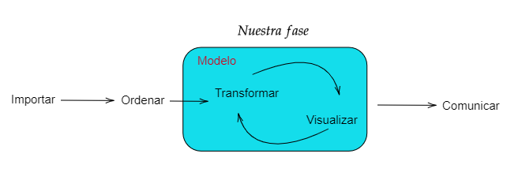
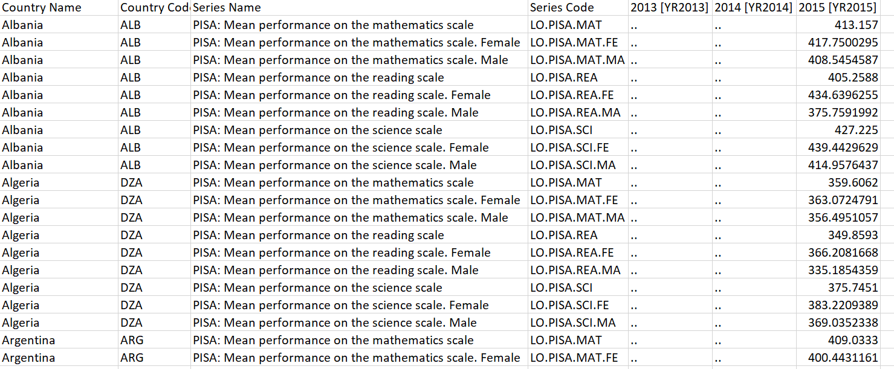

```{r setup, include=FALSE}
library(extrafont)
library(kableExtra)
knitr::opts_chunk$set(echo = TRUE)
```

## Introducción

En esta primera parte, se hará una exposición frente al _análisis exploratorio de datos_ o (*EDA*) -_siglas en ingles_-. Es una de las partes mas importantes que contamos los investigadores a la hora de responder preguntas y revisar bases de datos que constituyen el principal insumo para trabajar en esta parte. Información adicional y un contexto teórico mejor sobre el tema se puede encontrar en el enlace de [Análisis EDA](https://www.itl.nist.gov/div898/handbook/eda/section1/eda11.htm). 

## Objetivo

Implementar las fases de:

- Cargar o importar datos
- Limpiar la base de datos
- Procesar información
- Visualizar

Una forma de condensar esto se representa en la siguiente figura del proceso a realizar siempre en esta parte

```{r rmarkdown123, echo=FALSE, out.width='75%', fig.align='center'}

```

Algunas temáticas a lo largo del curso serán tomadas teniendo en cuenta el libro de Irizarry (2020) llamado [Introduction to Data Science](https://rafalab.github.io/dsbook/).

### Paquetes a usar

Se implementan los paquetes de `tidyverse` y de `ggplot2`, ya incluido en el primero, que contienen \textcolor{red}{herramientas} en la parte de *R* y de *Rstudio* (IDE) para realizar el proceso de análisis.


```{r pun, results='hide'}
library(tidyverse)
```

Note que ya este trae consigo el paquete de `ggplot2` que será útil para la parte de las gráficas y de visualización de los datos. Con lo anterior, ya podemos entonces abordar el tema investigativo producto de una evaluación de negocio, consultoría o trabajo académico.

# Caso 1: 

Entremos en materia de análisis. Tomaremos la base de datos de la prueba PISA (Programa para la Evaluación Internacional de Alumnos de la OCDE) del año 2015. Los datos los podemos tomar del link de la pagina de [Kaggle](https://www.kaggle.com/zazueta/pisa-scores-2015).


### Contexto

Evaluar las competencias académicas de los distintos países que forman parte de la *Organización para la Cooperación y el Desarrollo Económico* (OCDE). Ha sido costumbre para comparar los resultados de un país versus los otros en materia educativa y ver que tanto los jóvenes que se encuentran finalizando su temporada escolar de secundaria y media vocacional son tan competitivos en materias como _matemáticas_, _lectura_ y _ciencias básicas_. En particular se pide que se realice un análisis de los resultados encontrados para el año de 2015.

### Pregunta de investigación

Una de las tantas preguntas que podremos hacernos es: _¿Cómo ha sido el rendimiento académico de los distintos estudiantes de los países que hacen parte de la OCDE?_. Además, se pueden hacer preguntas del tipo: _¿Las mujeres tienen mejores resultados que los hombres?_.

### Datos preliminares

Los datos de entrada u obtenidos de forma original que pueden observarse directamente en el programa excel de microsoft office y tienen por ejemplo la siguiente forma:

```{r rmarkdown1234, echo=FALSE,out.width='75%', fig.align='center'}

```


Siendo un archivo de formato de texto separado por comas o archivo tipo^[Se puede consultar otros tipos de datos y la forma como se importa en <https://hbctraining.github.io/Intro-to-R/lessons/04_introR-data-wrangling.html>] _csv_. y que contiene variables con etiquetas que han sugerido sus creadores o los que han "digitalizado" esa información. Algunas de esas etiquetas de la base pueden ser observadas como


| Variable        | Significado                                        |
|-----------------|----------------------------------------------------|
|   LO.PISA.MAT   |          Resultado promedio en matemáticas         |
|  LO.PISA.MAT.FE | Resultado promedio en matemáticas para las mujeres |
|  LO.PISA.MAT.MA | Resultado promedio en matemáticas para los hombres |
|   LO.PISA.REA   |            Resultado promedio en Lectura           |


### Importar datos

Una de las formas de involucrar los datos es hacerlo con el asistente de *RStudio* en la parte de `Import Dataset` y seleccionar la opción del tipo de texto que se tiene p.e: (.txt o .csv o incluso .dta) o también mediante una ruta especifica de la ubicación del *Archivo*. 

```{r datos, warning=FALSE}
library(readr)
library(data.table)
datos_pisa <- fread("https://raw.githubusercontent.com/andvarga-eco/intro_dataecon/main/Data/Pisa%20mean%20perfromance%20scores%202013%20-%202015%20Data.csv")
```

Para observar los datos en *R*, una opción del encabezado de los datos se puede hacer de la siguiente manera:

```{r datos1}
head(datos_pisa)
```

La base de datos tiene una estructura de datos de tipo de *corte transversal* que indican valores por observaciones ordenadas por fila y esta establecida por países que se les tiene registro. Otra forma de mirar los datos es a partir del formato de cada una de las variables, esto puede hacerse con `str()` y es de tal manera que

```{r dat1}
str(datos_pisa)
```

Los datos son caracteres^[Cadenas de datos o formato texto.] y no es muy buena la forma en como están las columnas escritas en nombre, _dificultarán_ mucho para hacer códigos sencillos.

### Limpieza de la base y transformación

Empieza en parte el trabajo "duro", que significa hacer más útil la información y facilitar los procesos. Debemos hacer cosas como  _renombrar columnas, cambiar tipos de ellas, transponer los datos_, etc.  Siempre es bueno tener en cuenta lo siguiente para eso:

1. **Coherencia del tipo de datos**: Esto se refiere a tener todas las características representadas en el tipo de datos correcto. Así, si está trabajando en `tidyverse`, los números decimales deben representarse como _númericos_, los enteros como _integer_, las cadenas como _str_, las categorías como _factores_, etc. Otros ejemplos de consistencia de tipos de datos son la conversión de columnas Yes/No en booleanos _(True, False)_, hay que asegurarse de que todas las fechas están correctamente formateadas y no son tratadas como cadenas o números, y redondear los números decimales a una precisión apropiada.

2. **Consistencia de las unidades**: Si tiene características numéricas, es importante que estén en las unidades correctas. Por ejemplo, si tiene una característica en kilómetros y otra en millas, tiene que convertirlas a una misma o igual unidad antes de poder hacer cálculos que involucren a ambas.

3. **Coherencia categórica**: Las características que se supone que son categóricas deben estar estandarizadas. Por ejemplo, si su conjunto de datos tiene una categoría bicicleta que está representada por dos cadenas diferentes (por ejemplo, bicicleta y bici), entonces tiene que detectar esta inconsistencia y corregirla (por ejemplo, reemplazando todas las instancias de bicicleta por bici, para tener sólo una etiqueta por categoría).

4. **Formato de cadenas**: A veces hay elementos extraños en las cadenas, como asteriscos y otros caracteres especiales. Estos no suelen ser útiles, por lo que hay que eliminarlos. Otras tareas de formateo de cadenas pueden incluir la eliminación de la puntuación, las mayúsculas, las minúsculas o las mayúsculas, la eliminación de los espacios iniciales y finales, etc.

5. **Integridad referencial**: Cada observación única en su conjunto de datos debe tener un ID único, especialmente si planea unirlo con otros conjuntos de datos (en cuyo caso los ID de sus observaciones deben coincidir con las claves de unión del otro conjunto de datos). A menudo, esto requiere que se eliminen las filas duplicadas y se creen IDs para las filas que no los tienen.

6. **Coherencia de los nombres de las columnas**: No tiene que ser tan estricto con esto como con los anteriores, pero debe ser coherente con el nombre de las columnas, sin embargo, una buena práctica para esto es poder configurar todas sus columnas para que sigan un estándar de nomenclatura común para que sus nombres tengan sentido y sea fácil referirse a ellos en el futuro o en el manejo de los datos.

Los tipos de datos en *R* vienen a ser:

`lógico -> entero -> numérico -> cadena de texto (logical -> integer -> numeric -> character)`

Empecemos conociendo y familiarizando con los nombres (columnas) de la base de datos:

```{r corp}
names(datos_pisa)
```

Por otro lado, *renombrar* puede hacerlo uno de la siguiente forma de forma simple con: 

`names(datos_pisa)[1] <- 'Clase'` 

Lo que cambia el nombre de la primera columna O realizarlo con todas una a una:

```{r corp2}
names(datos_pisa)<-c('country','ccode','series','scode','yr2013', 'yr2014','yr2015')
```

Ya con estos nombres _-más fáciles y cortos-_ podemos entonces tener una base un poco mas simple y sencilla y con un mejor formato.

```{r continuo}
base_p <- datos_pisa[1:1161, c(1, 4, 7)]
base_p$country<-as.factor(base_p$country)
base_p$scode<-as.factor(base_p$scode)
base_p$yr2015<-as.numeric(base_p$yr2015)
```

Observe que hemos incluso cambiado el nombre de la base, ahora la llamamos `base_p` y hemos hecho algunas transformaciones de los caracteres en datos que acepta y trabaja el programa. Ahora, es donde aparece lo "mejor", el operador `pip` o `%>%` _-muy similar al de mayor que de los símbolos en matemáticas-_. Con el, se puede ahorrar el hecho de repetir códigos o hacer muchas lineas. Si por ejemplo, se requiere renombrar toda la base `rename` y rotarla con el comando^[Este permite tener los formatos wide y narrow de la bases.] `spread` con tal de tener una base un poco mas amplia, se hace con: 

```{r narrow}
trab<-base_p%>%spread(key=scode,value=yr2015)%>%
         rename(Matematicas = "LO.PISA.MAT",                        
         Mates.F = "LO.PISA.MAT.FE",
         Mates.M = "LO.PISA.MAT.MA",
         Lectura = "LO.PISA.REA",
         Lectura.F = "LO.PISA.REA.FE",
         Lectura.M = "LO.PISA.REA.MA",
         Ciencias = "LO.PISA.SCI",
         Ciencias.F = "LO.PISA.SCI.FE",
         Ciencias.M = "LO.PISA.SCI.MA"
  ) %>%
  drop_na()
head(trab)
```

Ahora la base es mas clara, posee características de medición, separadas por columnas singulares que poseen información **númerica** y que podemos hacer uso de métricas y poder responder nuestra pregunta inicial.

\newpage

## Visualización


```{r al, fig.height=17, fig.width=12}
library(ggplot2)
# Como nos va clasificando en matemáticas
ggplot(data=trab,aes(x=reorder(country,Matematicas),y=Matematicas)) + 
  geom_bar(stat ='identity',aes(fill=Matematicas))+
  coord_flip() + 
  theme_grey() + 
  scale_fill_gradient(name="Resultados en Matemáticas")+
  labs(title = 'Ranking de Países en prueba de Matemáticas',
       y='Puntaje Promedio',x='Países')+ 
  geom_hline(yintercept = mean(trab$Matematicas),size = 1, color = 'red')
```

Si observamos, países asiáticos tuvieron mejor rendimiento que los demás países y están muy por encima de la media de todos los demás. Colombia ocupa los últimos lugares del ranking y es preocupante esa parte.

```{example, label="Pr1", name="Haga el analisis con lectura"}
Ejercicio 1: Tome la misma base y ahora mire que ocurre con el ranking para lectura. 
¿Sómos mejores?
```


## Caso Colombiano

Si queremos solo mirar un país en particular, _-usemos a Colombia por ejemplo-_ con el objeto de mirar los resultados de sus pruebas y una forma de hacerlo es conociendo sus etiquetas

```{r pol, results='hide'}
#Conocer cada uno de las etiquetas
trab$country
levels(trab$country) #forma base
sapply(trab, levels)
trab %>% sapply(levels) #Lo mismo pero con -pip
```

Cada una de las anteriores opciones nos conducen a _familiarizarnos_ mejor con los datos y poder hacer extracciones, en esta parte buscamos seleccionar a  **Colombia** y entonces debemos escribir lo siguiente:

```{r col}
# Para seleccionar un solo valor de todos
trab[trab$country == "Colombia",]
```

En **R** hay múltiples formas de trabajar, la anterior es una sola de ellas y podemos inspeccionar la parte correspondiente para Colombia y mirar los resultados obtenidos a partir de sus columnas. Otras maneras de conocer una fila o columna en especifico es mediante su número. En el programa `[1]` hace parte específicamente al elemento 1 de la base o vector de trabajo. Si por ejemplo se tiene `[1,1]` Tendremos el valor de la primera fila y la primera columna. Si queremos seleccionar ya varios datos, se puede hacer de la siguiente forma

```{r kl, eval=FALSE}
trab[1:2, 3:5]  
```

También se puede hacer por el respectivo nombre pero usando _comillas_, así como:

```{r kl2, eval=FALSE}
trab[4:5, 'Matematicas']  
```

En esta parte **R** tomara desde la 4 a la 5 fila (observaciones) y la columna que se llama Matemáticas. Si ya desea seleccionar "ciertas" columnas, entonces le corresponde hacer

```{r kl3, eval=FALSE}
trab[4:5, c(1,5,6)] 
```

**R** tomara desde la 4 a la 5 fila (observaciones) y las columnas 1, 5 y 6 respectivamente. Con esto en mente, entonces generamos un mini-frame (o subconjunto) a mano de datos de tal forma que tengamos los ingredientes para el gráfico:

```{r col1}
datoscol<-trab[,c(1,2,5,8)]%>%filter(country=="Colombia")%>%pivot_longer(!country,names_to="Área",values_to="Puntaje")

```

De tal manera que ahora tenemos una base de datos pequeña con información extraida de la base original compuesta solo por una variable númerica y la otra de tipo cadena o factor. 

\newpage
Y ahora gráficamos lo anterior:

```{r grt, echo = TRUE,fig.width = 10}
col_plot<-ggplot(data=datoscol, aes(x=Área, y=Puntaje)) + 
  geom_bar(stat="identity",fill = "lightblue", position="stack")+
  labs(title = 'Resultados Colombia',
       y='Puntaje por áreas',x='Colombia')
col_plot
```

Note que entre áreas son mas o menos similares los resultados, sobresaliendo el componente de lectura. Sin embargo, es también notable de ver que los resultados están por debajo de la media de todos los países que se presentaron a la prueba.

```{r cal}
mean(trab$Matematicas)
```

Para la parte de matemáticas estamos casi 70 puntos por debajo del promedio general.


A la gráfica anterior la podemos hacer interactiva

```{r}
library(plotly)
ggplotly(col_plot)
```


```{example, label="Pr2", name="Resto de estadisticas"}
Ejercicio 2: ¿Qué otros elementos podemos adicionar para la interpretación y ampliar aun mas el análisis?
```


\newpage
## Diferencias entre puntajes
Ahora miremos diferencias entre puntajes. Primero debemos generar un par de columnas **nuevas** que nos permitan tener ese calculo.

```{r vb}
trab<-   trab%>%mutate(dif.Mat = ((Mates.F - Mates.M)/Mates.M)*100,
         dif.Lec = ((Lectura.F - Lectura.M)/Lectura.M)*100,
         dif.Ciencias = ((Ciencias.F - Ciencias.M)/Ciencias.M)*100,
         total = Matematicas + Lectura + Ciencias,
         Dif.promedio = (dif.Mat+dif.Lec+dif.Lec)/3
         ) 

```

Ya creadas las **variables** que miden las variaciones procedemos a graficar.

```{r cal12, echo = TRUE, fig.height=17, fig.width=12}
  ggplot(data=trab, aes(x=reorder(country, dif.Mat), y=dif.Mat)) +
  geom_bar(stat = "identity", aes(fill=dif.Mat)) +
  coord_flip() +
  theme_light() +
  geom_hline(yintercept = mean(trab$dif.Mat), size=1, color="black") +
  scale_fill_gradient(name="Diferencia %", low = "red", high = "green") +
  labs(title="Diferencia entre hombres y mujeres", x="", y="Diferencia % de los hombres")
```

```{example, label="Pr3", name="Haga el analisis con ciencias"}
Ejercicio 3: Replique lo anterior pero ahora mire que ocurre con ciencias. Haga la gráfica interactiva
¿Siguen siendo las mujeres mejores?
```

Ahora miremos un histograma de ciencias por países participantes

```{r i145}
ggplot(trab, aes(x=Ciencias))+
geom_histogram(aes(y=..density..),color="darkblue", fill="lightblue")+
  labs(title = 'Distribución Ciencias', y='Densidad',x='Ciencias Naturales')
```
\newpage

## Estadísticos clave y básicos

Con el paquete `skimr` podemos mirar las estadísticas de las variables de la base de datos.

```{r comp1, fig.width = 10}
library(skimr)
skim(trab, Matematicas, Lectura, Ciencias)
```

El comportamiento del componente de lectura es quien mejor distribución tiene para esta parte. Podemos _-jugar-_ también con los datos de los percentiles, quienes nos ilustran componentes como la mediana. 